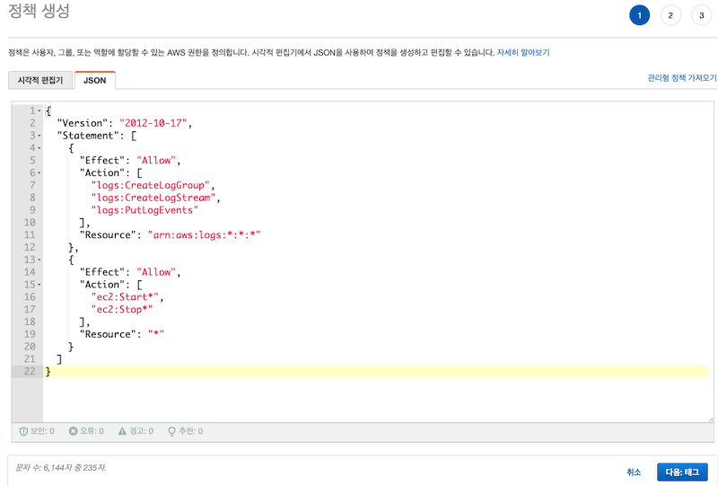
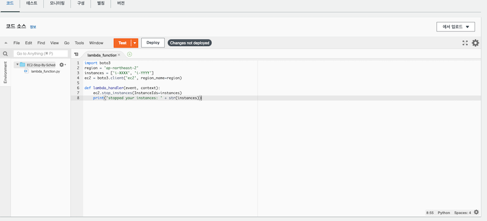
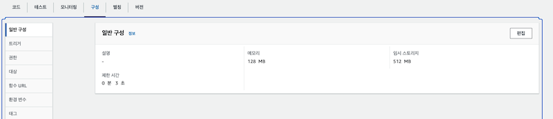
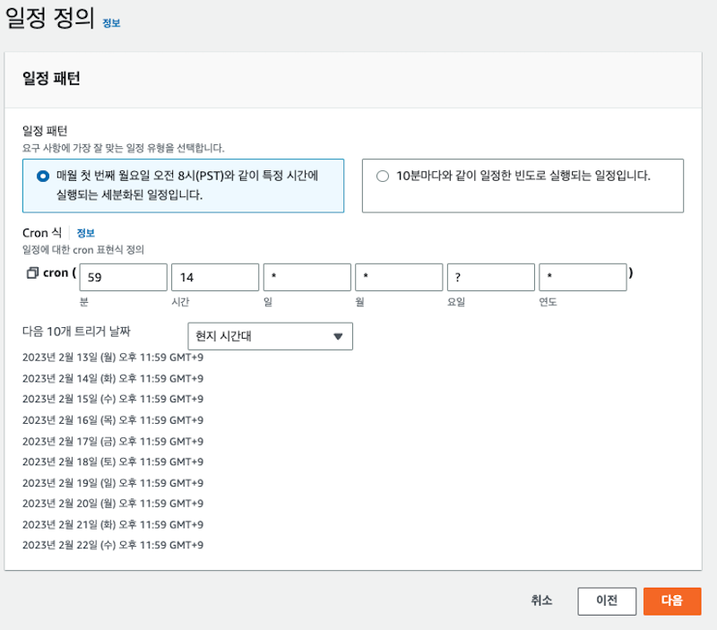

# EC2 스케줄링 정지/재시작 설정하기

- EC2의 비용을 절감하기 위해서 개발존, 테스트존 등은 EC2인스턴스를 사용하지 않는 시간에는 정지하고, 매일 아침 9시에 다시 기동해서 업무를 할 수 있도록 스케줄링할 수 있다. 

## 작업개요

- 우리는 다음과 같은 단계로 작업을 수행하게 된다. 
  - 1. 정책 생성, 롤 생성
  - 2. Lambda 를 통해서 EC2 인스턴스 종료/시작 함수 생성하기
  - 3. AWS Event Bridge를 활용하여 특정 시간 패턴에 따라 종료 혹은 시작하기

## 정책 생성하고 룰 생성하기

### 정책 생성하기 

- 정책은 다음과 같은 2가지 권한을 허용하도록 작성한다 
  - lambda 실행에서 로깅을 수행하기 위한 권한 정책
  - ec2 인스턴스의 정지/시작을 위한 권한 정책 

<br/>

- IAM > 정책 화면에서 "정책 생성"을 클릭한다. 
  


- 정책 생성 화면이 나타나면 아래와 같이 JSON 탭에 정책 정보를 추가한다. 



```json
{
  "Version": "2012-10-17",
  "Statement": [
    {
      "Effect": "Allow",
      "Action": [
        "logs:CreateLogGroup",
        "logs:CreateLogStream",
        "logs:PutLogEvents"
      ],
      "Resource": "arn:aws:logs:*:*:*"
    },
    {
      "Effect": "Allow",
      "Action": [
        "ec2:Start*",
        "ec2:Stop*"
      ],
      "Resource": "*"
    }
  ]
}
```

- 정책을 입력하였다면 태깅을 추가한다. 
- 여기서는 "EC2-Stop-Start-Schedule-Policy" 를 작성하였다. 
  


- 정책 검토 화면에서 생성한 정책 정보를 파악하자. 
  


- 확인이 되었다면 "정책 생성" 을 통해서 정책을 생성한다. 
  
### Role 생성하기 

- Role은 Lambda 를 통해 EC2 인스턴스를 정지/시작 하기 위한 롤을 생성한다. 
- 여기서 롤 대상은 Lambda가 된다. 

<br/>

- IAM > 역할 메뉴를 선택한다. "역할 만들기" 를 클릭한다. 
  


- 롤 생성 화면이 나오면 아래와 같이 선택한다. 
- AWS 서비스: 우리가 사용할 롤은 AWS 서비스의 역할이다.
- 일반 사용사례: Lambda 를 선택하여 Lambda 사용사례를 선택한다. 


- 이제 롤의 권한을 추기하자. 
- 권한은 지금까지 생성한 EC2-Stop-Start-Schedule-Policy 를 선택하여 해당 롤에 권한을 부여한다. 
  


- 롤 이름을 정의하고 롤을 생성한다. 
  


## Lambda 생성하기 

- Lambda는 2가지를 생성할 것이다. 
- 1. EC2 인스턴스를 중지하는 Lambda
- 2. EC2 인스턴스를 시작하는 Lambda

<br/>

- Lambda 생성시 이전에 생성한 EC2인스턴스를 중지/시작 할 수 있는 롤을 부여하는 것을 잊지 말자. 

<br/>

- Lambda > 함수 메뉴에서 "함수 생성" 을 선택한다.


- 함수 생성 화면에서 다음과 같이 입력한다. 
- 새로작성: 신규 Lambda이므로 이를 선택한다. 
- 함수이름: EC2-Stop-By-Scheduler 로 이름을 지었다. 
- 런타임: Lambda를 실행시킬 런타임 환경을 선택한다. 여기서는 Python 3.7을 선택하였다. 
  


- 권한부여를 하기 위해 다음과 같이 선택하자. 
- 실행역할: 기존 역할 사용 (우리는 이미 Role을 앞에서 만들었으니 그것을 사용할 것이다.)
- 기존역할: EC2-Stop-Start-Scheduler-Role 를 선택하자. (이것은 이전에 롤을 만들었던 것이다.)
- 이후 "함수 생성" 버튼으로 함수를 만든다. 
  


- 소스코드를 다음과 같이 입력한다. 

```python
import boto3
region = 'ap-northeast-2'
instances = ['i-XXXX', 'i-YYYY']
ec2 = boto3.client('ec2', region_name=region)

def lambda_handler(event, context):
    ec2.stop_instances(InstanceIds=instances)
    print('stopped your instances: ' + str(instances))
```

- 작성이 되었다면 "Deploy" 버튼을 클릭하고, 소스코드를 반영한다. 
  


- 작성이 되었다면 "구성" > "일반 구성" 에서 "편집"을 클릭한다. 



- 아래와 같이 제한시간을 "10초" 로 설정하였다.
- 이는 Lambda 실행이 오래 걸리는 경우 적절하게 조정을 해 주는 것이 좋다. 


- 작성이 완료 되었다면 "Test" 를 수행하기 위해서 테스트 이벤트 구성을 클릭하고, 아래와 같이 작성한다. 
- 단순히 파라미터등이 없다면 기본값으로 구성을 생성하면 된다. 
  


- EC2 시작을 위한 Lambda 도 생성해주자.


## Event Bridge 생성하기

- EventBridge는 특정 이벤트가 발생한경우, 이벤트가 매칭되었을때, 특정함수등을 수행할 수 있도록 해준다. 
- 우린 Linux의 Cron과 유사한 방법으로 이벤트 브릿지를 사용하여 Lambda를 호출할 것이다. 

<br/>

- EventBridge > 규칙 메뉴에서 "규칙 생성" 버튼을 클릭한다. 
  


- 규칙 세부 정보 정의를 다음과 같이 작성한다.
- 이름: EC2-Stop-Scheduler
- 규칙유형: 일정
- 이후 "다음"으로 규칙을 생성하자. 
  


- 일정정의 부분을 작성한다. 
- cron 을 이용하여 작성하면 된다. 단 이 시간대는 UTC이므로 +9 을 통해서 한국 시간과 맞추 주어야한다. 
- 아래는 오후 11시 59분에 수행될 수 있도록 작성하였다. 
- 다음 트리거 날짜: 이 부분에서 "현지 시간대"을 선택하면 한국 시간을 확인할 수 있다. 



- 이제 이벤트 브릿지의 대상을 선택하자.
- 대상유형: AWS 서비스
- 대상선택: Lambda
- 함수: EC2-Stop-By-Scheduler
- 자성이 되었다면 "다음" 으로 넘어간다. 
  


- 아래와 같이 EC2 인스턴스 시작도 동일하게 만들어 주자. 
  


- 우리가 방금 생성한 2개의 이벤트 브릿지 규칙이 생성되어 있음을 확인한다. 
- 이렇게 되면 해당 시간대에 Labmda 가 동작하여 EC2 인스턴스를 중지/시작 하게 될 것이다. 
  


## WrapUp

- 지금까지 EventBridge, Lambda 조합으로 EC2 인스턴스를 중지/시작해 보았다. 
- Lambda가 EC2에 접근하기 위해서 EC2에 대한 중지/시작 권한 정책을 작성한것을 확인하자. 
- 즉, RDS를 정지/재시작 하려고 한다면 RDS에 대한 중지/시작 권한을 찾아 정책에 추가하기만 하면 된다. 
- Lambda 함수는 역시 bodo3를 사용하여 AWS 리소스를 제어하고 있다. 여기에서는 EC2에 대한 라이브러리를 사용했지만, 만약 다른 서비스에 대한 제어를 하고 싶다면 boto3 메뉴얼 사이트를 참조하자. 
- boto3: https://boto3.amazonaws.com/v1/documentation/api/latest/index.html
- EC2 인스턴스에서 백그라운드로 실행이 필요한경우 pm2 라는 어플리케이션을 이용하자. 
- pm2: https://pm2.keymetrics.io/docs/usage/quick-start/