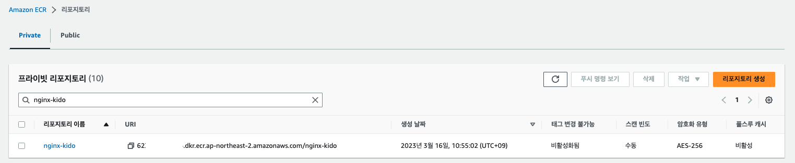

# ECR에 이미지 등록하기. 

- 우리가 사용할 컨테이너 이미지를 ECR에 등록을 해야, ECS 서비스에서 이미지를 사용할 수 있다. 

## 컨테이너 이미지 당겨오기

- 우선 해볼 작업은 nginx 공식 이미지를 docker-hub 로부터 가져올 것이다. 

### Docker 이미지 가져오기

- Docker은 이미 설치 되어 있다고 가정한다. 다른 컨테이너 도구를 사용해도 무방할 것이다. 

```go
$ docker pull nginx:latest

latest: Pulling from library/nginx
66dbba0fb1b5: Pull complete 
6a4b1f0b5a90: Pull complete 
16ea4daad357: Pull complete 
646b2422838c: Pull complete 
c6036fb71e57: Pull complete 
dc0e78f15ad0: Pull complete 
Digest: sha256:aa0afebbb3cfa4....5a65ce1d4b4f55a5c2ef2
Status: Downloaded newer image for nginx:latest
docker.io/library/nginx:latest
```

- 위와 같이 nginx 최신 이미지를 로컬 환경으로 pull 하였다. 
- 다음 명령을 이용하여 이미지 목록을 확인할 수 있다. 

```go
$ docker images | grep nginx 

REPOSITORY                                                TAG                                                                          IMAGE ID       CREATED         SIZE
nginx                                                     latest                                                                       114aa6a9f203   2 weeks ago     135MB
```

## 이미지 컨테이너 만들기

- 이제 우리는 nginx 웰컴 페이지를 포함하는 nginx 컨테이너를 다시 만들어 볼 것이다. 
- 다음과 같이 디렉토리를 생성하자. 

```go
$ mkdir -p samples/nginx-container
$ cd samples/nginx-container

```

### 웰컴 페이지 생성하기. 

- index.html 파일을 다음과 같이 작성한다. 

```html
<!DOCTYPE html>
<html lang="en">
<head>
  <meta charset="UTF-8">
  <meta http-equiv="X-UA-Compatible" content="IE=edge">
  <meta name="viewport" content="width=device-width, initial-scale=1.0">
  <title>Hello ECS</title>
</head>
<body>
  <h1>Hello ECS ~~~</h1>
</body>
</html>
```

### Dockerfile 작성하기

- 이제는 Dockerfile 을 생성하고 웰컴 페이지를 보여줄 컨테이너를 생성하자. 

```Dockerfile
FROM nginx
COPY index.html /usr/share/nginx/html
EXPOSE 8080
```

- 위 내용은 nginx 베이스 이미지를 사용하여 컨테이너화 한다. 
- 우리가 만든 index.html 을 컨테이너 내 /usr/share/ngin/html 디렉토리로 복사한다.
- 8080포트를 외부로 공개하겠다고 지정한다. 

## 컨테이너 이미지 빌드하기

- 이제 우리가 생성한 컨테이너 이미지를 빌드해보자. 

```go
$ docker build -t nginx-kido .
 
$ docker images | grep nginx

nginx-kido                                                latest                                                                       755a6df07907   18 seconds ago   135MB
nginx                                                     latest                                                                       114aa6a9f203   2 weeks ago      135MB

```

- `docker build -t nginx-kido .` 로 이미지 이름을 nginx-kido 로 생성했다. 마지막에 '.' 은 꼭 추가되어야한다. 현재 디렉토리를 이미지화 하겠다는 의미이다. 


### 생성한 이미지 실행해서 확인하기

- 우리가 만든 nginx 이미지가 정상으로 수행되는지 확인하자. 

```go
$ docker run -d --name nginx-kido-run -p 8080:80 nginx-kido

3f1b6de079a6a5bb768dc022bcf9837bf2685835fe5a3bbc5c67fc714211347d
```

- request 요청하기

```go
$ curl localhost:8080

<!DOCTYPE html>
<html lang="en">
<head>
  <meta charset="UTF-8">
  <meta http-equiv="X-UA-Compatible" content="IE=edge">
  <meta name="viewport" content="width=device-width, initial-scale=1.0">
  <title>Hello ECS</title>
</head>
<body>
  <h1>Hello ECS ~~~</h1>
</body>
</html>%
```

- 정상으로 우리가 만든 웰컴 페이지가 응답으로 나오는것을 알 수 있다. 

- 다음 명령어로 컨테이너를 정지하자. 
  
```go
$ docker stop nginx-kido-run
```

## ECR 에 컨테이너 등록하기

- 이제 ECR에 컨테이너를 등록할 차례이다. 
- 이를 위해서는 우선 aws cli가 로컬에 설치되어 있어야하고, aws configure 가 설정이 되어야한다. 
- [aws cli 설치](https://docs.aws.amazon.com/ko_kr/cli/latest/userguide/getting-started-install.html) 참조
- [aws cli 환경구성](https://docs.aws.amazon.com/ko_kr/cli/latest/userguide/cli-configure-envvars.html) 참조

### 이미지 리포지토리 생성하기

- 이제 이미지 리포지토리를 생성하자.

```go
$ aws ecr create-repository --repository-name nginx-kido --region ap-northeast-2

{
    "repository": {
        "repositoryArn": "arn:aws:ecr:ap-northeast-2:62XXXXXXX6:repository/nginx-kido",
        "registryId": "62XXXXXXX6",
        "repositoryName": "nginx-kido",
        "repositoryUri": "62XXXXXXX6.dkr.ecr.ap-northeast-2.amazonaws.com/nginx-kido",
        "createdAt": 1678931702.0,
        "imageTagMutability": "MUTABLE",
        "imageScanningConfiguration": {
            "scanOnPush": false
        },
        "encryptionConfiguration": {
            "encryptionType": "AES256"
        }
    }
}
```

- 정상으로 생성 되었다고 응답이 왔다. 
- 실제 콘솔에서도 확인해보자. 아래와 같이 정상으로 생성되었음을 알 수 있다. 



### ECR 에 로그인하기

- 리포지토리를 생성했으니 이제는 컨테이너를 등록하자. 
- 다음 명령을 통해서 컨테이너 이미지에 접근할 토큰을 조회한다. 

```go
$ aws ecr get-login-password --region ap-northeast-2 | docker login --username AWS --password-stdin <ecr-repository-uri>

Login Succeeded
```

### 컨테이너 이미지 푸시하기

#### 이미지 태깅하기

```go
$ docker tag nginx-kido:latest 6XXXXXXXX6.dkr.ecr.ap-northeast-2.amazonaws.com/nginx-kido
```

#### 이미지 푸시하기 

```go
$ docker push 6XXXXXXXX6.dkr.ecr.ap-northeast-2.amazonaws.com/nginx-kido
```

### 이미지 가져오기

```go
$ docker pull 6XXXXXXXX6.dkr.ecr.ap-northeast-2.amazonaws.com/nginx-kido:latest

```

## Wrap

- nginx 이미지를 새롭게 도커라이징 하고, ECR에 추가하는 작업을 수행해 보았다. 
- 나머지 상세 ECR 을 이용하는 부분은 [ECR AWS CLI사용](https://docs.aws.amazon.com/ko_kr/AmazonECR/latest/userguide/getting-started-cli.html) 부분을 확인하자. 
