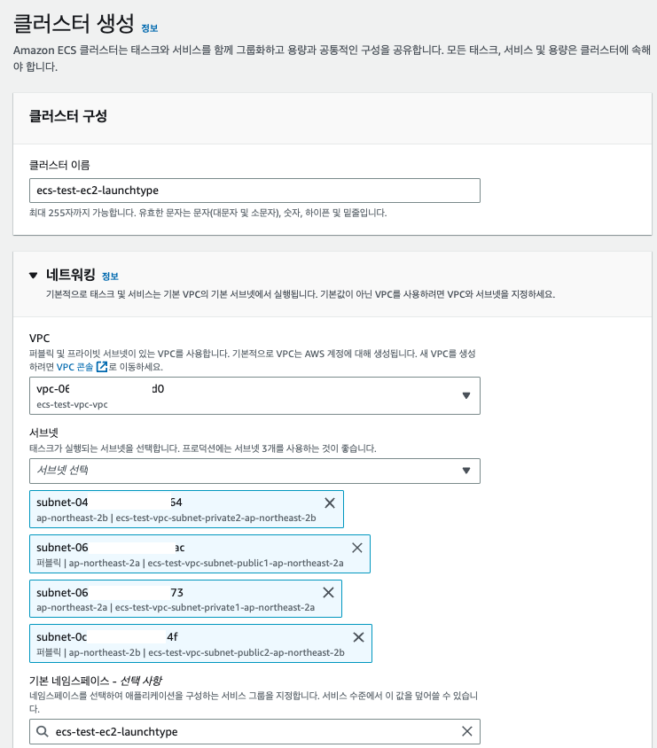

# EC2 Launch Type 을 이용한 AWS ECS Cluster 생성하기 

- ECS를 생성하는 방법에는 Fargate, EC2 Launch Type을 이용하여 생성할 수 있다. 
- 이번 아티클에서는 EC2 Launch Type을 이용하여 AWS ECS Cluster를 생성할 것이다. 

## VPC 생성하기 

- 첫번째로 VPC를 생성하는 것이 필요하다. 
- VPC는 논리적으로 나눈 가상 네트워크로, AWS 리소스를 논리적으로 묶어주는 역할을 한다. 
- VPC > Create VPC 를 선택하여 새로운 VPC를 생성하자. 
- AWS에서는 VPC와 Subnet을 동시에 생성할 수 있으므로 동시에 생성할 것이다. 


- 위 내용과 같이 VPC와 하위 구성요소들이 생성 되는 것을 확인할 수 있다. 
- VPC 이름: ecs-test-vpc-vpc
- 서브넷: (4개))
  - public subnet 2개 (a, b존)
  - private subnet 2개 (a, b존)
- 라우팅 테이블: (3개)
  - pulbic 라우팅 테이블 1개
  - private 라우팅 테이블 2개
- 네트워크 연결: (2개)
  - Internet G/W: 외부 통신용 1개
  - VPC Endpoint: S3연결용 Endpoint 1개


- 퍼블릭 서브넷 2개
- 프라이빗 서브넷 2개
- VPC Endponit S3용 1개

<br/>

- 위와 같이 구성하여 VPC정보를 생성하였다. 

### 생성결과


- 결과적으로 위 단계를 거쳐 VPC를 구성하기 위한 필요한 작업이 수행되고, 생성된 리소스를 확인할 수 있다. 

## Target Group 생성하기 

- Target Group은 EC2 를 이용한 ECS 설정시에 어떤 EC2를 대상으로 삼을지 결정하기 위해 설정하게 된다. 
- EC2 > 대상그룹 메뉴를 선택한다. 그리고 Create Target group(대상그룹 생성) 버튼을 클릭한다. 


- 아래 화면이 나오면 대상 그룹의 기본 설정을 선택하게 된다. 
- 우리는 EC2 Instance를 대상그룹으로 설정할 것이기 때문에 Instances 를 선택한다. 
- 그리고 대상 그룹 이름을 `ecs-test-targetgroup` 이라고 지정하였다.
- 프로토콜은 `HTTP`으로 port는 80으로 설정한다.


- 대상그룹이 존재하는 vpc 를 지정한다. 
- vpc는 이전에 생성한 `ecs-test-vpc-vpc` 를 선택했다. 
- 프로토콜 버전은 대상 그룹으로 요청을 보낼대 어떠한 프로토콜을 이용할지 결정한다. 우리는 HTTP1을 이용할 것이다.


## Load Balancer 생성하기 

- Load Balancer는 외부로 부터 들어오는 요청을 타겟그룹의 특정 인스턴스로 트래픽을 분산하는 역할을 한다. 
- EC2 > 로드밸런서 메뉴를 선택하고 Create Load Balancer 버튼을 클릭한다. 
  


- AWS에서는 4가지 타입의 로드 밸런서를 지원한다. 
- ALB(Application Load Balancer): ALB는 HTTP 트래픽 요청을 분산하는 역할을 수행한다. HTTP/HTTPS로 들어오는 요청은 ALB를 통해 대상 인스턴스로 전달된다. 
- NLB(Network Load Balancer): Network Loadbalancer는 TCP나 UDP 등으로 전달되는 트래픽을 전달하고, 빠른 성능을 원하거나, 고정 IP할당이 필요한경우 NLB를 생성하여 연결한다. 
- GWLB(Gateway Load Balancer): 서드파티 가상 어플리케이션 그룹을 배포한경우 사용되는 로드 밸런서이다. 보안강화, 컴플라이언스 준수 및 정책 준수가 필요한경우 사용되는 로드밸런서이다.
- CLB(Clasic Load Balancer): 초기 AWS에서 지원하던 로드 밸런서로, HTTP에서부터 TCP 등과 같은 다양한 처리를 수행한다. 그러나 최근에는 사용자에게 직접적으로 제공하지 않는다. 
  


- 우리는 여기서 Application Load Balancer를 선택할 것이다. 
- Load Balancer Name 에 ecs-test-lb 라고 작성했다. 
- Scheme의 경우 internet-facing 으로 지정하였다. 이경우 ALB는 외부 트래픽을 받아 들이도록 동작한다. internal로 지정한경우 AWS 내부에서 private IP를 이용하여 트래픽을 전달하는 용도로 사용된다. 
- IP Accress는 IPv4로 지정하였다. 
  


- 역시 LB가 위치할 VPC를 지정하였다. 
- Subnet의 경우에는 인터넷에 노출 시킬 것이기 때문에 위치를 public subnet으로 지정해 주었다. 
  


- 보안그룹을 지정한다. 보안 그룹의 경우 LB로 들어오는 inbound 트래픽에 대한 제약을 설정할 수 있으며, ALB를 이용하므로 HTTP:80 으로 지정하였다. 
- 그리고 타겟 그룹은 좀전에 생성한 ecs-test-targetgroup 로 설정했다. 
  


- 이후 설정은 그대로 두고, 생성을 선택하자. 
  


## KeyPair 생성하기 

- KeyPair은 EC2 인스턴스에 22번 포트로 ssh 접근을 위해 필요하다. 
- keyPair을 생성하고 나중에 ECS가 생성하는 EC2 인스턴스에 접근할 수 있게 된다. 


- 키페어 이름을 'ecs-test-key'로 지정하였다. 
  


## ECS Cluster 생성하기 

- 이제 ECS Cluster를 생성할 차례이다. 
- Amazon Elastic Container 메뉴에서 클러스터 생성 버튼을 클릭하자. 
  


- 클러스터 생성을 위해 클러스터 이름을 `ecs-test-ec2-launchtype` 로 지정하였다. 
- 네트워킹 영역에서 우리가 생성할 VPC를 지정하자. 
- 서브넷은 public 2개, private 2개로 생성했다. 
- 기본 네임스페이스는 생성한 그대로 사용할 것이다. 



- 인프라의 경우 Amazon EC2 인스턴스를 체크하자. 
- 이렇게 되면 ECS는 AWS Fargate와 EC2 인스턴스 방식으로 태스크를 배포할 수 있게 된다. 
- Auto Scaling Group(ASG) 는 EC2 대상 인스턴스의 자동 스케일아웃/인을 위해 필요한 설정이다. 여기서는 새 ASG 생성을 선택하였다. 
- 운영체제 아키텍처: 설치될 운영체제를 선택한다. 여기서는 `Amazon Linux 2(arm64)` 로 설정했다. 
- EC2 인스턴스 유형: ECS로 설치될 대상 인스턴스의 타입을 지정한다. 비용이 절감되는 t4g.medium 으로 설정하였다. 
- 용량: 최소: 0, 최대: 5로 설정하였다. 이 경우 ECS 클러스터가 생성되더라도 EC2 인스턴스는 아직 생성이 되지 않게 된다. 
- SSH key pair: 이전에 생성된 키 페어를 선택하자. ssh 접근에 필요하며 이 값을 지정하지 않으면, ssh 접근이 불가능하다. 
  


- 모니터링 항목에서 Container Insights를 활성화 하면, 컨테이너의 상태 정보를 CloudWatch 에서 확인할 수 있다. 
  


## Task Definition 생성하기 

- Task Definition 은 Cluster 에서 수행해야할 Task에 대한 정의를 작성한다. 
- Task Definition의 주요 내용은 다음과 같다. 
  - 태스크 정의 패밀리 이름: 태스크 정의 이름이다.
  - 컨테이너 이름: 태스크로 수행될 컨테이너 이름이다.
  - 이미지 uri: ECR, DockerHub 등과 같은 컨테이너 이미지 리포지토리와 컨테이너를 지정한다. 
  - 포트매핑: 컨테이너 내부/외부 포트를 매핑한다. 
  - 환경변수: 컨테이너가 수행될대 필요한 환경 변수를 지정한다. 


- 태스크 정의 패밀리: 태스크 이름을 지정한다. 
- 컨테이너 이름: 수행할 컨테이너 이름
- 컨테이너 이미지: 수행할 컨테이너 이미지 주소 (ECR, DockerHub) 등이 올 수 있다. 
- 포트
  - 컨테이너 포트: 컨테이너 내부의 포트이다. 
  - 프로토콜: 외부와 통신하기 위한 프로토콜
  - 포트이름: 컨테이너 포트 오픈 이름
  - 웹 프로토콜: 웹통신시 어떤 프로토콜을 사용할지 지정


- 앱 환경
  - AWS Fargate(서버리스): 서버가 필요하지 않고 관리형 인스턴스에 태스크를 수행할 수 있도록 정의서를 작성한다. 
  - Amazon EC2(인스턴스): EC2 인스턴스로 사용하는 경우 지정
- 운영체제: 태스크가 실행될 대상 운영체제이다. (host os)
- 테스크 크기: CPU, Memory 를 얼마나 필요한 태스크인지 확인한다.
- 태스크 실행 역할: 실행 역할을 지정한다. 이 값이 지정되어야 태스크가 실행될 수 있다.  


- 스토리지를 지정한다. 최소 21Gib 부터 시작된다. 
  


- 로그 수집시 키와 값을 지정한다. 

### JSON 타입 Task 정의

- 위와 같은 작업으로 생성된 Task 정의를 확인해보자. 

```json
{
    "taskDefinitionArn": "arn:aws:ecs:ap-northeast-2:36xxxxxxxx12:task-definition/ecs-task-definition:1",
    "containerDefinitions": [
        {
            "name": "nginx",
            "image": "nginx",
            "cpu": 0,
            "portMappings": [
                {
                    "name": "nginx-80-tcp",
                    "containerPort": 80,
                    "hostPort": 80,
                    "protocol": "tcp",
                    "appProtocol": "http"
                }
            ],
            "essential": true,
            "environment": [],
            "environmentFiles": [],
            "mountPoints": [],
            "volumesFrom": [],
            "logConfiguration": {
                "logDriver": "awslogs",
                "options": {
                    "awslogs-create-group": "true",
                    "awslogs-group": "/ecs/ecs-task-definition",
                    "awslogs-region": "ap-northeast-2",
                    "awslogs-stream-prefix": "ecs"
                }
            }
        }
    ],
    "family": "ecs-task-definition",
    "executionRoleArn": "arn:aws:iam::36xxxxxxxx12:role/ecsTaskExecutionRole",
    "networkMode": "awsvpc",
    "revision": 1,
    "volumes": [],
    "status": "ACTIVE",
    "requiresAttributes": [
        {
            "name": "com.amazonaws.ecs.capability.logging-driver.awslogs"
        },
        {
            "name": "ecs.capability.execution-role-awslogs"
        },
        {
            "name": "com.amazonaws.ecs.capability.docker-remote-api.1.19"
        },
        {
            "name": "com.amazonaws.ecs.capability.docker-remote-api.1.18"
        },
        {
            "name": "ecs.capability.task-eni"
        },
        {
            "name": "com.amazonaws.ecs.capability.docker-remote-api.1.29"
        }
    ],
    "placementConstraints": [],
    "compatibilities": [
        "EC2",
        "FARGATE"
    ],
    "requiresCompatibilities": [
        "FARGATE"
    ],
    "cpu": "1024",
    "memory": "3072",
    "runtimePlatform": {
        "cpuArchitecture": "X86_64",
        "operatingSystemFamily": "LINUX"
    },
    "registeredAt": "2023-03-22T02:27:26.214Z",
    "registeredBy": "arn:aws:sts::36xxxxxxxx12:assumed-role/AWSReservedSSO_AWSAccountAdministrator_f01f",
    "tags": []
}
```

- taskDefinitionArn: 태크정의에 대한 AWS 리소스 위치를 알려준다.
- containerDefinitions: 컨테이너 정의 부분이다.
  - name: 컨테이너 이름
  - image: 이미지 위치 
  - cpu: 태스크 실행시 필요한 컨테이너 cpu
  - portMappings: 포트 매핑 (컨테이너와 호스트의 포트 매핑)
- logConfiguration: 로그 위치와 관련된 설정
- family: 태스크 패밀리 이름
- networkMode: ecs의 네트워크 모드가 지정된다. 
  - bridge: 
    - 기본값, 컨테이너에서 호스트 머신의 네트워크 인터페이스를 사용하고 NAT를 통해 인터넷에 연결된다.
    - 이 모드는 단일 호스트에서 실행되는 컨테이너를 실행할 때 유용하다.
  - host: 
    - 컨테이너는 호스트 머신의 네트워크 인터페이스를 직접 사용한다.
    - 이 모드는 네트워크 성능이 매우 중요한 경우, 예를 들어 고성능 데이터베이스 애플리케이션에서 유용하다.
  - awsvpc: 
    - 컨테이너는 가상 네트워크 인터페이스를 사용하고, 서브넷과 보안 그룹을 사용하여 VPC 내에서 실행된다. 
    - 이 모드는 보안성이 높은 애플리케이션에 유용하다.
  - none: 
    - 컨테이너는 네트워크 인터페이스를 가지지 않으며, 완전히 격리되어 있다. 
    - 이 모드는 로컬 컨테이너에서 테스트할 때 유용하다.

## Service 생성하기 

- ECS는 태스크를 2가지 타입으로 실행할 수 있다. 
  - Task: 
    - 태스크는 한 번 실행되고 완료될 때까지 실행되는 컨테이너의 단일 인스턴스이다. 
    - 태스크는 특정 작업을 실행하는 데 사용된다. 
    - 예를 들어, 배치 프로세스나 임시 작업 등에 유용하다. 
    - 태스크는 일회성이므로, 완료되면 다시 시작되지 않는다. 
  - Service: 
    - 서비스는 일반적으로 상시 실행되는 애플리케이션의 실행에 사용된다.
    - 서비스는 하나 이상의 작업(Task)을 실행할 수 있으며, 각 작업은 하나 이상의 컨테이너를 실행한다.
    - 서비스는 자동으로 로드 밸런싱되고, 애플리케이션의 확장 및 갱신을 지원한다.
    - 또한 서비스는 AWS의 다른 서비스와 통합되어 있으며, 로그, 모니터링 및 경고와 같은 기능을 제공한다.
- 우리는 위 2가지 유형에서 Service를 생성할 것이다. 이를 통해 여러개의 태스크를 수행하고, 지정된 Desire 수의 태스크만큼 수행되는지 확인 해볼 것이다. 
  
## 작업배치

Task placement(작업 배치) 옵션은 Amazon ECS가 클러스터의 인스턴스에 작업을 배치하는 데 사용하는 알고리즘을 결정합니다.

다음과 같은 템플릿을 사용할 수 있습니다.

AZ Balanced Spread - 작업을 가용 영역과 가용 영역의 컨테이너 인스턴스에 분산합니다.

이 값이 기본값입니다.

AZ Balanced BinPack - 작업을 가용 영역과 가용 메모리가 최소인 컨테이너 인스턴스에 분산합니다.

BinPack - 사용 가능한 CPU 또는 메모리 최소량에 따라 작업을 분산합니다.

One Task Per Host - 각 컨테이너 인스턴스에 서비스의 작업을 최대 1개 배치합니다.

Custom - 자체 작업 배치 전략을 정의합니다.

Custom(사용자 지정) 템플릿을 선택하면 최대 5개의 전략과 10개의 제약 조건을 정의할 수 있습니다.

Strategy(전략)는 Type(유형)(알고리즘)과 Field(필드)(알고리즘이 적용되는 개체)로 구성됩니다.

Constraint(제약 조건)는 Amazon ECS가 작업을 배치할 때 고려하는 필터입니다. 제약 조건은 Type(유형)(규칙 정의)과 Expression(표현식)(둘러싼 큰따옴표(" ") 없이 사용자 지정 또는 기본 속성 정의)으로 구성됩니다.


## 테스트하기

## WrapUp


## CloudFormation 을 이용한 생성 명령

```go
aws cloudformation create-stack --stack-name ecs-ec2 --capabilities CAPABILITY_IAM --template-body file://./ecs-ec2-via-cloudformation.yml
```

## aws-cli 를 이용한 생성

```go
ecs-cli up --capability-iam \
--subnets $subnet_1,$subnet_2 \
--vpc $vpc \
--launch-type EC2 \
--size 1 \
--instance-type t2.small \
--cluster ecs-ec2
```

```go
ecs-cli up --capability-iam \
--subnets $subnet_1,$subnet_2 \
--vpc $vpc \
--launch-type FARGATE \
--cluster ecs-fargate
```

## ECS Deep Dive

### ECS Task Definitions

- Task Definitions 은 JSON으로 구성한 메타 데이터이다.
- 이를 통해 ECS가 어떻게 Docker Container를 실행하는지 지정한다.
- 포함되는 내용
  - Image Name: 컨테이너 이미지 이름
  - Port Binding for Container and Host: 컨테이너와 호스트에 바인드될 포트
  - Memory and CPU Required: 필요한 메모리와 CPU
  - Environment Variables: 컨테이너 실행시 필요한 환경변수
  - Networking Information: 네트워크 정보
  - IAM Role: IAM 롤
  - Logging Configurations (ex: CloudWatch): 로깅 설정, 클라우드 워치 설정등
  - Internet Gateway: 외부와 통신한 인터넷 게이트웨이 정보

### ECS IAM Roles

- EC2 Instance Profile:
  - ECS Agent에 의해서 사용된다.
  - ECS Service에 API Call을 수행한다. 
  - 클라우드 워치로그로 컨테이너 로그를 전달한다. 
  - ECR로 부터 Docker 이미지를 땡겨온다. 
- ECS Task Role:
  - 각 태스크가 특정 롤을 가지도록 허용한다. 
  - 서로다른 ECS 서비스를 수행하기 위해서 다른 롤을 이용하도록 한다. 
  - 태스크 롤은 Task Definition에 정의된다. 

### ECS Service

- ECS Service는 얼마나 많은 태스크가 수행되어야 하는지 정의한다. 
- ECS Service는 태스크가 어떻게 수행되어야 하는지 정의한다. 
- EC2 인스턴스 그룹을 통해서 원하는 태스크의 수와 이들이 어떻게 분산 수행되어야 하는지 지정한다. 
- ELB/NLB/ALB 와 링크를 걸 수 있다. 
- ECS 서비스 없이 태스크를 수행할 수도 있다. 

## ECS Task Placement

- EC2 타입의 태스크가 런치되면 ECS는 반드시 어디에 위치해야하는지 지정해 두어야한다. 
- 이는 CPU, memory, 가능한 포트 등의 제약 조건에 따라 결정된다. 
- 이와 유사한 방법으로 스케일 다운시에도, ECS는 어떤 태스크가 정지 되어야할지 지정하게 된다. 
- 이를 지원하기 위해서 task 위치 전략을 정의하고, task 위치 제약조건을 설정할 수 있다. 
- 노트: 태스크 위치 지정은 EC2 기반의 ECS에만 적용이 가능하며, Fargate는 지원하지 않는다. 

### Task Placement 절차

- Task Placement Strategy 는 Best Effort로 동작한다. 
- ECS 가 Task를 위치할때 다음 조건에 따라 컨테이너를 선택한다. 
  - 1. Task Definition에 정의한 CPU, Memory, Port에 만족하는 인스턴스를 식별한다. 
  - 2. Task Placement 제약조건을 만족하는 인스턴스를 식별한다. 
  - 3. Task Placement 전략을 만조하는 인스턴스를 식별한다. 

#### Task Placement 전략

##### Binpack

- 가장 적합한 양의 CPU, Memory 을 기반으로 Task를 위치시킨다. 
- 비용을 절약하기 위해서 최소한의 인스턴스 수를 이용하낟. 
- 예)

```json
"placementStrategy": [
  {
    "field": "memory",
    "type": "binpack"
  }
]
```

##### Random 전략

- 램덤하게 태스크를 위치 시킨다. 

```json
"palcementStrategy": [
  {
    "type": "random"
  }
]
```

##### Spread 전략

- 태스크를 특정 값을 기반으로 분산 시킨다.
- 예: InstanceId, attrubute: ecs.availability-zone

```json
"placementStrategy": [
  {
    "field": "attribute:ecs.availability-zone",
    "type": "spread"
  }
]
```

##### 혼합 전략

- 태스크 위치 전략은 서로 혼합해서 사용이 가능하다. 

```json
"placementStrategy": [
  {
    "field": "attribute.ecs.availability-zone",
    "type": "spread"
  },
  {
    "field": "instanceId",
    "type": "spread"
  }
]
```

```json
"palcementStrategy": [
  {
    "field": "attribute.ecs.availability-zone",
    "type": "spread"
  },
  {
    "field": "memory",
    "type": "binpack"
  }
]
```

#### Task Placement Constraints (태스크 배치 전략)

- distinctInstance: 서로다른 컨테이너 인스턴스에 태스크를 배치한다. 

```json
"placementConstraints": [
  {
    "type": "distinctInstance"
  }
]
```

- memberOf: 특정 표현식에 매치되는 인스턴스에 태스크를 배치한다. 
  - 이때 Cluster Query Language 를 이용하여 작성한다. 

```json
"placementConstraints": [
  {
    "expression": "attribute:ecs.instance-type =~ t2.*",
    "type": "memberOf"
  }
]
```

## ECS Networking Modes

- None: 
  - 외부 커넥션을 지원하지 않는다. 
  - port 매핑을 할 수 없다. 
- Bridge:
  - 기본 모드이다. 
  - EC2 인스턴스 내부에서 일어나며, docker virtual netowrk 를 소유하게 된다.
  - 컨테이너는 호스트의 포트에 매핑이 가능하며, 외부에서 호스트 포트로 접속할 수 있다. 
  - 호스트 포트는 정적 혹은 동적으로 할당될 수 있다. 이를 지정하지 않는다. 
  - 동일한 인스턴스에 여러개의 태스크를 수행하는 경우에는 동적 포트 매핑을 수행할 수 있다. 
  - 이런 경우 ALB와 연동할 수 있으며, 클라이언트
- Host:
  - EC2 인스턴스를 가져야 하는 환경이고, 호스트 모드로 지정해야할 때가 있다. 
  - 이 케이스에 Docker Virtual Network 가 없고, 80 포트를 태스크가 가지고 있는 경우로 포트 바인딩이 없다
  - 극단적인 네트워크 성능이 필요한 경우 이 모드를 사용할 수 있다. 
  - 포트 매핑이 없기 때문에 동일한 ECS 태스크에 대해서 복수개 인스턴스를 실행할 수 없다. 
- AWS VPC (Fargate를 위해서는 필수요건이다)
  - 이를 사용하면 Task는 지정된 ENI가 필요하다. (ENI = Elastic Network Intarface)
  - 이 모드를 사용하면 하나의 태스크는 유니크한 아이디를 가질 수 있게 된다. 
  - 태크크가 생성될때마다, 새로운 ENI와 해당 port 가 할당이 된다. 
  - 이 모드에서는 네트워크 성능이 극대화 된다. 
  - 여기에서도 역시 포트 매핑이 없다. 유니크 아이디에 포트가 생성이 되므로 포트 매핑이 필요하지 않게 되는 것이다. 
  - 쉽게 인스턴스를 이용하고, VPC 모드를 사용할 수 있다. 
  - 중요한 것은 이 모드를 수행하기 위해서 충분한 IP 주소가 있어야 한다. 