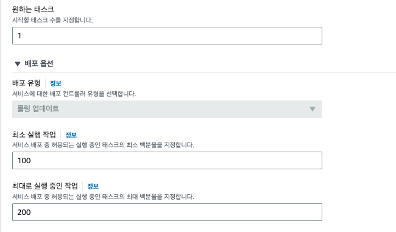
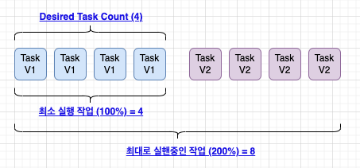
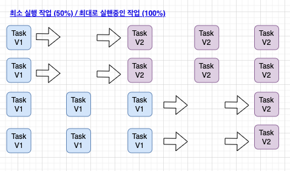
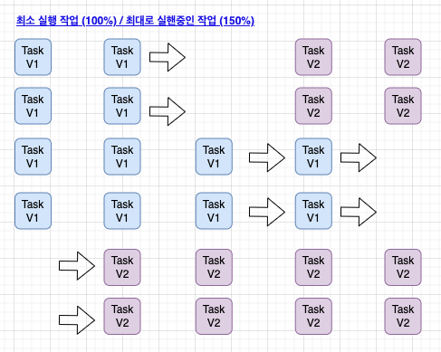
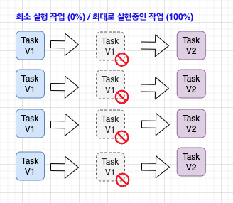

# ECS Rolling Update 배포 정책 이해하기

- ECS는 Rolling Update 을 기본 배포 정책으로 베포를 수행하고 있다. 
- Rolling Update는 한번에 N개의 서비스를 배포하고, 기존 서비스는 종료하는 방식의 배포전략을 말한다. 
- 이때 시스템의 특징에 따라 Rolling Update정책을 어떻게 지정하느냐는 안정적인 서비스 운영을 위한 중요한 결정사항이 될 것이다. 

## ECS 배포 정책 

- 위 내용과 같이 ECS 클러스터를 구성하고 난 후 Service 를 생성할때 "배포옵션"을 선택할 수 있다. 
- 원하는 태스크:
  - 실행되어야할 Task의 수를 나타낸다. 
- 배포 유형: "롤링 업데이트" 로 지정되어 있다. 
  - 배포 유형에 따라 ECS Service Scheduler는 현재 실행중인 컨테이너의 버젼을 최신 컨테이너 버젼으로 교체하는 역할을 한다. 
- 최소 실행작업:
  - 서비스 배포중에 허용되는 실행중인 태스크의 백분율이다. 
  - 위와 같이 100으로 지정하면 100% 로 현재 서비스가 그대로 유지되어야 함을 의미한다. 
- 최대로 실행중인 작업:
  - 서비스 배포 중에 허용되는 실행중인 태스크의 최대크기에 대한 백분율이다. 
  - 위와 같이 200으로 설정하면, 현재 서비스 개수보다 2배 많은 태스크가 수행될 수 있다는 의미이다. 

- 위 이미지와 같이 Desired Task Count(원하는 태스크)가 4라고 하면 4개의 Task가 수행될 것이다. 
- 최소 실행 작업(100%) 으로 설정하면 ECS 스케줄러는 배포가 수행되는 동안 4개 이하로 Task가 떨어지지 않도록 유지하게 된다. 즉 4개로 항상 유지된다는 의미이다. 
- 최대 실행 중인 작업(200%) 으로 설정하면 ECS 스케줄러는 배포가 수행되는 동안 최대 Task를 200% 까지 수행할 수 있다. 그러므로 최대 8개의 Task가 실행된다. 
- 배포가 진행되면서 새로운 Task가 모두 수행되면 오래된 버젼은 자동으로 제거되어 Desired Task 수로 조정되게 된다. 
- 위 사항이 바로 롤링 업데이트 동작이다. 

## 정책에 따른 Rolling Update 동작방식 

### 최소 실행작업 (50%) / 최대 실행 중인 작업 (100%)

- 위 롤링 업데이트는 다음과 같다. 
- Desired Task: 4
- 최소 실행작업 (50%)
- 최대 실행 중인 작업 (100%)

 

- 위 설정으로 롤링 업데이트 과정은 다음과 같다. 
  - 1. 최대 실행중인 작업이 100%로 잡혀 있기 때문에 새로운 태스크를 수행할 수 없다. 
  - 2. 최소 실행작업이 50%로 잡혀 있으므로, 4개에서 50%인 2개의 Task가 종료된다. 
  - 3. 이후 Desired Task를 맞추기 위해서 Task V2 2개가 실행된다. 
  - 4. Task의 Health Check가 완료되면 다시 Task V1 개가 제거된다. (최소 실행작업이 50%이므로)
  - 5. 이후 Dsired Task를 맞추기 위해서 Task V2 2개가 추가로 실행된다. 
  - 6. 최종적으로 Desired Task에 맞게 태스크가 수행되었고, 정상적으로 Rolling Update가 완료된 상태가 된다. 

 

- 위 배포 전략은 서비스의 트래픽이 안정적이고, 태스크가 절반정도 종료되어도 고객에게 영향을 주지 않는 서비스에 적합하다. 
- 또한 비용 절감을 위한 용도로 서비스를 안정적으로 배포할 수 있다. 

### 최소 실행작업 (100%) / 최대 실행 중인 작업 (150%)

- 위 롤링 업데이트는 다음과 같다. 
- Desired Task: 4
- 최소 실행작업 (100%)
- 최대 실행 중인 작업 (150%)

 

- 위 설정으로 롤링 업데이트 과정은 다음과 같다. 
  - 1. 최소 실행작업이 100%이므로 기존 수행중인 Task는 더이상 삭제될 수 없다. 
  - 2. 최대 실행중인 작업이 150%이므로 4개중 50% 인 2개가 추가로 더 실행될 수 있다. 그러므로 Task V2 2개가 실행된다. 
  - 3. Task v2의 헬스체크가 완료되면 기존 Task V1 2개를 제거한다. 
  - 4. 최대 실행중인 작업 100%에 따라 다시 새로운 2개의 Task V2가 실행된다. 
  - 5. 추가로 수행된 Task v2의 헬스체크가 완료되면 Desired Task 수 4개에 따라 기존 Task V1은 제거된다. 
  - 6. 최종적으로 Task v2 4개가 수행되고 Rolling Update가 완료된다. 

 

- 위 배포 전략은 서비스의 안정성이 중요할때 사용된다. 
- 충분히 Desired Task 수로 서비스가 가능하다는 가정하에서, 새로운 Task를 수행하고, 기존 서비스에 영향을 주지 않는 상태로 유지한 후, 기존 버젼을 제거하는 방식으로 안전하게 롤링 업데이트를 수행하는 용도이다. 
- 비용보다는 안정성을 필요료 하는 경우 적합한 배포 전략이다.
  
### 최소 실행작업 (0%) / 최대 실행 중인 작업 (150%)

- 위 롤링 업데이트는 다음과 같다. 
- Desired Task: 4
- 최소 실행작업 (0%)
- 최대 실행 중인 작업 (100%)

 

- 위 설정으로 롤링 업데이트 과정은 다음과 같다. 
  - 1. 최소 실행 작업이 0% 이고, 최대 싫행중인 작업이 100% 이므로 한꺼번에 이전 버젼 Task를 제거한다. 
  - 2. 이후 Desired Task의 정책에 따라 새로운 버젼 Task V2를 한꺼번에 수행된다. 
  - 3. 헬스체크가 완료되면 서비스가 개제되며, 배포가 진행되는 동안 사용자는 503 오류를 받을 수 있다. 

 

- 위 배포 전략은 다운타임에 대해서 큰 이슈가 없을때 적용이 가능한 서비스이다. 
- 안정적인 서비스를 위해서는 ALB의 엔드포인트를 서비스 점검페이지로 전환하는 작업이 선행될 필요가 있다. 
- 그렇지 않으면 고객은 503 오류를 받고, 장애상황을 맞이하게 된다.

 

## Wrap Up

- 지금까지 Rolling Update 에 대해서 알아보았다. 
- 롤링 Update는 Desirec Task, 최소 실행작업(비율), 최대 실행 중인 작업(비율) 에 따라 태스크 배포와 제거가 수행된다. 
- 위 예제에서와 같이 비율을 어떻게 설정되느냐에 따라 배포 수행 방식이 달라진다. 
- 서비스의 특성에 맞게 적절한 배포 옵션을 지정하는 것이 매우 중요하며, 배포 시나리오를 사전에 구성한 수 올바른 전략을 사용하는 것이 무엇보다 중요하다.
