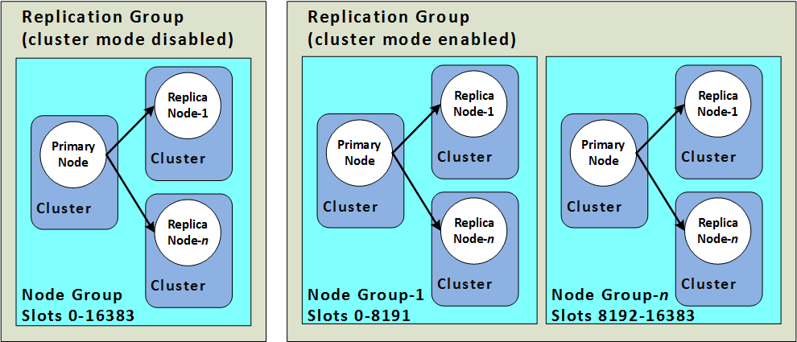

# ElastiCache 성능 모니터링 

- 신뢰성, 사용성, 리소스 성능관리에서 모니터링은 필수
- Amazon Cloud Watch 를 사용하면 ElastiCache 의 상태를 모니터링하고, 예측할 수 있다. 
- Cloud Watch 의 [18가지 성능지표](ttps://aws.amazon.com/about-aws/whats-new/2020/06/announcing-new-cloudwatch-metrics-elasticache-redis/) 를 확인하여 메트릭의 임계치를 설정하고, 넘어가면 알람을 통해서 조기에 상태를 확인할 수 있다. 

## 주요 지표

- ElastiCache Redis 의 상태는 CPU, memory, 네트워킹을 확인할 수 있따. 
- 참고 지표:
  - CPU
  - Memory
  - Network
  - Connection
  - Replication
  - Latency

## Cluster vs Non Cluster Mode

- 클러스터 모드: 
  - 여러 primary node에 샤딩되어 데이터 쓰기 가능
  - 데이터 쓰기속도 증가를 위해 수평확장 가능 
- Non Cluster 모드:
  - 하나의 Primary Node에 읽기/쓰기
  - 다른 Node는 읽기 전용으로 읽기 수행 
  - 쓰기 성능 향상을 위해서 primary node 스케일업 필요

### CPU

- 메트릭:
  - EngineCPUUtilization: Redis 에 대해서 CPU사용량 확인가능
  - CPUUtilization: 노드 전체의 CPU 사용량 확인가능 
  - CPUCreditUsage: T2, T3 인스턴스 사용시 버스트를 위한 크레딧 사용량
  - CPUCreditBalance: T2, T3 인스턴스 사용시 버스트를 위한 크레딧 잔량 
- Redis는 쓰기는 단일 쓰레드로 수행되며, 스냅샷작업등은 서로다른 CPU 이용가능
- 쓰기의 경우 여러 요청이 들어오는 경우 한번에 하나씩만 수행됨
- EngineCPUUtilization 메트릭을 통해서 CPU 사용성을 확인할 수 있음
  - Threshold의 경우 업무에 따라 다르지만 90% 미만인지 확인이 필요 
  - 임계값 : 65%에는 WARN 전송, 90% HIGH 전송하여 대비하기 
- Redis는 SLOWLOG를 이용하여 커맨드가 완료되기 까지 시간이 오래 걸린 정도 확인 가능 
  - https://redis.io/commands/slowlog
- KEYS 명령을 과도하게 사용하는 경우 CPU로드 올라갈 수 있음
- SMEMBERS, SDIFF, SUNION등 집합 명령어는 CPU 로드 올라갈 수 있음
- 스냅샷 생성의 경우 복제본에서 스냅샷을 생성하는 방법 고려 --> Primary Node 에 영향을 안줄 수 있어 유리함
- 높은 볼륨 (데이터양)의 오퍼레이션은 EngineCPUUtilization 을 높이는 원인
- 읽기를 위해서 Redis READONLY command 를 클러스터 모드로 실행하는 것도 도움이 됨
- 이미 복제노드에서 읽기를 수행하고 있다면 노드 추가를 고려하기 
- 쓰기 부하가 높은경우
  - 클러스터 모드: 더 많은 샤드를 넣거나 스케일 아웃으로 성능 향상
  - None Cluster 모드: 마스터 노드의 사양을 높이는 작업으로 성능 향상
- CPUUtilization 메트릭을 통해서 전체 호스트에 대한 CPU 사용율을 확인할 수 있다 .
- T2, T3 캐시 노드 이용시 Credit 소진 전까지 CPU를 버스트할 수 있음. 
  - CPUCreditUsage, CPUCreditBalance를 함께 모니터링 하면서 성능 모니터링 할 수 있음 

###  Memory

- 메트릭:
  - BytesUsedForCache: 메모리 사용 용량 
  - DatabaseMemoryUsagePercentage: 메모리 사용 퍼센트
- 메모리는 Redis의 핵심적인 요소이다.
- used_memory 메트릭이 매우 중요하다. CloudWatch --> BytesUsedForCache 라는 지표 제공
- maxmemory 는 노드의 최디 사용가능 메모리, reserved_memory 는 최대 메모리에 포함된다. 
- DatabaseMemoryUsagePercentage 메트릭으로 메모리 활용 퍼센트 확인가능 
  - 이 값이 100퍼센트에 달하면 Redis maxmemory policy가 트리거됨
  - 이후 쓰기 작업을 더이상 진행하지 못하고 튕겨남
- DatabaseMemoryUsagePercentage에 대해 CloudWatch를 이용하여 사전에 알림을 받기 
- 성능 업그레이드 방법
  - Non Cluster Mode: 스케일 업을 통해서 더 많은 메모리 사용할 수 있는 인스턴스 사용
  - Cluster Mode: 스케일 아웃으로 점진적으로 메모리 용량 확장하기
  - TTL을 데이터에 설정하여 자동으로 메시지 삭제수행하기 이 값은 Reclaimed CloudWatch 메트릭을 사용하여 확인 가능 
- TTL을 통한 Eviction 시 높은 용량의 제거가 수행되면 EngineCPUUtilization이 높게 나타남

- 백업, 페일오버시 Redis 는 추가적인 메모리 이용하여 쓰기 수행. 이때 메모리 용량이 넘어서면 처리가 느려지며, 페이징이 증가, SwapUsage 가 늘게 됨
- 백업, 페일오버를 위해서 reserved_memory를 사용한다. 

- SwapUsage는 50MB를 초과할 수 없고, swap를 이용하면 클러스터 파라미터 그룹에서 검증이 필요하다. 

### Network

- 메트릭:
  - NetworkBytesIn: 클러스터로 들어오는 데이터 바이트
  - NetworkBytesOut: 클러스터에서 나가는 데이터 바이트
  - NetworkPacketsIn: 클러스터로 들어오는 패킷 개수
  - NetworkPacketsOut: 클러스터에서 나가는 패킷 개수
- 클러스터 네트워크 대역폭 용량을 결정하는 요소 --> 노드 유형 
- CloudWatch의 NetworkBytesIn과 NetworkBytesOut 을 이용하여 네트워크로 데이터를 쓰고, 읽는 바이트 수 측정가능
- NetworkPacketsIn과 NetworkPacketsOut 을 이용하여 패킷 쓰기/읽기 를 확인할 수 있다. 
- 네트워크 용량은 사용량 + 트래픽증가에 따란 여분 용량을 함께 지정이 필요
- 읽기 복제본을 통해서 읽기 수행하는지 확인 (Redis READONLY 명령어 사용하는지 여부)
- 이미 수행되고 있다면 노드 추가 고려 
- 쓰기 오퍼레이션이 네트워크 사용량 증가시
  - Primary Node에 더 많은 용량 추가 
  - Non Cluster Mode: 노드 타입 스케일 업 
  - Cluster Mode: 동일한 스케일 수행 가능 (여러 Primary Node에 대해서)

### Connection

- redis는 maxclient 설정에 대한 제한이 있다. 기본값은 65,000이다. 
- 메트릭
  - CurrConnections: 동시성 개수, 액티브 커넥션 Redis 엔진에 의해서 등록됨
  - NewConnections: 커넥션 총 개수는 연결이 활성 상태인지 닫혀 있는지 관계없이 지정된 기간동안의 수이다. 
    - NewConnections 이 중요한 부분이
- KeepAlive의 기본 시간 : 300초, redis 3.2.4 이전에는 tcp-keepalive가 기본적으로 disable이 되어 있음 
- 성능을 개선하기 위해서는 Connection Pooling을 지정하여 클라이언트에서 접근이 필요 

### Replication

- 기본 노드는 하나 이상의 읽기 전용 복제본에 대해 스트림으로 전송
- ReplicationLag 값은 복제본이 기본 노드에서 얼마나 뒤처져 있는지 나타냄
- 높은 복제 지연 --> 일반적으로 과도한 쓰기활동, 네트워크 용량 고갈, 근본 서비스상의 문제등으로 발생한다. 

### Latency

- Redis INFO에서 commandstat 통계를 사용하여 계산됨
- StringBasedCmdsLatency 메트릭 확인가능 평균 밀리초 단위로 측정이 됨 
