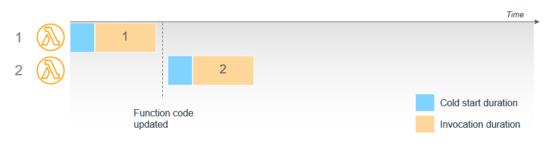
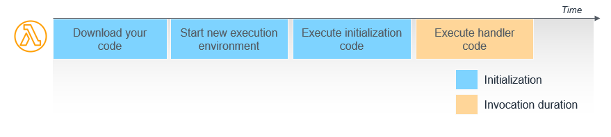
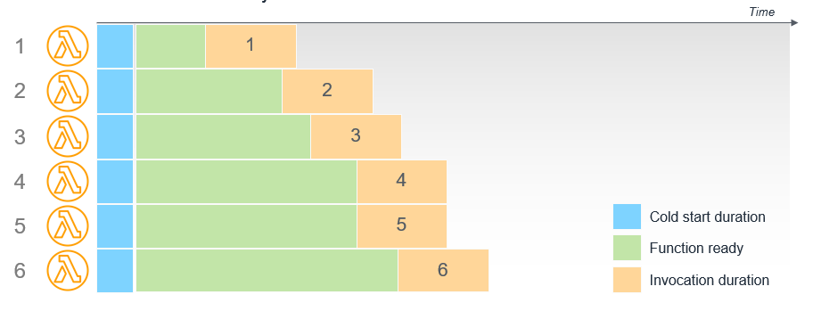
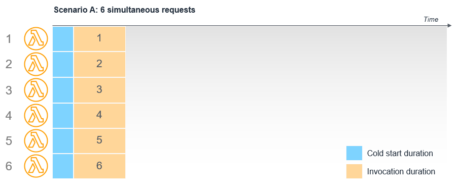
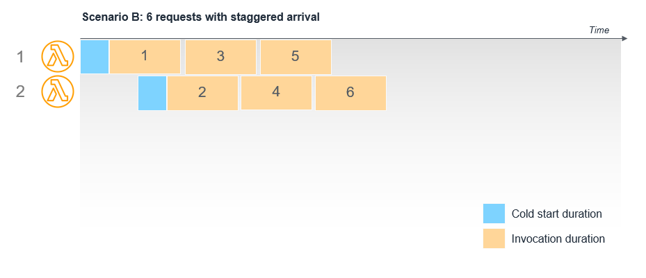
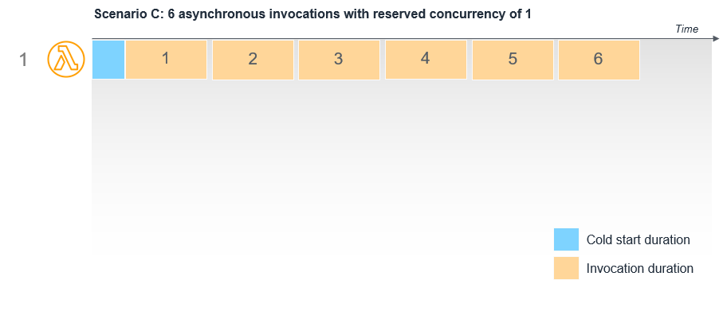

# Operating Lambda: Performance optimization – Part 1

- https://aws.amazon.com/ko/blogs/compute/operating-lambda-performance-optimization-part-1/

- Lambda 오퍼레이팅 시리즈에서 개발자, 아키텍트, 시스템 관리자를 위한 중요한 토픽을 다룬다. 
- 이는 AWS Lambda 기반의 어플리케이션이다. 
- 3개의 시리즈에서 성능 최적화에 대해서 논의할 것이다. 

- Serverless 어플리케이션들은 성능을 극대화 할 수 있고, 병렬화와 동시성을 통해서 이들이 가능하다. 
- Lambda 서비스는 자동적으로 스케일링 된다. 개별 Lambda 함수를 최적화 할 수 있으며 이는 latency를 줄이고, throughput을 증가 시킨다. 

- 이 포스트에서는 Lambda 실행 환경 라이프사이클을 보여주며, 정의 설명, 특정, 콜드 스타트 향상 등을 다룬다. 

## Understanding cold starts and latency

- Lambda API를 통해서 함수를 실행하기 위해서 Lambda는 요청을 받게 되면, 서비스는 우선 실행 환경울 준비한다. 
- 이 단계에서 서비스는 함수를 위한 코드를 다운로드 받는다. 
- 코드는 AWS S3에 존재하거나, 컨테이너인경우 ECR에 저장된다. 
- 환경은 메모리 영역, 실행시간, 특정된 설정등을 생성한다. 
- 일단 완료되면 Lambda는 핸들러 코드를 최정적으로 수행하기 전에 이벤트 핸들러 외부 코드를 초기화 한다. 

- 이 다이어그램에서 첫번제 2 스텝은 환경을 설정하고 코드를 받는다 이는 "cold start"라고 알려진 정보이다. 
- Lambda 가 함수를 준비하는데 걸리는 시간에 대해서는 요금이 부과되지 않지만 전체 호출 기간에 지연 시간이 추가된다. 

- 실행이 완료되면 실행 환경이 고정된다. 
- 리소스와 성능 향상을 위해서 Lambda서비스는 특정되지 않은 시간동안 환경을 구성한다. 
- 이 시간동안 다른 요청이 동일한 함수에 도착하면 서비스는 환경을 재 사용한다. 
- 실행 환경이 이미 존재하고 코드를 다운로드하고 초기화 코드를 실행할 필요가 없기 때문에 이 두번째 요청은 일반적으로 더 빨리 완료된다. 이를 "warm start"라고 부른다. 

- 프로덕션 람다 워크로드의 분석에 따르면 cold start 는 일반적으로 호출의 1%가 소요된다. 
- cold start 의 시간은 100ms 에서 1초 범위에서 수행된다. 
- 람다 서비스는 이후 호출에 대해서 워밍된 환경을 재사용한다. cold start들은 프로덕션 워크로드 보다 개발 및 테스트 기능에서 더 일반적이다. 
- 이는 개발과 테스트 함수들은 덜 호출되기 때문이다. 

## The execution environment lifecycle

- 람다 서비스는 실행이후에 즉시 디스트로이 하기 보다 실행 환경을 유지한다. 
- 환경 라이프타임의 길이는 다양한 팩터에 따라서 영향을 받는다. 이들은 개발자가 오늘 설정할 수 없는 부분이다. 
- 람다 서비스에서 운영 팩토는 유지 시간에 영향을 준다. 

- 실행 환경의 재사용은 매우 유용하다. 성능최적화에 대해서 의존해서는 아니다. 
- Lambda는 AWS 리전의 여러 가용 영역에서 실행을 관리하는 고가용성 서비스이다. 
- 고객 트래픽에 집계에 따라서 서비스는 언제든지 기능을 로드밸런싱 할 수 있다. 
- 결과적으로 함수는 짧은 시간에 두 번 호출될 수 있으며 이 로드 재조정 활동으로 인해 두 실행 모두 콜드 스타트가 발생한다. 

- 추가적으로 트래픽으로 인해 람다 함수가 확장되는 경우 함수를 추가로 동시에 호출할 때마다 새로운 실행 환경이 필요하다. 
- 즉, 기존 동시 기능이 이미 웜 상태일 수 있는 경우에도 각 동시 실행이 콜드 스타트를 경험한다. 

- 최종적으로 람다 함수의 코드를 업데이트 하거나 기능 설정을 변경할 때마다 다음 호출로 인해 콜드 스타트가 발생한다. 
- "최신" 별칭의 이전 버젼을 실행하는 기존 환경은 코드의 새 버전만 사용되도록 가져온다.

## Understanding how functions warmers work

- 더 광범위한 서버리스 커뮤니티는 핑 메커니즘을 통해 람다 함수를 "웜(warm)"하는 오픈 소스 라이브러리를 제공한다. 
- 이러한 접근은 EventBridge 규칙을 사용하여 1분마다 함수 호출을 예약하여 실행 환경을 활성 상태로 유지하는데 도움이 된다. 
- 결과적으로 함수를 호출할 때 웜 환경을 사용할 가능성이 높아진다. 

- 그러나 이것이 콜드 스타트를 줄이는 보장된 방법이 아니다. 
- 기능이 트래픽에 맞게 확장될 때 프로덕션 환경에서는 도움이 안된다. 

- 이는 람다 서비스가 일반 로드 밸런싱 작업의 일부로 다른 가용 영역에서 함수를 실행하는 경우에도 작동하지 않는다. 
- 추가적으로 람다 서비스는 실행 환경을 정기적으로 수집하여 최신 상태로 유지하므로 ping 사이에 함수를 호출할 수 있다. 
- 이 전체 케이스에서 웜 라이브러리를 이용하더라도 콜드 스타트가 발생한다. 
- 이 접근은 개발환경과 테스트환경 처럼 낮은 트래픽이나 낮은 우선순위의 작업에 적합할 수 있다. 

- 추가적으로 호출을 위해 웜 환경을 대상으로 지정할 수 없다. 
- 람다 서비스는 내부 큐잉과 최적화 팩터를 기준으로 요청을 수신받아 실행환경을 구성한다. 
- 이는 반복 요청이나 기존 로드 밸런서에 설정될 수 있는 "고정 세션" 개념에 대한 선호도가 아니다. 

## Reducing cold starts with Provisioned Concurrency

- 만약 워크로드의 실행 시간을 예측 가능해야한다면 [Provisioned Concurrency](https://aws.amazon.com/blogs/compute/new-for-aws-lambda-predictable-start-up-times-with-provisioned-concurrency/) 가능한 가장 낮은 latency 를 보장하는 추천 솔루션이다. 
- 이 기능은 함수가 초기화 되고, 웜 되어 있는 것을 유지한다. 프로비저닝한 규모에서 두 자릿수 밀리초 만에 응답할 수 있도록 한다. 
- 필요할때 요청하는 Lambda 함수와 다르게 이는 모든 설정 활동이 호출보다 먼저 발생함을 의미한다. 

- 예를 들어 Provisioned Concurrency 을 6개로 설정하면 6개의 실행 환경이 호출될때 준비된다. 
- 초기와 호출 사이 시간은 실행 환경이 구성되고, 준비된다. 

- 프로비젼된 동시성 함수는 몇가지 중요한 면에서 주문형 함수와 다르다. 
  - 초기화 코드가 최적화 될 필요는 없다. 이것은 호출 훨씬 전에 발생하기 때문에 긴 초기화는 호출 대기 시간에 영향을 미치지 않는다. Java와 같은 일반적으로 초기화 하는데 시간이 오래 걸리는 런타임을 사용할 경우 프로비져닝된 동시성을 사용하면 성능이 향상될 수 있다. 
  - 초기화 코드가 호출의 총 수보다 더 자주 실행되는 경우 람다는 고가용성이므로 프로비저닝된 동시성 단위 1개당 최소 2개의 실행 환경이 별도의 가용 영역에 준비되어 있다. 이는 서비스 중단 시 코드를 사용할 수 있도록 하기 위한 것이다. 환경이 확보되고 로드 밸런싱이 발생하면 Lambda는 가용성을 보장하기 위해 환경을 과도하게 프로비저닝한다. 이 활동에 대한 비용은 청구되지 않는다. 코드 초기화가 로깅을 구현하는 경우 기본 핸들러가 호출되지 않더라도 이 코드가 실행될 때마다 추가 로그 파일이 표시된다. 
  - 프로비젼된 동시성은 $LATEST 버전으로 사용될 수 없다. 이 기능은 게시된 버젼 및 함수 별칭에만 사용할 수 있다. 프로비저닝된 동시성을 사용하도록 구성된 함수에 대한 콜드 스타트가 표시되면 프로비저닝된 동시성이 구성된 버전 또는 별칭 대신 $LATEST 버전을 호출하는 것일 수 있다.

## Understanding invocation patterns

- 람다 실행 환경은 한번에 하나의 요청을 처리한다.
- 호출이 끝나고 나면 실행 환경은 일정 기간동안 유지된다. 만약 다른 요청이 도착하면 환경은 이후 요청에서 재사용된다. 
- 만약 요청이 동시에 요청되면 람다는 복수개의 실행환경을 제공하기 위해서 람다 함수는 스케일업 한다. 
- 각 환경은 독립적으로 설정된다. 그래서 각 호출 실험은 완젼히 cold start가 수행된다. 

- 예를 들어 Amazon API Gateway 은 람다 함수를 6번 동시에 호출했다면 람다는 6개의 환경을 생성한다. 
- 각 호출은 cold start가 수행된다. 

- 그러나 만약 API Gateway가 람다 함수를 6번 순차적으로 호출하면 각 호출당 약간의 딜레이가 있는경우라면, 존재하는 실행환경은 재사용될 수 있다. 즉, 이전 호출이 완료되는 경우 재사용된다. 
- 이 케이스에 오직 첫번재 2개의 호출에서 cold start가 수행된다. 호출이 3 ~ 6까지 웜 환경을 이용한다. 

- 비동기식 호출의 경우 호출자와 람다 서비스 사이에 내부 대기열이 있다. 
- 람다는 이 대기열의 메시지를 최대한 빨리 처리하고 필요에 따라 자동으로 확장한다. 
- 함수가 예약된 동시성을 사용하는 경우 이는 최대 용량으로 작동하므로 내부 대기열은 함수가 메시지를 처리 할 수 있을 때까지 메시지를 유지한다. 

- 예를 들어 S3버킷은 객체가 버킷에 기록될 때 람다 함수를 호출하도록 구성된다. 

- 만약 람다 함수의 예약 용량을 1로 설정하고 동시에 6개의 객체를 버킷에 쓰는경우 단일 실행 환경에서 이벤트를 순차적으로 처리한다. 
- 보류 중인 이벤트는 내부 대기열에서 유지 관리된다. 

## 결론

- 이 포스트는 람다의 성능 최적화에 대한 3부작중 첫번째이다. 
- 람다 실행 환경이 작동하는 방식과 콜드 스타트가 발생하는 이유를 설명한다. 
- 콜드 스타트의 대기 시간을 최소화하기 위해 기능 워머가 작동하는 방식과 프로비저닝된 동시성이 프로덕션 워크로드에 선호되는 솔루션인 이유를 보여준다. 
- 마지막으로 호출 패턴을 설명하고 호출 모드가 호출 동작과 동시성에 어떻게 영향을 미칠 수 있는지에 대한 몇가지 예를 보여준다. 
- 파트2는 람다 성능을 위한 메모리 설정을 다루고, 어떻게 정적 초기화를 최적화 하는지 보여준다. 

