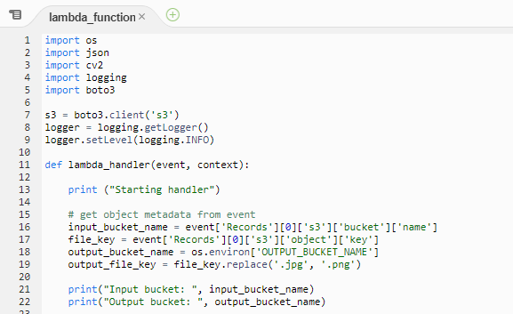

# Operating Lambda: Performance optimization – Part 2

- from: https://aws.amazon.com/ko/blogs/compute/operating-lambda-performance-optimization-part-2/

- 람다 운영 시리즈에서는 AWS Lambda 기반 애플리케이션을 관리하는 개발자, 설계자 및 시스템 관리자를 위한 중요한 주제를 다룬다. 
- 3부로 구성된 이 시리즈에서는 Lambda 기반 애플리케이션의 성능 최적화에 대해 설명한다. 

- 파트 1에서는 람다 실행 환경 수명 주기를 설명하고, 콜드 스타트 정의, 측정 및 개선에 대해 설명한다. 
- 이 블로그 포스트의 게시물은 메모리 구성이 람다 성능에 미치는 영향과 정적 초기화 코드를 최적화 하는 방법을 설명한다. 

## Memory and computing power

- 메모리는 함수의 성능을 제어하기 위해 람다 개발자가 사용할 수 있는 중요한 수단이다. 128MB ~ 10,240MB 사이에서 람다 함수에 할당할 메모리를 구성할 수 있다. 
- 람다 콘솔은 새 기능을 가장 작은 설정으로 기본 설정하고 많은 개발자가 함수에 128MB를 선택한다. 

- 그러나 128MB는 일반적으로 이벤트를 다른 AWS 서비스로 변환하고 라우팅하는 기능과 같은 가장 단순한 람다 기능에만 사용해야한다. 
- 만약 함수라 라이브러리 또는 람다 계층을 가져오거나 Amazon S3 또는 Amazon EFS에서 로드된 데이터와 상호 작용하는 경우 더 높은 메모리 할당으로 설능이 향상될 가능성이 높다 .

- 메모리 양은 또한 기능에 사용할 수 있는 가상 CPU 의 양을 결정한다. 
- 더 많은 메모리를 추가하면 CPU 양이 비례적으로 증가하여 사용 가능한 전체 계산 능력이 증가한다. 
- 만약 함수가 CPU, 네트워크 또는 메모리에 종속될 경우 메모리 설정을 변경하면 성능이 크게 향상될 수 있다. 

- 람다 서비스는 함수에서 소비한 총 기가바이트(초) 양에 대해 요금을 부과하므로 총 기간이 일정하게 유지되면 메모리를 늘리면 전체 비용에 영향을 준다. 
- 기가바이트-초 는 총 메모리(기가바이트)와 지속시간(초)의 곱이다. 
- 그러나 많은 경우 사용 가능한 메모리를 늘리면 지속 시간이 감소한다. 결과적으로 전체 비용 증가는 무시할 수 있거나 감소할 수 있다. 

- 예를 들어 1000번 소수를 계산하는 함수를 호출하면 다른 메모리 수준에서 다음과 같은 평균 지속 시간을 가질 수 있다. 

|Memory|	Duration|	Cost|
|---|---|---|
|128 MB|	11.722 s|	$0.024628|
|256 MB|	6.678 s|	$0.028035|
|512 MB|	3.194 s|	$0.026830|
|1024 MB|	1.465 s|	$0.024638|

- 이 경우 128MB 에서 함수를 완료하는 데 평균 11.722초가 걸리며 비용은 1,000회 호출에 대해 $0.024628이다 
- 메모리가 1024MB로 증가하면 평균 지속 시간이 1.466초로 떨어지므로 비용은 $0.024638이다. 
- 1,000분의 1의 비용 차이에 대해 기능의 성능은 10배 향상된다. 

- Amazon CloudWatch 로 기능을 모니터링 하고 메모리 사용량이 구성된 최대값에 도달하면 경보를 설정할 수 있다. 
- 이것은 메모리 바운드 기능을 식별하는 데 도움이 될 수 있다. CPU 바운드 및 IO 바운드 기능의 경우 지속 시간을 모니터링 하면 종종 더 많은 통찰력을 얻을 수 있다. 
- 이경우 메모리를 늘리면 컴퓨팅 또는 네트워크 병목 현상을 해결하는데 도움을 줄 수 있다. 

## Profiling functions with AWS Lambda Power Tuning

- 람다 함수에 할당된 메모리를 선택하는 것은 속도(지속시간)와 비용의 균형을 맞추는 최적화 프로세스이다. 
- 다양한 메모리 할당을 구성하고 완료하는 데 걸리는 시간을 측정하여 함수에 대한 테스트를 수동으로 실행할 수 있지만 AWS Lambda Power Tuning 도구를 사용하면 프로세스를 자동화 할 수 있다. 
- 관련 경로: https://github.com/alexcasalboni/aws-lambda-power-tuning

- 이 툴은 AWS Step Function을 사용하여 복수개의 람다 함수에 다양한 메모리 할당을 적용하여 동시에 테스트를 수행하고 성능을 측정한다. 
- 입력 기능은 라이브 프로덕션 시나리오에서 가능한 성능을 측정하기 위해 라이브 HTTP 호출 및 SDK 상호 작용을 수행하는 AWS 계정에 실행한다. 
- CI/CD 프로세스를 구현하여 이 도구를 사용하여 배포한 새 기능의 성능을 자동으로 측정할 수 있다. 

- 다음 결과 그래프로 표시하여 성능 및 비용 균형을 시작화 할 수 있다. 이 예에서 함수의 비용은 1024MB와 1535MB로 가장 낮지만 3008MB 에서 가장 빠른 실행을 볼 수 있다. 


- 일반적으로 CPU 바운드 람다 함수는 메모리가 증가할 때 가장 큰 이점을 얻는 반면, 네트워크 바운드 함수는 가장 적게 나타난다. 
- 이는 더 많은 메모리가 더 큰 계산 기능을 제공하지만 네트워크 호출에서 다운스트림 서비스의 응답 시간에 영향을 미치지 않기 때문이다. 
- 함수에서 프로파일러를 실행하면 다양한 메모리 할당에서 코드가 수행하는 방식에 대한 통찰력을 얻을 수 있으므로 함수를 구성하는 방법에 대해 더 나은 결정을 내릴 수 있다. 

- 또한 AWS Cost Optimizer를 사용하여 AWS 계정의 모든 Lambda 함수에 대한 비용 성능 분석을 자동화 할 수 있다. 
- 이 서비스는 지난 14일 동안 50회 이상 실행된 기능을 평가하고 메모리 할당에 대한 자동 권장 사항을 제공한다. 
- Cost Optimizer 콘솔에서 이 추천 엔진을 사용하도록 선택할 수 있다. 

## Optimizing static initialization

- 정적 초기화는 핸들러 코드가 함수에서 실행을 시작하기 전에 발생한다. 
- 핸들러 외부에서 발생하는 INIT 코드이다. 
- 이 코드는 종종 라이브러리 및 종속성을 가져오고 구성을 설정하고 다른 서비스에 대한 연결을 초기화 하는 데 사용한다. 
- 프로덕션 호출 전반에 걸친 람다 성능 분석에서 데이터에 따르면 함수 실행 전 지연 시간의 가장 큰 기여자는 INIT 코드에서 비롯된다. 
- 개발자가 가장 많이 제어할 수 있는 섹션도 콜드 스타트 기간에 가장 큰 영향을 미칠 수 있다. 



- INIT 코드는 새 실행환경이 처음 실행될 때 실행되며, 함수가 확장되고 Lambda 서비스가 함수에 대한 새 환경을 생성할 때마다 실행된다. 
- 호출이 웜 실행 환경을 사용하는 경우 초기화 코드는 다시 실행되지 않는다. 콜드 스타트의 이 부분은 다음에 의해 영향을 받는다. 
  - 가져온 라이브러리 및 종속성, 람다 계층 측면에서 함수 패키지의 크기이다. 
  - 코드 및 초기화 작업의 양
  - 연결 및 기타 리소스를 설정할 때 라이브러리 및 기타 서비스의 성능

- 여기에는 취할 수 있는 여러 단계가 있다. 함수에 많은 개채와 연결이 있는 경우 단일 함수를 여러 개의 특수 함수로 재구성할 수 있다. 
- 이들은 개별적으로 더 작고 작은 INIT 코드를 가진다. 

- 함수가 필요한 라이브러리와 종속성만 가져오는 것이 중요하다. 
- 예를 들어 마약 Amazon Dynamo DB를 AWS SDK로 사용하려고 하는 경우 전체 SDK를 가져오기 보다 각각 개별적인 서비스를 가져오는것이 필요하다. 
- 3개의 예제를 비교하자. 

- JavaScript

```javascript
// Instead of const AWS = require('aws-sdk'), use:
const DynamoDB = require('aws-sdk/clients/dynamodb') 
// Instead of const AWSXRay = require('aws-xray-sdk'), use:
const AWSXRay = require('aws-xray-sdk-core')         
// Instead of const AWS = AWSXRay.captureAWS(require('aws-sdk')), use:
const dynamodb = new DynamoDB.DocumentClient()
AWSXRay.captureAWSClient(dynamodb.service)  
```

- 테스트에서 전체 AWS SDK 대신 DynamoDB 라이브러리를 가져오는 것이 125ms 더 빠르다.
- AWS X-Ray 코어 라이브러리 가져오기는 X-Ray SDK보다 5ms 빨랐다. 

- 유사하게 서비스 초기화를 래핑할 때 래핑 전에 DocumentClient를 준비하면 140ms 이득이 나타난다. 
- Javascript 용 AWS SDK 버젼 3은 이제 모듈식 가져오기를 지원하며, 사용하지 않는 종속성을 더욱 줄일 수 있다. 
- https://github.com/aws/aws-sdk-js-v3

- 정적 초기화는 종종 함수가 동일한 실행 환경에 대한 여러 호출을 통해 연결을 재사용할 수 있도록 데이터베이스 연결을 여는 좋은 장소이다. 
- 그러나 함수의 특정 실행 경로에서만 사용되는 많은 수의 개체가 있을 수 있다. 
- 이 경우 전역 범위에서 변수를 지연 로드하여 정적 초기화 기간을 줄일 수 있다. 

- 호출당 컨텍스트별 정보에 대해 전역 변수를 피해야한다. 
- 만약 함수에 단일 호출의 수명동안만 사용되는 전역 변수가 있고 다음 호출을 위해 재설정되는 경우 핸들러에 대해 로컬인 변수 범위를 사용하라.
- 이것은 호출에서 전역 변수 누출을 방지할 뿐만 아니라 정적 초기화 성능도 향상 시킨다. 

### Comparing the effect of global scope

- 이 예제에서 람다 함수는 고객 ID를 조회하며, 결제처리를 위해서 데이터베이스에서 조회한다. 
- 여기에는 몇가지 이슈가 있다. 


- 1. 호출별로만 사용되는 개인 데이터는 핸들러 내에서 정의되어야한다. 전역변수는 동일한 실행 환경에서 호출간에 값을 유지한다. 
- 2. 라이브러리는 핸들러 외부의 초기화 코드에 정의되어야 하므로 실행 환경이 생성될 때 한번 로드된다. 이 구현으로 인해 모든 호출에 라이브러리가 로드되어 성능이 저하된다. 
- 3. 커넥션 로직은 초기화 핸들러에서 관리해야하며 비밀이 포함된 연결 문자열은 일반 텍스트로 저장되어서는 안된다. 
- 4. 이러한 유형의 논리는 의도하지 않은 결과를 초래할 수 있다. ExistingCustomer 함수가 false를 반환하면 customerId는 함수의 마지막 호출 값을 유지한다. 결과적으로 잘못된 고개에게 요금이 청구된다. 

- 다음 예제는 이 이슈를 해결한 올바른 스콥을 이용한 것이다. 


- 1. 라이브러리는 초기화 섹션에서 정의되며 실행 환경당 한번 로드된다. 인스턴스 변수가 느리게 로드된다. 
- 2. customerId는 핸들러에서 정의되므로 함수 간 데이터 누출 위험 없이 함수가 종료될 때 변수가 지워진다. 
- 3. dbInstance 연결은 지연 로딩을 사용하여 첫 번째 호출에서만 이루어진다 .
- 4. 기존 Customer함수가 false를 반환하는 경우 customerId값은 널과 같다. 

## Static initialization and Provisioned Concurrency

- 온디멘드 람다 함수에서 정적 이니셜라이저는 요청이 수신된 후 핸들러가 호출되기 전에 실행된다. 
- 이로 인해 요청자에게 지연 시간이 발생하고 전체 콜드 스타트 기간에 기여한다. 
- 이전 섹션에서와 같이 정적 이니셜라이저를 최적화할 수 있지만 여기서 많은 양의 작업을 수행해야 할 수 있으며 긴 INIT 기간을 피할 수 없는 경우가 있다. 

- 프로비젼된 동시성을 통해 트래픽을 수신하기 전에 실행 환경을 준비할 수 있으므로 복잡하고 긴 INIT 코드가 있는 기능에 이상적이다. 
- https://aws.amazon.com/blogs/compute/new-for-aws-lambda-predictable-start-up-times-with-provisioned-concurrency/
- 이 경우 INIT 코드의 지속 시간은 호출의 전체 성능에 영향을 미치지 않는다. 

- 모든 프로비젼된 동시성 함수가 기존 온디맨드 람다 실행 스타일보다 더 빨리 시작되지만 이는 일부 함수 프로필에 특히 유용하다. 
- C# 및 Java 와 같은 런타임은 Node.js 또는 Python 보다 초기화 시간이 훨씬 느리지만 일단 초기화되면 실행 시간이 더 빠르다. 
- 프로비저닝된 동시성을 켜면 이러한 런타임이 함수 시작의 일관되고 짧은 대기 시간과 실행 중 성능의 이점을 모두 누릴 수 있다. 

## Conclusion

- 이 포스트는 람다의 성능 최적화에 대한 3부작 시리즈중 2번째이다. 
- 메모리 구성이 람다 성능에 미치는 영향과 메모리 설정이 함수에 사용 가능한 컴퓨팅 성능 및 네트워킹 I/O 도 제어하는 이유를 설명한다. 
- 비용과 성능의 균형을 유지하기 위해 선호하는 구성을 찾기 위해 람다 함수를 프로파일링 하는 방법에 대해 설명한다. 

- 또한 정적 초기화 코드가 작동하는 방식과 이 코드를 최적화 하여 콜드 스타트 대기 시간을 줄이는 방법도 다룬다. 
- 함수 패키지 크기, 라이브러리 성능 및 모듈식 가져오기가 대기 시간에 어떤 영향을 미칠 수 있는지 보여준다. 
- 파트 3에서는 람다 함수 대신 직접 서비스 통합을 사용할 수 있는 경우 대화형 및 비동기식 워크로드와 비용 최적화 팁을 비교한다. 

