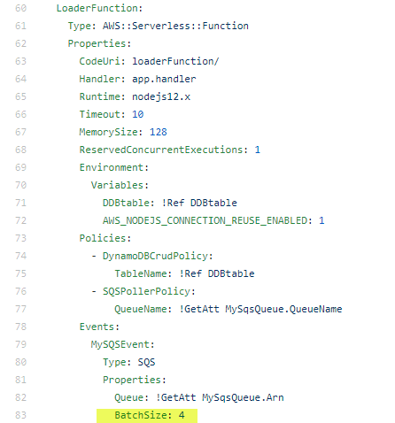

# Operating Lambda: Performance optimization – Part 3

- from: https://aws.amazon.com/ko/blogs/compute/operating-lambda-performance-optimization-part-3/

- 람다 운영 시리즈에서 AWS 람다 기바 애플리케이션을 관리하는 개발자, 설계자 및 시스템 관리자를 위한 중요한 주제를 다룬다. 
- 3부로 구성된 이 시리즈에서는 람다 기반 애플리케이션 성능 최적화에 대해 설명한다. 

- 1부에서는 람다 실행 환경 수명 주기를 설명하고 콜드 스타트 정의, 측정 및 개선에 대해 설명한다. 
- 2부에서는 메모리 구성이 람다 성능에 미치영 영향과 정적 초기화 코드를 최적화 하는 방법을 설명한다. 
- 이 블로그에서는 람다 함수의 성능 개선을 하는데 도움이 될 수 있는 함수 아키텍터와 모범 사례를 설명한다. 

- AWS 는 네트워킹 및 컴퓨팅 계층을 포함하여 람다 서비스의 기본 구성 요소를 정기적으로 개선한다. 
- 람다 개발자는 기능을 변경하지 않고도 이러한 개선 사항의 이점을 자동으로 얻을 수 있따. 

- 함수를 최적화 하기 위해서 개발자가 가장 큰 영향을 미칠 수 있는 람다 실행 수명 주기 부분에 집중하는 것이 가장 좋다. 
- 핸들러 외부의 초기화 코드와 핸들러 코드 자체는 모두 고객 중심 최적화를 위한 중요한 영역이다. 
- 람다 서비스의 지속적인 개선과 함께 이러한 영역에 중점을 두는 것이 전체 성능을 최적화 하는 데 권장되는 방법이다. 

## Comparing the performance of interactive and asynchronous workloads

- 분산 시스템 응용 프로그램은 네트워크를 통해 메시지를 사용하여 통신하는 여러 서비스로 구성된다. 
- 네트워크 지연, 트래픽, 메시지 재시도, 시스템 장애 조치 및 서비스의 개별 성능 프로필로 인해 작업 단위를 완료하는 데 걸리는 시간이 다를 수 있다. 

- 평균 수치에 대한 성능을 측정하는 대신 이상값을 측정하는 것이 더 도움이 될 수 있다. 
- AWS X-Ray 보고서는 이상값을 성능을 식별하는 데 도움이 되는 응답 분포 히스토그램을 보여준다. 
- 예를 들어 백분위수 메트릭을 사용하여 p95 또는 p99 범위에서 발생하는 대기 시간을 식별할 수 있다. 이것은 각각 요청의 가장 느린 5% 또는 1%에 대한 성능을 보여준다. 

- 성능 목표는 사용 사례에 따라 결정된다. 
- 대화형 워크로드에서 호출은 최종 사용자와 이벤트에 의해 직접 트리거 된다. 
- 웹 앱 또는 모바일 앱과 같은 애플리케이션의 경우 요청의 왕복 성능은 최종 사용자가 직접 경험한다. 
- 사용자가 애플리케이션의 백엔드에 API요청을 하면 응답을 반환하기 전에 다운스트림 서비스를 동기적으로 호출한다.
- 이러한 유형의 애플리케이션에서는 사용자 경험을 개선하기 위해 최적화하기 위해 왕복 지연 시간이 중요하다. 

- 많은 대화형 동기 작업 부하에서 반응형 비동기 접근 방식을 사용하도록 설계를 다시 구성할 수 있다. 
- 이 경우 초기 API 호출은 Amazon SQS 대기열에 요청을 유지하고 호출자에게 즉시 승인으로 응답한다. 

- 만약 Amazon API Gateway 를 이용하면 이는 람다 함수 대신에 서비스 통합을 이용하여 이를 완료할 수 있다. 
- 작업은 비동기적으로 계속되고 호출자는 신행 상황을 폴링하거나 애플리케이션이 웹훅 또는 WebSocket을 사용하여 요청 상태를 전달한다. 
- 이 접근 방식은 최종 사용자 경험을 개선하는 동시에 워크로드에 더 큰 규모와 탄력성을 제공하는 데 도움이 될 수 있다. 

- [“Managing backend requests and frontend notifications in serverless web apps”](https://aws.amazon.com/blogs/compute/managing-backend-requests-and-frontend-notifications-in-serverless-web-apps/)

- 많은 비동기식 워크로드의 경우 개별 람다 함수의 콜드 스타트 지연 시간은 전체 성능보다 덜 중요하다. 
- Amazon S3 또는 SQS 와 같은 이벤트 소스로 작업할 때 람다 트래픽을 처리하도록 확장한다. 
- 많은 작업을 병렬로 처리할 수 있으므로 소수의 호출에서 콜드 스타트 대기 시간이 발생하더라도 처리 작업의 전체 시간에 미치는 영향은 미미하다. 

## When not to use a Lambda function

- 항상 람다 함수를 사용할 필요는 없다. 경우에 따라서 성능을 향상 시킬 수 있는 다른 대안이 있을 수 있다. 

- 오케스트레이터 역할을 하고 다른 서비스 및 기능을 호출하고 작업을 조정하는 기능의 경우 기능에서 유휴 시간이 발생할 수 있다. 
- 함수는 일반적으로 다른 작업이 수행되는 동안 기다리므로 비용이 증가한다. 
- 대부분의 경우 오케스트레이션 흐름을 AWS Step Function으로 이동하면 유지 관리가 더 쉽고 탄력적인 상태 시스템이 생성되고 비용 절감에 도움이 될 수 있다. 

- 해당 데이터에 대한 비즈니스 로직을 수행하지 않고 한 서비스에서 다른 서비스로 데이터를 전송하는 람다 함수는 종종 서비스 통합으로 대체될 수 있다. 
- 예를 들어 일반적으로 테이블에서 항목을 읽기 위해 API Gateway 와 Amazon DynamoDB사이에 람다 함수를 배치할 필요가 없다. 
- 이는 DynamoDB와 직접 통합되는 API Gateway서비스에서 VTL을 사용하여 달성할 수 있다. 이를 통해 확장성을 개선하고, 비용을 절감할 수 있다. 

- 마이크로 서비스가 필터링을 위해 모든 이벤트를 람다 함수로 보내고 이벤트의 작은 하위 집합에서만 작동하는 경우 함수를 호출하기 전에 필터링을 구현할 수 있다. 예를 들어:
  - S3 이벤트는 접두사 및 접미사 패턴으로 필터링할 수 있으므로, 특정 객체 키만 필터링할 수 있다. 
  - Amazon SNS는 대상을 호출하기 전에 메시지를 필터링할 수 있다. 
  - Amazon EventBridge를 사용하면 규칙 ㅐ에서 강력한 콘텐츠 필터링 로직을 사용하여 기능을 트리거하는 이벤트를 매우 선택적으로 수행할 수 있다.

- 필터를 사용하면 애플리케이션이 관심을 갖는 이벤트에 대해서만 람다 함수를 호출하기 때문에 비용을 절감하고 효율성을 개선할 수 있다. 

## Cost optimization

- 위크로드에 대해 람다를 실행하는 비용은 실행 횟수 기간 및 메모리 사용량 (Gb/s 로 결합), 데이터 전송의 세 가지 요소에 의해 결정된다. 
- 이전 섹션에서 설명한 메모리 할당의 영향 외에도 이러한 세 가지 변수에 영향을 미치므로 비용을 절감할 수 있는 다른 디자인 선택 사항이 있다. 

- 런타임 선택은 비용에 영향을 줄 수 있다. 
- 일반적으로 컴파일된 언어는 해석된 언어보다 코드를 더 빠르게 실행하지만 초기화 하는데 더 오래걸릴 수 잇다. 

- 기본 기능이 있는 작은 기능의 경우 해석된 언어가 가장 빠른 총 실행 시간에 더 적합하므로 비용이 가장 저렴하다. 

- 컴파일된 언어를 사용하는 함수는 계산이 더 복잡하거나 프로비저닝된 동시성을 사용하는 워크로드에서 더 빠르므로 호출 전 초기화 오버헤드가 발생한다. 

- 호출 빈도는 비용을 결정하는 주요 요소이다. 
- 람다 함수를 트리거링하는 이벤트에 따라 총 호출 수를 줄이는데 사용할 수 있는 다양한 제어가 있다. 
- 다음에 의해 트리거되는 람다 함수의 경우. 
  - API Gateway:
    - 클라우드 프론트를 이용하여 API Gateway 에서 호출하는 경우 자주 변경되지 않는 반환 데이터를 호출한경우 캐시를 이용할 수 있다. 
    - 클라우드 프런트 비용이 증가하지만 API Gateway 및 람다의 비용은 줄어든다. 
  - SQS: 
    - BatchSize 속성은 호출당 람다로 전송되는 SQS대기열의 항목수를 결정한다. 
    - https://docs.aws.amazon.com/lambda/latest/dg/with-sqs.html
    - 이 수를 늘리면 람다 호출 수가 줄어든다. 사용 사례에 따라 더 작은 호출로 더 많은 데이터를 처리하기 위해 SQS로 보낸 메시지당 더 많은 데이터를 집게할 수 있다. 

- 또한 워크로드에 대한 전체 데이터 전송 비용을 고려하라. 
- 람다에 대한 데이터 전송 비용은 데이터 전송 섹션의 https://aws.amazon.com/ec2/pricing/on-demand/ 에 나열된 Amazon EC2 데이터 전송 요금으로 청구된다. 
- 인터넷에서 전송된 데이터에는 전송 비용이 부과되지 않는다. 일반적으로 마이크로서비스 간에 메시지로 전달되는 데이터의 양을 제한하여 이러한 비용을 최소화 할수 있다. 

## Conclusion

- 이 포스트는 람다의 성능 최적화에 대한 3부작 시리즈 마지막 부분이다. 
- 람다 서비스는 서비스의 기본 하드웨어, 소프트웨어 및 아키텍처에서 성능을 자주 개선한다. 
- 이 포스트는 개발자가 성능에 가장 큰 영향을 미칠 수 있는 람다 수명 주기 부분을 식별한다. 

- 대화형 워크로드와 비동기식 워크로드, 그리고 람다 함수 대신 직접 서비스 통합을 사용할 수 있는 경우를 비교한다. 또한 워크로드 실행 비용을 줄이는데 도움이 될 수 있는 몇가지 비용 최적화 팁도 보여준다. 

