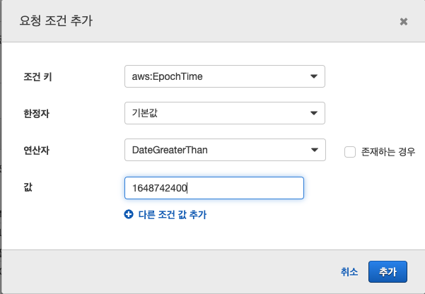
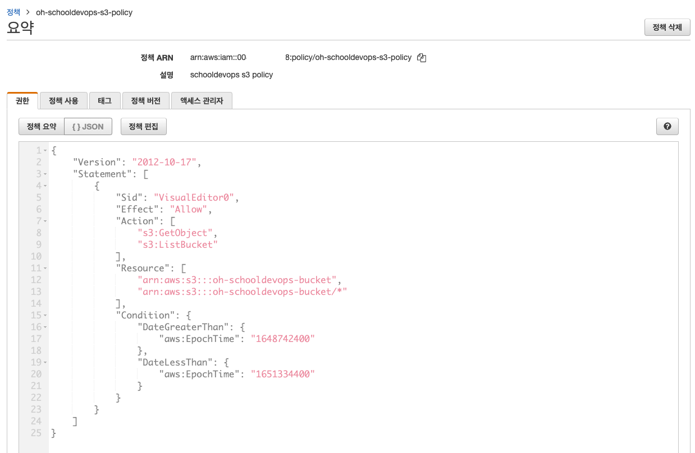

# AWS Policy 생성하기. 

- AWS에서는 특정 리소스에 접근하기 위한 권한에 대한 정책을 생성할 수 있다. 
- 정책은 어떠한 리소스에 대해서, 접근 권한이 어떻게 되는지에 대한 설정을 하는 것을 말한다. 
- 정책을 생성하면, 사용자나 그룹에 정책을 부여할 수 있으며, 정책을 부여 받은 사용자나 그룹은 해당 리소스에 정책에 지정한 권한을 수행할 수 있다. 

## AWS 정책 생성하기 

- AWS 정책생성은 다음 2가지 방식으로 생성할 수 있다. 
  - Visual Editor을 이용하여 생성하기. 
  - JSON을 이용하여 생성하기. 
- 여기서는 S3 버킷을 하나 생성하고, S3의 리스트와 버킷을 읽을 수 있도록 정책을 생성해 볼 것이다. 

### S3 버킷 생성하기. 

- S3 메뉴에 접근하여 아래와 같이 버킷을 생성한다. 


- 화면에서 "버킷 만들기" 를 선택한다. 


- 버킷 이름: oh-schooldevops-bucket
- 리젼: ap-northeast-2
- 태그: Name: my-schooldevops-bucket


- 나머지는 그대로 두고 "버킷 만들기" 를 선택한다. 


- 버킷이 생성되면 검색창에서 "oh-" 를 선택하고 엔터를 클릭한다. 
- 방금 우리가 만든 버킷이 생성되었다. 


- 이제 속성 탭에서 arn을 복사해 둔다. 
- s3의 arn은 arn:aws:s3:::oh-schooldevops-bucket 이다. 

### Policy 생성하기. 

- 이제 정책을 생성할 차례이다. 
- 생성할 정책은 S3내부 디렉토리 목록을 확인하고, 해당 디렉토리내 오브젝트를 조회하는 권한만 주도록 할 것이다. 


- IAM > 액세스 관리 > 정책 을 클릭한다. 
- "정책 생성" 버튼을 클릭한다. 

#### 서비스 지정하기

- 서비스는 정책을 적용할 대상 리소스를 나타낸다. 
- 우리는 여기서 S3를 선택할 것이다 .


- 화면과 같이 S3를 검색하고 "S3" 를 클릭한다. 

#### 작업 지정하기

- 작업은 선택한 리소스에 대해서 어떠한 권한이 있는지 지정한다. 
- S3 버킷의 디렉토리 목록과, 객체 목록을 확인할 수 있도록 선택할 것이므로 다음과 같이 작업을 선택한다. 
  


- 목록 > ListBucket: 버킷의 목록을 볼 수 있다 .
- 읽기 > GetObject: 버킷내의 객체 목록을 볼 수 있다. 
  
#### 우리가 만든 S3 특정하기

- 이제는 위 정책을 정확히 어떤 리소스에 적용할지 선택을 해야한다. 
- 여기서는 ARN (Aws Resource Name) 을 지정해 주면 된다. 


- S3_bucket ARN 지정: 이전에 복사한 arn을 입력한다. 
- 그렇게 되면 Bucket name 에 oh-schooldevops-bucket 이 적용된다. 
- "추가" 버튼을 클릭한다. 


- 객체를 조회를 위한 ARN을 지정한다. 
- S3_object ARN 지정: 이전에 복사한 버킷 arn에 '/*' 를 입력한다. 
- Bucket name: 여기서는 조금전에 생성한 우리의 버킷 이름을 입력하자. 
- Object name: 여기서는 모든 객체를 확인할 수 있어야하기 때문에 * 를 입력한다. (자동적으로 "모두 선택" 이 체크된다.)
- "추가" 버튼을 클릭한다. 


- arn을 모두 입력하면 위 화면과 같이 내용을 확인할 수 있다. 
  
#### 요청 조건 추가하기 

- 이제 요청 조건을 추가해보자. 
- 무조건 보고 싶다면 이 부분은 스킵하면 되며, 특정 조건에 따라 버킷 내용을 보고자 한다면 요청 조건 추가를 할 수 있다. 
- 여기서는 2022-04-01 ~ 2022-05-01 기간내 생성한 객체만 보도록 설정해 볼 것이다. 
  


- aws:EpochTime: 에폭 타임 (유닉스 에폭 타임을 비교할 것이다.)
- 한정자: 기본값으로 둔다.
- 연산자: DateLessThan 은 작은경우를 의미한다. 
- 값: 2022-05-01 에 해당하는 epoch 값을 조회하여 입력한다. 



- aws:EpochTime: 에폭 타임 (유닉스 에폭 타임을 비교할 것이다.)
- 한정자: 기본값으로 둔다.
- 연산자: DateGraterThan 은 작은경우를 의미한다. 
- 값: 2022-01-01 에 해당하는 epoch 값을 조회하여 입력한다. 


- 최종 적으로 요청이 여러개가 추가된 것임을 알 수 있다. 


- 태그를 추가한다. Name: s3-my-test 로 입력한다. 

#### 이름 생성하기 

- 이름과 기타 내용을 입력한다. 
  


- 이름: oh-schooldevops-s3-policy 
- 설명: schooldevops s3 policy 와 같이 구분할 수 있는 설명을 입력한다. 
- 나머지는 그대로 둔다. 
  
#### 정책 생성후 요약정보 보기 

- 생성된 정책 정보를 확인한다. 
  




- 위와 같이 요약정보를 JSON 형태로 확인이 가능하다. 

### JSON 내용 확인하기. 

- 정책 생성시 위와 같이 Visual Editor 을 이용하여 생성할 수 있다. 
- 그러나 최종 정책이 생성된 것과 같이 JSON으로 생성역시 가능하다. 
- JSON 생성은 유사하므로, 우리는 JSON을 어떻게 만드는지에 대해서 구체적으로 알아볼 것이다. 

```json
{
    "Version": "2012-10-17",
    "Statement": [
        {
            "Sid": "VisualEditor0",
            "Effect": "Allow",
            "Action": [
                "s3:GetObject",
                "s3:ListBucket"
            ],
            "Resource": [
                "arn:aws:s3:::oh-schooldevops-bucket",
                "arn:aws:s3:::oh-schooldevops-bucket/*"
            ],
            "Condition": {
                "DateGreaterThan": {
                    "aws:EpochTime": "1648742400"
                },
                "DateLessThan": {
                    "aws:EpochTime": "1651334400"
                }
            }
        }
    ]
}
```

- Version: 버젼은 무조건 "2012-10-17" 로 설정한다. 이는 고정값이라고 생각하면 될것이다. 
- Statement: 정책의 상세 내역은 Statement 블록 하위에 생성한다. 
- Statement.Sid: Sid는 정책을 구분짓는 이름이다. 여기서 VisualEditor0 이라고 되어 있으나 필요한경우 사용자가 직접 입력하면 된다. 
- Statement.Effect: 현재 정책을 허용할지, 거부할지 지정할 수 있다. Allow, Deny중 하나가 올 수 있다
  - Allow: 정책을 허용한다
  - Deny: 정책을 거부한다. 
- Statement.Action: 액션은 특정 리소스에 어떠한 일을 수행할 수 있는지 지정한다. 이는 리소스에 따라서 Action이 다르다. '*'로 전체 액션을 지정할 수 있지만 이는 매우 잘못된 형식이다.
  - s3:GetObject: s3에서 객체를 조회할 수 있도록 한다. 
  - s3:ListBucket: 버킷내 객체 리스트를 확인할 수 있다. 
- Statement.Resource: 적용할 대상 리소스를 구체적으로 지정할 수 있다. '*'를 하면 모든 리소스가 되지만, 이는 매우 잘못된 형식이다. 
  - arn:aws:s3:::oh-schooldevops-bucket : 비컷 자체를 나타낸다. 
  - arn:aws:s3:::oh-schooldevops-bucket/* : 버킷내 모든 객체를 나타낸다. 
- Statement.Condition: 버킷 정책중 특정 조건에 해당하는지 지정할 수 있다. 선택항목이다. 
  - DateGreaterThan: 날짜타입이 더 큰지 여부에 대한 연산자이다. 
    - aws:EpochTime: 1648742400 이는 에폭 타임이 2022년 05월 01일 에 해당한다.
  - DateLessThan: 날짜 타입이 더 작은지 여부에 대한 연산자이다.
    - aws:EpochTime: 1651334400 이는 에폭 타임이 2022년 04월 01일 에 해당한다. 

- 내용을 하나하나 확인해보면 우리 정책이 S3에 대한 권한을 지정하는 것이고, 해당 권한이 어떤 리소스에 적용될지, 그리고 어떠한 조건에 따라 연동할 수 있을지 확인할 수 있다. 