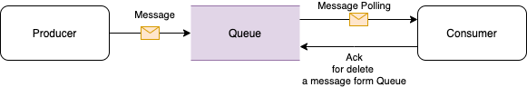
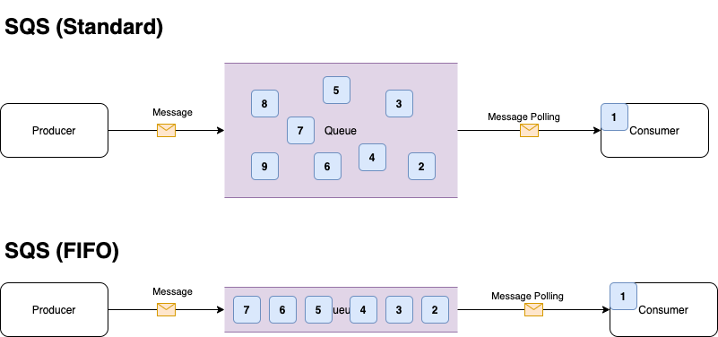
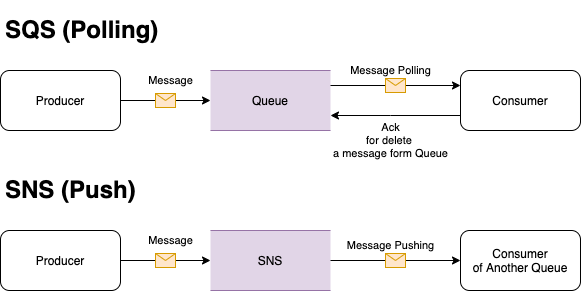

# AWS SQS (Simple Queue Service)

Queue는 일반적으로 각 어플리케이션들이 가지는 Coupling을 끊어주는 역할을 한다. 

프로듀서가 메시지를 보내서 Queue에 메시지를 저장하고, 이를 컨슈머가 가져가서 프로세싱 하는 방식이다. 

<Queue의 일반적인 Flow>

- 위 그림은 일반적인 Queue 의 처리 과정이다. 
    1. Producer 는 메시지를 생성하여 Queue로 메시지를 전송한다. 
    2. Queue는 메시지를 일정 기간 가지고 있게 된다. 
    3. Consumer 는 주기적으로 Queue를 Polling 하면서 신규 메시지가 있다면 가져가서 처리한다. 
    4. 처리가 끝나면 Queue로 Ack 를 전송한다. (메시지 아이디에 해당하는 Ack를 받으면 Queue에서 메시지를 제거한다. )

이렇게 프로듀서와 컨슈머를 Queue 라는 미들웨어로 분리하면, 각 시스템에 영향을 받지 않고 원하는 작업을 수행할 수 있다. 

이번 아티클에서는 SQS에 대해서 정리해보고, Queue 에 대한 내용, 지원하는 Queue feature에 대해서 알아볼 것이다. 

## Overview 

- 분산 시스템 및 서버리스 어플리케이션 분리, 확장을 위한 완젼 관리형 메시지 대기열 서비스 
- MOM(Message Oriented Middleware) 에 대한 완전관리 
- AWS 콘솔, CLI, SDK 등을 활용하여 서비스 가능 
- 리젼 단위 이용, (다른 리전간 SQS 공유 불가)
- 메시지 보관 기간 (1분 ~ 14일까지)
- 메시지 크기 (1kb ~ 256kb), 더 큰 크기의 메시지는 SQS 확장 클라이언트 이용 (최대 2Gb)
- inflight 메시지 수(메시지가 삭제되지 않은 개수)
  - 표준: 120,000개
  - FIFO: 20,000개
- 2가지 타입 (Standard, FIFO) 로 구성 가능 
  - Standard
    - 최대 처리량
    - Best effort 순서
    - 최소 1회 전달 제공
  - FIFO
    - 정확한 순서의 보장
    - 정확히 1번 실행 
    - \<queueName\>.fifo 이름을 사용해야한다. 

## 사용 이점

- 관리 오버헤드 제거
  - 가용성, 확장성, 완젼관리형
- 메시지 전달 안정성
  - 메시지 손실 없이 전달 가능
  - 시스템간 커플링 해소 
  - 메시지 복제본 저장
- 데이터 안전성 유지
  - KMS 이용한 안전한 메시지 관리
  - CloudTrail 키사용 내역 기록
- 탄력적, 비용효율적
  - 동적확장 지원
  - 용량계획, 사전 프로비저닝 고민 필요 없음

## 메시지 대기열 비교. 

- 상단 이미지는 표준 대기열이다. (표준 대기열은 Throughput을 극대화 하기 위해서 순서 보장을 하지 않는다.)
- 하단 이미지는 FIFO 대기열이다. (들어온 순서대로 처리가 된다.)

### 표준 대기열 (Standard Queue)

#### 장점

- 무제한에 가까운 메시지 전송 지원 (최대 처리량), 제한이 없는 TPS
- 최소 1회 전달 보장 (At-Least-Once-Delivery), 단 중복 수신이 될 수 있다.
- Best-Effort-Ordering: 최대한 순서를 보장하고자 노력한다. (하지만 신뢰할 수 없다.)

#### 단점

- 메시지 순서 보장 안됨
- 반드시 1번만 읽기 보장 안됨 (중복 읽기 가능성 존재)

### FIFO 대기열 (First In First Out Queue)

#### 장점

- 메시지 순서 보장 (First-In-First-Out Delivery)
- Exactly-Once Processing: 1번의 전송, 1번의 수신 지켜짐 (중복수신 방지) 
- Limited Throughput: 초당 300TPS 제한 존재 

#### 단점

- 순서를 위해 느린 퍼포먼스 (초당 300TPS)

## SQS, SNS, Amazon MQ, Amazon Kinesis Stream

- SQS: Simple Queue Service
  - 가벼운 관리형 메시지 대기열
  - pull(polling) 기반으로 메시지 처리 (즉, 메시지 가져오기 방식)
- SNS: Simple Notification Service
  - push 기반으로 메시지를 실시간 전달
  - 시간이 관건인 메시지 전달
- Amazon MQ:
  - On-Promise에서 사용하던 Message Queue 를 이관시 유리
  - MOM 기반의 서비스 표준은 어떠한 것이라도 Amazon MQ로 이관 가능 
- Amazon Kinesis Stream
  - 빅데이터 스트리밍을 실시간으로 처리
  - 여러 Amazon Kinesis Application 의 레코드 읽고 응답 가능
  - Amazon Kinesis Client LIbrary(KCL) 을 이용하여 파티션 키에 대한 모든 레코드를 동일한 레코드 프로세서에 제공
    - 스트림에서 계산, 집계, 필터링 수행 가능 

## SQS 참고

from: https://www.awsgeek.com/Amazon-SQS/Amazon-SQS.jpg

### Queue 구조

- Producer
- Message Broker (SQS)
- Consumer

### 지원 종료 

- Standard Queue
  - 순서 보장 안됨
  - 높은 Throughput
- FIFO Queue
  - 순서보장
  - 낮은 성능

### 가격

- Standard \< FIFO

### Security

- KMS 를 이용한 암호화 키 관리
- TLS 전송
- Auditing (Tracing)
- Amazon S3 연동 (잘못된 접근 기록)

### APP Integration Family

- SQS, SNS, Amazon MQ, Step Function 등과 조합하여 효과 극대화 