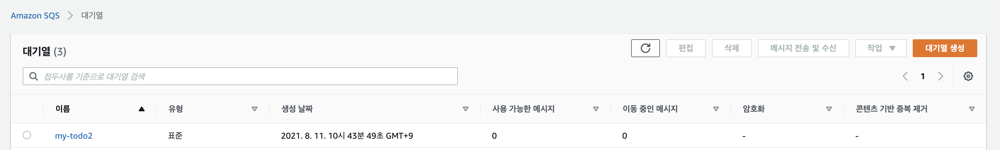
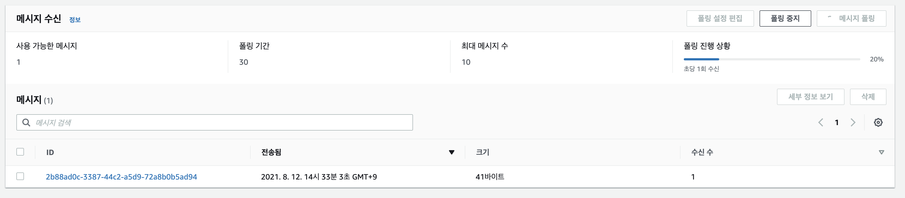
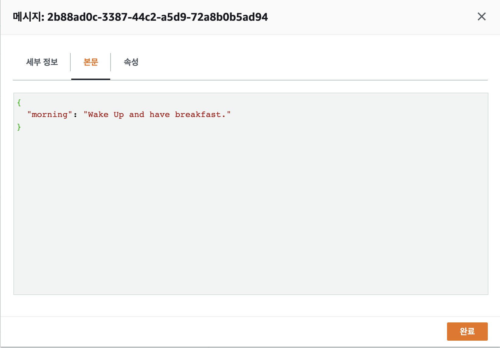
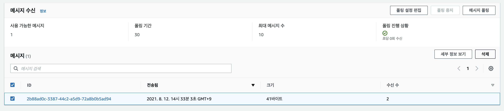

# SQS Hands On Part 01

## SQS 대기열 생성하기. 

### 유형민 치름 지정

- 이전 아티클에서 살펴본것과 같이 Standard (표준) 큐를 선택하자. 
- 아래 그림과 같이 이름은 MyTodo 로 작성했다. 

- 표준 대기열 (Standard Queue)
  - 무제한 초당 트랜잭션 (TPS) 를 지원한다. 
  - 메세지는 최소 한번 전송되지만 간혹 2개 이상의 메시지 사본이 전송되기도 함
  - 최적의 (Best effort) 순서 제공
  - 경우에 따라 메시지 전송 순서와 다르게 전송될 수 있다. 
  - 높은처리량 사용예:
    - 실시간 사용자 요청을 백그라운드 작업과 분리 - 미디어 크기 조정, 인코딩 등 (백단 작업 진행시)
    - 어러 워커 노드에 작업 할당시 - 대량 신용카드 확인 등
- FIFO 대기열 (FIFO Queue)
  - 초당 3000개 메시지 지원
  - 각 메시지는 정확히 1번 전송
  - 메시지 순서 보장
  - 반드시 1번 전송, 중복 허용하지 않는 케이스에 활용
  - 큐 이름은 반드시 .fifo 로 끝나야함
  - 사용예:
    - 사용자가 입력한 명령이 올바른 순서로 실행 보장
    - 가격 수정을 올바로 수행해야하는 경우 

### 메시지 Config 설정 

- 구성은 메시지의 크기, 타 컨슈머에 메시지 표시여부, 보존기단 등 
- 기본값을 그대로 사용한다. 

- 표시 제한 시간: 
  - 한 컨슈머가 대기열에서 수신한 메시지가 다른 메시지 컨슈머에게 보이지 않게되는 시간
  - 컨슈머가 메시지를 가져가고, 처리 및 삭제하지 못하면 다른 컨슈머에게 메시지가 보이게 된다. (즉, 1번만 메시지 보여야 하는 경우라면 시간내 삭제 필요)
  - 기본값은 30초 (컨슈머가 처리하는 시간에 따라 조정 필요)
  - 한번 설정하면 큐 내부의 모든 메시지에 대해서 적용이 된다. 
  - 최적의 성능을 위해서 표시 제한 시간 초과는 AWS SDK 읽기 제한 시간보다 길게 설정해야한다. 
- 메시지 보존 기간:
  - Amazon SQS 가 삭제 되지 않은 메시지를 보관하는 시간
  - 보존기간 범위 60초(1분) ~ 1,209,600초(14일) 까지 가능
  - 대기열, 배달하지 못한 메시지 대기열 통합 시간임 (그러므로 배달 못한 메시지 대기열의 보존 기간을 원래 대기열의 보존 기간보다 길제 잡아야한다.)
- 전송 지연:
  - 이 대기열에 추가된 각 메시지의 첫 번째 전송에 대한 지연 시간 
  - 지정된 시간동안 메시지는 컨슈머에게 소비 되지 않고 지연된다. 
  - 0초 ~ 15분까지 설정 가능 
  - Standard 는 한번 설정된 시간은 계속 흘러 지연되었다가 진행
  - FIFO 는 설정 변경하면 이후 메시지부터 적용됨 
- 최대 메시지 크기:
  - 이 대기열에 최대 메시지 크기
  - 1바이트 ~ 256KB까지 크기 가능 
  - 256KB보다 큰 메시지 전송시에는 Amazon SQS Extended Client Library 를 이용하여 전송 가능 
  - Amazon S3에 메시지 로드에 대한 참조가 포함된 메시지 전송
  - 최대 크기는 2GB까지 가능 
- 메시지 수신 대기 시간:
  - 폴링이 메시지를 사용할 수 있을 때까지 기다리는 최대 시간
  - 0초 ~ 20초까지 가능
  - 긴 폴링은 빈 응답수 (ReceiveMessage 요청에 사용할 수 메시지가 없는경우)와 잘못된 빈 응답(메시지를 사용할 수 있지만 응답에 포함되지 않은경우)를 제거 하여 Amazon SQS 사용 비용 줄이기 가능
  - 수신 요청이 최대 메시지 수를 수집하면 즉시 반환
  - 0으로 설정하면 짧은 폴링이 됨 
- 콘텐츠 기반 중복 제거:
  - Amazon SQS 는 메시지 본문에 기반하여 중복 제거 ID를 자동 생성 가능

### 액세스 정책설정

- 액세스 정책은 이 대기열에 액세스 할 수 있는 계정 및 사용자와 허용되는 작업을 정의한다. 
- 기본 설정에서 메시지를 보낼 수 있는 사람과, 메시지르 수신할 수 있는 사람을 구성할 수 있다. 
- JSON(읽기 전용) 에 정책이 설정된다. 
- 기본적으로 메시지 대기열 주인만 쓰고/읽을 수 있다. 
- 고급 설정은 직접 JSON 을 변경하여 권한을 설정할 수 있다. 

- 위 그림과 같이 설정이 가능하다. 
  - 전송권한
    - 대기열 소유자만
    - 지정된 AWS 계정, IAM 사용자 및 역할만
  - 수신권한
    - 대기열 소유자만
    - 지정된 AWS 계정, IAM 사용자 및 역할만
  

### 암호화 여부 

- SSE(Server Side Encryption) 을 활성화 하면 모든 메시지를 암호화 한다. 
- 권한이 있는 소비자에게 전송되는 경우에만 메시지 해독
- SSE는 메시지 본문 암호화, 필드단위 암호화는 지원 안함

### 배달 못한 편지 대기열

- 메시지를 소비할 수 없는 경우 배달 되지 못한 편지 대기열 (DLQ)로 전송할 수 있다. 
- 문제가 있는 메시지 격리하고 원인 분석 가능
- 자동으로 생성되지 않으며, 생성 지정을 해야한다. 

### 태그 

- SQS를 위한 태그를 지정한다. 

## 생성 결과 

## Test 수행하기. 

### 메시지 생성하기. 

- 생성된 MyTodo SQS 상세 정보로 들어가서 "메시지 전송 및 수신" 을 클릭한다. 

- 메시지 내용을 위와 같이 작성하자. 
- 메시지 내용은 어떻게 작성하든 상관이 없지만, 형식을 지정해서 사용하는 것이 유용하다. 

- 메시지 속성은, 메시지 필터링을 위한 정보를 설정할 수 있다. 이 부분은 지금은 필요 없다. 

### 메시지 수신하기. 

- 생성된 메시지는 Queue에 들어가 있고, 수신을 기다리는 상태가 되었다. 

- 다음과 같이 메시지 수신 > 메시지 폴링 을 클릭하여 메시지를 가져오자. 
- 메시지가 수신되었음을 확인할 수 있다. 

- 메시지 상세 내용을 보면, 조금전 전송한 메시지임을 확인할 수 있다. 

- 수신된 메시지를 확인했으므로 이제 삭제를 해주자. 
- 메시지 수신 > 메시지 항목에 체크를 하고, "삭제" 버튼으로 메시지를 큐에서 제거하자. 

## Wrap UP

- 간단하게 SQS를 생성해보고, 동작 방식에 대한 이해를 해 보았다. 
- 단순하게 SQS 원하는 시스템에 따라서 필요한 타입을 선택하고, 사용할 수 있다. 

