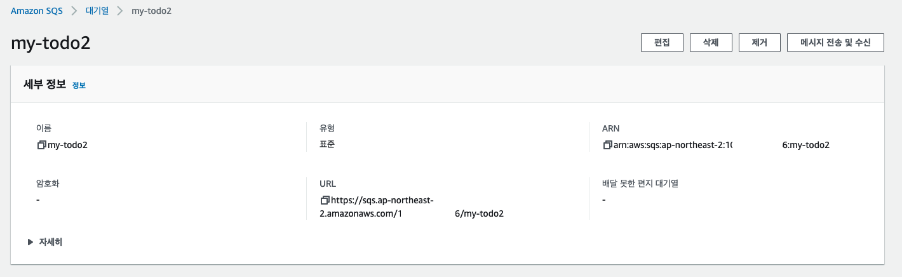

# SQS With JMS (Java Message Service)

## Overview 

- Amazon SQS와 JMS (Java Message Service) 를 사용하여 메시지를 전송/수신 할 수 있다. 
- JMS를 이용하면, Amazon SQS에 Queue가 존재하는지 확인하고, 존재하지 않는다면 메시지 대기열을 생성한다. 

- JMS와 연동을 위한 스텝은 다음과 같다. 
  - 프로젝트 생성 (sender, receiver) 각각 생성
  - JMS 연결 생성
  - Amazon SQS 메시지 큐 존재 확인 및 생성
  - 메시지 전송
  - 메시지 수신
  - 메시지 비동기 수신

## 프로젝트 생성하기 

- https://start.spring.io 에 접근하여 다음과 같이 프로젝트를 생성한다. 


- GENERATE를 클릭하고 IDE 툴에서 프로젝트를 열자. 

### 의존성 추가하기. 

- AWS SQS 를 사용하기 위한 의존성 라이브러리를 추가한다. 

```xml
<dependency>
  <groupId>com.amazonaws</groupId>
  <artifactId>amazon-sqs-java-messaging-lib</artifactId>
  <version>1.0.4</version>
  <type>jar</type>
</dependency>
```

### AWS CLI로 AWS 자격증명 등록하기. 

- 우선 AWS에 직접 접근하기 위해서는 AWS 자격증명 (credential)을 등록해야한다. 
- 자격증명 등록을 위해서는 [다음 사이트를](https://docs.aws.amazon.com/ko_kr/cli/latest/userguide/cli-configure-profiles.html) 참조하자. 
- 이미 terraform_user 에 대한 credential을 등록했다면 아래 내용을 스킵하자. 

```go
aws configure --profile terraform_user
```

### Configure 설정하기. 

- 이제는 Configure를 설정할 차례이다. 
- AWS SQS는 JMS와 연동하여 Java 에서 메시지를 SQS로 전송할 때 JMS 를 이용할 수 있게 해준다. 

com.schooldevops.sqs.jms.configs.SQSConfig.java 파일을 아래와 같이 작성하자. 

```go
package com.schooldevops.sqs.jms.configs;

import com.amazon.sqs.javamessaging.ProviderConfiguration;
import com.amazon.sqs.javamessaging.SQSConnectionFactory;
import com.amazonaws.auth.profile.ProfileCredentialsProvider;
import com.amazonaws.client.builder.AwsClientBuilder;
import com.amazonaws.services.sqs.AmazonSQSClientBuilder;
import org.springframework.context.annotation.Bean;
import org.springframework.context.annotation.Configuration;

@Configuration
public class SQSConfig {

    @Bean
    public SQSConnectionFactory sqsConnectionFactory() {
        SQSConnectionFactory connectionFactory = new SQSConnectionFactory(
                new ProviderConfiguration(),
                AmazonSQSClientBuilder.standard().withEndpointConfiguration(
                        new AwsClientBuilder.EndpointConfiguration(
                                "https://sqs.ap-northeast-2.amazonaws.com/1XXXXXX6/my-todo2",
                                "ap-northeast-2")
                ).withCredentials(new ProfileCredentialsProvider("terraform_user"))
        );

        return connectionFactory;
    }
}

```

- 위 내용은 SQSConnectionFactory 를 Spring Bean으로 등록하는 소스이다. 
- SQSConnectionFactory 는 Java Application에서 SQS로 커넥션을 등록하고 커넥션 객체를 반환하는 팩토리 객체이다. 
- SQSConnectionFactory는 프로바이더 설정 (ProviderConfiguration) 과 엔드포인트와 엔드포인트 연관정보를 설정할 수 있도록 해준다. 
  - Endpoint는 AWS SQS내에 존재하는 엔드포인트 URL을 복사하여 설정해주면 된다. 

**URL참고**



- 위 그림과 같이 url 부분을 복사하여 EndpointConfiguration에 추가하면 된다. 

- 그리고 마지막으로 withCredential을 이용하여 우리가 등록한 profile 을 지정해주면 실행되는 머신의 credential profile을 이용하여 AWS에 접근하게 된다. 

### Sender 서비스 생성하기. 

- 이제는 메시지 전송을 위해서 SQSService를 생성해보자. 
- 소스는 com.schooldevops.sqs.jms.services.SQSService.java로 생성하자. 
  
```go
package com.schooldevops.sqs.jms.services;

import com.amazon.sqs.javamessaging.AmazonSQSMessagingClientWrapper;
import com.amazon.sqs.javamessaging.SQSConnection;
import com.amazon.sqs.javamessaging.SQSConnectionFactory;
import com.amazonaws.services.sqs.model.CreateQueueRequest;
import org.springframework.beans.factory.annotation.Autowired;
import org.springframework.stereotype.Service;

import javax.jms.*;
import java.util.HashMap;
import java.util.Map;

@Service
public class SQSService {

    @Autowired
    SQSConnectionFactory sqsConnectionFactory;

    public String send(final String queueName, final String message) throws RuntimeException {

        Session session = null;

        try {
            // Connection 생성하기.
            SQSConnection connection = sqsConnectionFactory.createConnection();

            makeQueue(connection, queueName);

            session = connection.createSession(false, Session.AUTO_ACKNOWLEDGE);
            Queue queue = session.createQueue(queueName);
            MessageProducer producer = session.createProducer(queue);

            TextMessage textMessage = session.createTextMessage(message);
            producer.send(textMessage);


        } catch (Exception e) {
            System.out.println(e.getMessage());
            System.out.println(e);

            throw new RuntimeException(e);
        } finally {
            if (session != null) {
                try {
                    session.close();
                } catch (JMSException e) {
                    System.out.println(e.getMessage());
                    System.out.println(e);
                    throw new RuntimeException(e);
                }
            }
        }

        return message;
    }

    public String receive(final String queueName) throws RuntimeException {
        Session session = null;

        try {
            // Connection 생성하기.
            SQSConnection connection = sqsConnectionFactory.createConnection();

            makeQueue(connection, queueName);
//            makeFifoQueue(connection, queueName);

            session = connection.createSession(false, Session.AUTO_ACKNOWLEDGE);
            Queue queue = session.createQueue(queueName);
            // Create a consumer for the 'MyQueue'
            MessageConsumer consumer = session.createConsumer(queue);
            // Start receiving incoming messages
            connection.start();

            // Receive a message from 'MyQueue' and wait up to 1 second
            Message receivedMessage = consumer.receive(1000);

            // Cast the received message as TextMessage and display the text
            if (receivedMessage != null) {
                System.out.println("Received: " + ((TextMessage) receivedMessage).getText());
                return ((TextMessage) receivedMessage).getText();
            }
            return null;

        } catch (Exception e) {
            System.out.println(e.getMessage());
            System.out.println(e);

            throw new RuntimeException(e);
        } finally {
            if (session != null) {
                try {
                    session.close();
                } catch (JMSException e) {
                    System.out.println(e.getMessage());
                    System.out.println(e);
                    throw new RuntimeException(e);
                }
            }
        }
    }

    private void makeQueue(SQSConnection connection, String queueName) throws Exception {
        // Get the wrapped client
        AmazonSQSMessagingClientWrapper client = connection.getWrappedAmazonSQSClient();

        // Create an SQS queue named MyQueue, if it doesn't already exist
        if (!client.queueExists(queueName)) {
            client.createQueue(queueName);
        }
    }


    private void makeFifoQueue(SQSConnection connection, String queueName) throws Exception {
        // Get the wrapped client
        AmazonSQSMessagingClientWrapper client = connection.getWrappedAmazonSQSClient();

        String fQueueName = String.format("%s.fifo", queueName);
        // Create an Amazon SQS FIFO queue named MyQueue.fifo, if it doesn't already exist
        if (!client.queueExists(fQueueName)) {
            Map<String, String> attributes = new HashMap<String, String>();
            attributes.put("FifoQueue", "true");
            attributes.put("ContentBasedDeduplication", "true");
            client.createQueue(new CreateQueueRequest().withQueueName(fQueueName).withAttributes(attributes));
        }
    }
}

```

- 위 코드는 전체 코드이다. 하나씩 실펴보자. 

#### SQSConnectionFactory 사용하기. 

- 이를 위해서 아래와 같이 Autowire 했다. 
- SQSConnectionFactory는 이미 Config 에서 Bean으로 등록했다. 

```go
    @Autowired
    SQSConnectionFactory sqsConnectionFactory;
```

#### Send 메소드 생성하기. 

```go
    public String send(final String queueName, final String message) throws RuntimeException {

        Session session = null;

        try {
            // Connection 생성하기.
            SQSConnection connection = sqsConnectionFactory.createConnection();

            makeQueue(connection, queueName);

            session = connection.createSession(false, Session.AUTO_ACKNOWLEDGE);
            Queue queue = session.createQueue(queueName);
            MessageProducer producer = session.createProducer(queue);

            TextMessage textMessage = session.createTextMessage(message);
            producer.send(textMessage);


        } catch (Exception e) {
            System.out.println(e.getMessage());
            System.out.println(e);

            throw new RuntimeException(e);
        } finally {
            if (session != null) {
                try {
                    session.close();
                } catch (JMSException e) {
                    System.out.println(e.getMessage());
                    System.out.println(e);
                    throw new RuntimeException(e);
                }
            }
        }

        return message;
    }
```

- Send 메소드를 생성하고 2개의 파라미터를 받는다. 
  - queueName: 전송할 큐 이름을 파라미터로 받는다. 
  - message: 전송할 메시지로 문자열로 전송한다. 
- sqsConnectionFactory.createConnection() 을 이용하여 커넥션을 생성했다. 
- makeQueue 메소드는 큐의 존재를 확인하고, 없다면 새로 생성하는 메소드이다. 
- 큐를 생성하였다면 이제는 createSession을 이용하여 큐와 연동할 세션을 생성한다. 
  - transacted: false가 기본 값이다. 
  - Session.AUTO_ACKNOWLEDGE: 이를 이용하여 수신하면 큐로 수신 애크를 전송하고, 큐에서 메시지를 삭제한다. 
- `MessageProducer producer = session.createProducer(queue);` 를 이용하여 메시지 프로듀서를 생성하였다. 
- `TextMessage textMessage = session.createTextMessage(message);` 는 전송할 메시지를 생성하였다. 
- 그리고 send 를 통해서 메시지를 큐로 전송하였다. 
- 이후 메시지가 전송되고 나면 커넥션을 클로즈 하였다. 


#### Queue 생성 메소드

```go
    private void makeQueue(SQSConnection connection, String queueName) throws Exception {
        // Get the wrapped client
        AmazonSQSMessagingClientWrapper client = connection.getWrappedAmazonSQSClient();

        // Create an SQS queue named MyQueue, if it doesn't already exist
        if (!client.queueExists(queueName)) {
            client.createQueue(queueName);
        }
    }
```

- 위과 같이 메시지 큐를 확인하고, 큐가 존재하지 않는경우 큐를 생성한다. 
- 해당 소스는 Standard Queue를 생성하는 코드이다. 
- 만약 Fifo Queue를 생성한다면 아래와 같이 FiFo Queue 생성 메소드를 확인하자. 

```go
    private void makeFifoQueue(SQSConnection connection, String queueName) throws Exception {
        // Get the wrapped client
        AmazonSQSMessagingClientWrapper client = connection.getWrappedAmazonSQSClient();

        String fQueueName = String.format("%s.fifo", queueName);
        // Create an Amazon SQS FIFO queue named MyQueue.fifo, if it doesn't already exist
        if (!client.queueExists(fQueueName)) {
            Map<String, String> attributes = new HashMap<String, String>();
            attributes.put("FifoQueue", "true");
            attributes.put("ContentBasedDeduplication", "true");
            client.createQueue(new CreateQueueRequest().withQueueName(fQueueName).withAttributes(attributes));
        }
    }
```

- FIFO queue는 반드시 큐 이름이 *.fifo 로 끝나야한다. 
- 큐 속성은 FifoQueue 값을 true로 설정하였다. 
- ContentBasedDeduplication 값은 true로 설정하였으며, 이는 큐 내에서 중복을 제거하여 정확히 1번 전송, 1번 수신으로 동작하도록 한다. 

#### 동기식 수신 메소드 생성하기. 

- 큐는 동기/비동기로 수신을 할 수 있다. 
- 아래 메소드는 동기 방식으로 수신을 한다.

```go

    public String receive(final String queueName) throws RuntimeException {
        Session session = null;

        try {
            // Connection 생성하기.
            SQSConnection connection = sqsConnectionFactory.createConnection();

            makeQueue(connection, queueName);

            session = connection.createSession(false, Session.AUTO_ACKNOWLEDGE);
            Queue queue = session.createQueue(queueName);
            // Create a consumer for the 'MyQueue'
            MessageConsumer consumer = session.createConsumer(queue);
            // Start receiving incoming messages
            connection.start();

            // Receive a message from 'MyQueue' and wait up to 1 second
            Message receivedMessage = consumer.receive(1000);

            // Cast the received message as TextMessage and display the text
            if (receivedMessage != null) {
                System.out.println("Received: " + ((TextMessage) receivedMessage).getText());
                return ((TextMessage) receivedMessage).getText();
            }
            return null;

        } catch (Exception e) {
            System.out.println(e.getMessage());
            System.out.println(e);

            throw new RuntimeException(e);
        } finally {
            if (session != null) {
                try {
                    session.close();
                } catch (JMSException e) {
                    System.out.println(e.getMessage());
                    System.out.println(e);
                    throw new RuntimeException(e);
                }
            }
        }
    }

```

- 동기 수신의 경우도, 커넥션을 생성하고, 세션을 생성하는 코드는 센더와 동일하다. 
- `MessageConsumer consumer = session.createConsumer(queue);` 를 이용하여 컨슈머를 생성한다. 
- 그리고 수신을 위해서 커넥션과 연동하는 코드를 추가한다. `connection.start();` 이며 이는 수신을 기다리게 된다. 
- `Message receivedMessage = consumer.receive(1000);` 을 이용하여 1초동안 대기한 후 컨슈머에서 메시지를 가져온다.
- 수신된 메시지는 `((TextMessage) receivedMessage).getText()` 로 메시지를 변환할 수 있다. 
- 수신이 완료되면 커넥션을 클로즈 해준다. 

### 메시지 전송용 API 생성하기.

- 이제는 큐로 메시지를 전송하기 위해서 REST API 를 아래와 같이 만들자. 
- com.schooldevops.sqs.jms.controllers.SendController.java 에 다음 코드를 작성하자. 

```go
package com.schooldevops.sqs.jms.controllers;

import com.schooldevops.sqs.jms.services.SQSService;
import org.springframework.beans.factory.annotation.Autowired;
import org.springframework.web.bind.annotation.PathVariable;
import org.springframework.web.bind.annotation.PostMapping;
import org.springframework.web.bind.annotation.RestController;

@RestController
public class SendController {

    @Autowired
    SQSService sqsService;

    @PostMapping("/message/{msg}")
    public String sendMsg(@PathVariable("msg") String msg) {
        return sqsService.send("my-todo2", msg);
    }
}

```

- sqsService 빈을 이용하여 메시지를 전송하였다. 

## 메시지 수신코드 작성하기. 

- 메시지 센더와 동일하게 메시지 수신기를 위한 프로젝트를 생성하자. 
- maven 의존성 설정도 Sender도 동일하다. 
- 또한 config 설정을 통한 SQSConnectionFactory 빈 등록 역시 동일하다. (상기 센더 코드 참조)

### 비동기 Listener 작성하기. 

- 메시지를 비동기로 수신하기 위해서 MessageListener 를 구현한 코드를 다음과 같이 작성하자. 
- com.schooldevops.sqs.jms.services.SQSMsgListener.java 코드를 생성하고 아래와 같이 작성하자. 

```go
package com.schooldevops.sqs.jms.services;

import javax.jms.JMSException;
import javax.jms.Message;
import javax.jms.MessageListener;
import javax.jms.TextMessage;

public class SQSMsgListener implements MessageListener {
    @Override
    public void onMessage(Message message) {
        try {
            // Cast the received message as TextMessage and print the text to screen.
            System.out.println("Received: " + ((TextMessage) message).getText());
        } catch (JMSException e) {
            e.printStackTrace();
        }
    }
}

```

- 위 코드는 JMS의 MessageListener 를 구현한다. 
- 구현된 코드는 onMessage 메소드를 오버라이드 해야한다. 
- Message를 수신 받으면, `((TextMessage) message).getText()` 로 변환해서 사용하면 된다. 

### MsgListener를 등록하기 위한 Service 생성하기. 

- Sender과 유사하게 Service를 등록하자. 
- `com.schooldevops.sqs.jms.services.SQSService.java` 를 생성하고 아래와 같이 작성하자 

```go
package com.schooldevops.sqs.jms.services;

import com.amazon.sqs.javamessaging.AmazonSQSMessagingClientWrapper;
import com.amazon.sqs.javamessaging.SQSConnection;
import com.amazon.sqs.javamessaging.SQSConnectionFactory;
import com.amazonaws.services.sqs.model.CreateQueueRequest;
import org.springframework.beans.factory.annotation.Autowired;
import org.springframework.stereotype.Service;

import javax.jms.*;
import java.util.HashMap;
import java.util.Map;

@Service
public class SQSService {

    @Autowired
    SQSConnectionFactory sqsConnectionFactory;

    public void setAsyncConsumer(final String queueName) {
        Session session = null;

        try {
            // Connection 생성하기.
            SQSConnection connection = sqsConnectionFactory.createConnection();

            makeQueue(connection, queueName);

            session = connection.createSession(false, Session.AUTO_ACKNOWLEDGE);
            Queue queue = session.createQueue(queueName);

            MessageConsumer consumer = session.createConsumer(queue);
            consumer.setMessageListener(new SQSMsgListener());
            connection.start();

        } catch (Exception e) {
            System.out.println(e.getMessage());
            System.out.println(e);

            throw new RuntimeException(e);
        }
    }

    private void makeQueue(SQSConnection connection, String queueName) throws Exception {
        // Get the wrapped client
        AmazonSQSMessagingClientWrapper client = connection.getWrappedAmazonSQSClient();

        // Create an SQS queue named MyQueue, if it doesn't already exist
        if (!client.queueExists(queueName)) {
            client.createQueue(queueName);
        }
    }

}

```

- setAsyncConsumer 메소드는 커넥션, 세션 생성은 Sender와 동일하다. 
- Consumer 에서 비동기 수신을 위해서 `consumer.setMessageListener(new SQSMsgListener());` 를 작성했다. 
- 이코드로 MessageListener가 비동기로 등록되어 사용한다. 

### 비동기 생성 코드 실행하기. 

- 이제 서버가 수행될때, 비동기 메시지 리스너를 실행하기 위해서 다음과 같이 코드를 실행하자. 
- `com.schooldevops.sqs.jms.JmsApplication.java` 에서 코드를 다음과 같이 작성한다. 

```go
package com.schooldevops.sqs.jms;

import com.schooldevops.sqs.jms.services.SQSService;
import org.springframework.beans.factory.annotation.Autowired;
import org.springframework.boot.CommandLineRunner;
import org.springframework.boot.SpringApplication;
import org.springframework.boot.autoconfigure.SpringBootApplication;

@SpringBootApplication
public class JmsApplication implements CommandLineRunner {

	@Autowired
	SQSService sqsService;

	public static void main(String[] args) {
		SpringApplication.run(JmsApplication.class, args);
	}

	@Override
	public void run(String... args) throws Exception {
		sqsService.setAsyncConsumer("my-todo2");
	}
}

```

- 서비스를 Autowired 하였고, CommandLineRunner 을 구현하여 Application 이 BootUp 될때 커맨드 라인이 수행되도록 했다. 
- 커맨드 라인으로 `sqsService.setAsyncConsumer("my-todo2");` 을 호출하였고, my-todo2 큐로 부터 컨슘 하도록 한다. 

## 테스트 수행하기. 

- jms_sender를 아래와 같이 수행하자. 

```go
mvn spring-boot:run
```

- jms_receiver를 아래와 같이 수행하자. 

```go
mvn spring-boot:run -Dserver.port=9090
```


- 그리고 다음과 같이 curl 을 통해서 메시지를 전송하자. 

```go
curl -X POST http://localhost:8080/message/Hello-THUB

Hello-THUB
```

- jms_receiver 콘솔을 확인해보면 다음과 같이 메시지가 전송되는 것을 확인할 수 있다. 

```go
Hello-THUB
```

## Wrapup 

- 지금까지 AWS와 JMS를 활용하여 메시지를 전송/수신 하는 방법을 확인해 보았다. 
- 관련 [GitHub](https://github.com/schooldevops/AWS_Tutorials_by_kido/tree/main/sources/JMS)는 다음에서 확인하자. 