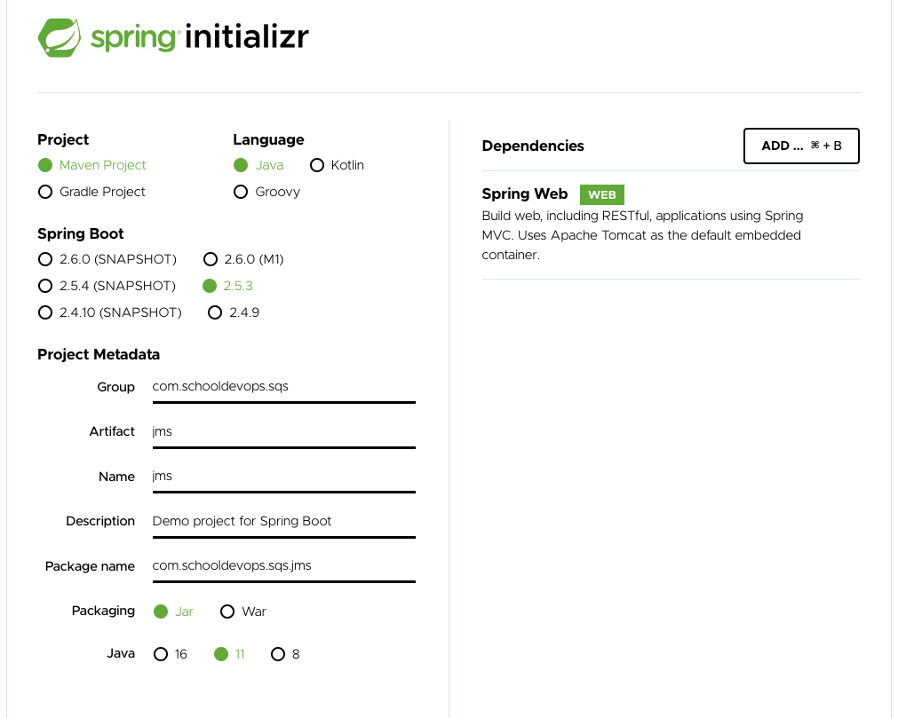

# SQS With JMS (Java Message Service)

## Overview 

- Amazon SQS와 JMS (Java Message Service) 를 사용하여 메시지를 전송/수신 할 수 있다. 
- JMS를 이용하면, Amazon SQS에 Queue가 존재하는지 확인하고, 존재하지 않는다면 메시지 대기열을 생성한다. 

- JMS와 연동을 위한 스텝은 다음과 같다. 
  - 프로젝트 생성 (sender, receiver) 각각 생성
  - JMS 연결 생성
  - Amazon SQS 메시지 큐 존재 확인 및 생성
  - 메시지 전송
  - 메시지 수신
  - 메시지 비동기 수신

## 프로젝트 생성하기 

- https://start.spring.io 에 접근하여 다음과 같이 프로젝트를 생성한다. 



- GENERATE를 클릭하고 IDE 툴에서 프로젝트를 열자. 

### 의존성 추가하기. 

- AWS SQS 를 사용하기 위한 의존성 라이브러리를 추가한다. 

```xml
<dependency>
  <groupId>com.amazonaws</groupId>
  <artifactId>amazon-sqs-java-messaging-lib</artifactId>
  <version>1.0.4</version>
  <type>jar</type>
</dependency>
```

  