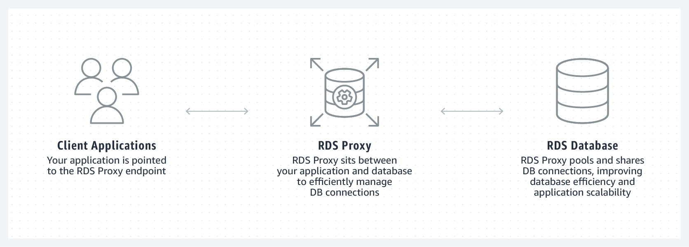

# AWS RDS Proxy

- AWS RDS는 Relation Database Service 의 약자로 관리된 데이터베이스 서비스이다.
- 데이터베이스가 가진 문제
  - 데이터베이스에 수많은 Connection이 생기며, 이 연결의 최대 수에 대한 제한이 있음, 적절한 배분이 필요함
  - 데이터베이스 관련 오류를 처리하는 방법이 필요하며, 개발자가 개발해야하는 부분

- RDS Proxy 는 Amazon RDS에 대한 완젼 관리형 데이터베이스 프록시 서비스이다. 
- 커넥션 풀링을 통해 커넥션 공유
- 데이터베이스 장애에 탄력적으로 대응
- 어플리케이션 확장 지원 등을 수행한다. 

## RDS Proxy 이점

- 커넥션 풀링 지원
  - 데이터베이스 커넥션 과정을 최소한으로 줄여주어 어플리케이션 성능향상 제공
- 데이터베이스 failover 대응
  - 데이터베이스 failover 대응으로 어플리케이션 가용성 향상
- IAM 인증을 사용하여 데이터베이스에 연동
  - IAM 인증과 연동되어 어플리케이션 코드에서 데이터베이스 연결을 위한 민감정보 제거
- Aurora MySQL, Aurora PostgreSQL, RDS for MySQL, RDS for PostgreSQL 지원 

### 커넥션 풀링 

- 커넥션 풀링은 데이터베이스 커넥션을 공유하고 재사용할 수 있도록 하여 어플리케이션 최적화를 수행한다. 
- 또한 커넥션 풀링을 이용하면 최소한의 연결만 수행될 수 있도록 불필요한 커넥션을 제거한다. 
- 데이터베이스 커넥션을 매번 맺어주는 것은 데이터베이스 상의 CPU 작업을 늘이고, 메모리를 소비하게 된다.
- RDS Proxy는 어플리케이션에서 데이터베이스 커넥션 코드를 제거하도록 지원한다. 
- 즉, 최소한의 리소스 오버헤드를 줄이며, 어플리케이션 내에서 커넥션을 공유한다. 

### Pinning

- Pinning은 하나의 세션이 끝날때 까지 동일한 연결이 세션에서 사용되는 것을 말한다. 이 경우 세션 외부에서 데이터베이스 연결을 안전하게 재사용하기 쉽지 않다. 
- AWS 는 pinning을 가능한 피할 수 있도록 가이드 하고 있다. 

### 장애 핸들링

- 데이터베이스의 FailOver는 대표적인 장애 시나리오 중의 하나이다. 
- 마스터 데이터베이스 노드가 문제가 생기면, 보조 데이터베이스 노드로 FailOver가 일어난다. 
- 이는 데이터베이스 업그레이드와 같은 관리작업이 수행되는 경우 혹은 데이터베이스 인스턴스에 문제가 발생한 경우 일어난다. 
- RDS Proxy는 이러한 상황에서 가용성을 극대화 하도록 한다. 
  - 인스턴스 장애가 생긴경우 다른 인스턴스로 FailOver한다. 
  - 새로운 인스턴스로 FailOver 동안 수신한 요청을 유지하는 방법으로 가용성을 향상 시킨다. 
- AWS는 RDS proxy 가 장애 조치 시간을 30 ~ 60% 개선한다고 말하고 있다. 

### RDS Proxy 보안

- RDS Proxy는 어플리케이션과 데이터베이스 사이에 추가적인 레이어를 둔다.
- AWS는 IAM 인증을 사용하길 추천하며, 이를 통해서 코드에 데이터베이스 인증에 대한 크레덴셜을 기술하지 않아도 되는 이점이 있다. 

### 가격

- RDS Proxy 는 각 활성화된 데이터베이스 인스턴스에 대해서 시간당 vCPU당 과금 된다. 
- 가격은 RDS 인스턴스 타입에 따라 다르다. 인스턴스가 더 크다면 더 많은 과금이 된다. 
- 부분 시간에 대한 요금은 10분을 최소로 하며 초당 과금된다. 

### RDS Proxy 모니터링 

- RDS Proxy 는 Amazon CloudWatch를 통해 수행된다. 
- CloudWatch 는 proxy에 대한 성능과 행위에 대한 모니터링을 수행하며, 유용한 메트릭을 제공한다. 
- 핵심 메트릭:
  - DatabaseConnections: 데이터베이스와 연결된 커넥션 개수 
  - DatabaseConnectionsCurrentlyBorrowed: 현재 어플리케이션에 의해서 사용되는 커넥션 개수, 이 메트릭상의 알람은 매우 중요하다. 
  - DatabaseConnectionsCurrentlySessionPinned: pin 상태에 들어가 있는 커넥션 개수, 이 숫자는 가능한한 낮아야 RDS성능을 극대화 할 수 있다.

### RDS Proxy의 한계점

- 반드시 데이터베이스 인스턴스와 동일한 VPC에만 둘 수 있다. 퍼블릭 접근은 수행할 수 없다. 
- RDS proxy는 EC2에 설치한 데이터베이스와 연동이 안된다. 
- RDS proxy는 Aurora Serverless 를 아직 지원하지 않는다. 
- Proxy는 오직 1개의 데이터베이스 인스턴스에만 연동이 된다. 

### 적합한 사용처

- 예측이 어려운 워크로드
- 데이터베이스 커넥션을 자주 오픈/클로즈 하는 경우 
- 고 가용성이 필요한 경우 

from: https://www.learnaws.org/2020/12/13/aws-rds-proxy-deep-dive/

