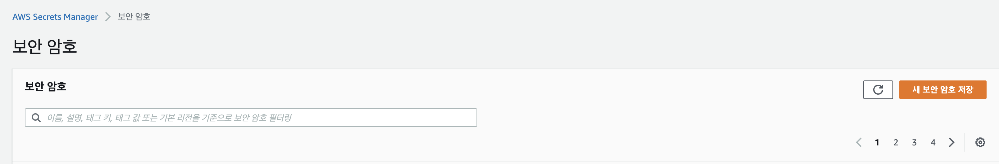
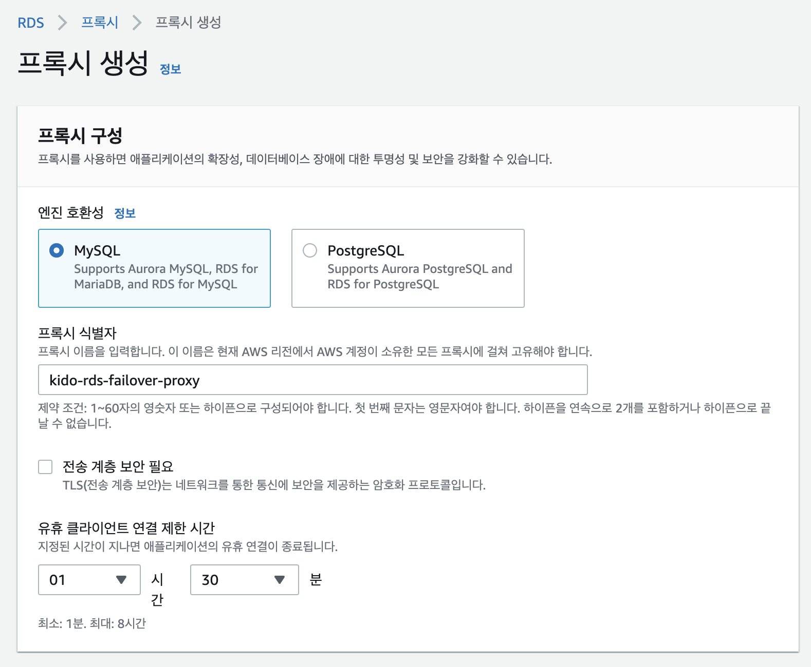

# RDS Proxy 설치하기. 

from: https://aws.amazon.com/ko/getting-started/hands-on/set-up-shared-database-connection-amazon-rds-proxy/

- RDS Proxy는 RDS의 완전 관리형 및 고가용성 데이터베이스 프록시, 어플리케이션 확장성, 데이터베이스 장애 복원력, 보안 강화 
- Lambda 사용시 효과 증대
  - 데이터베이스에 다수의 연결 설정필요
  - 빠르게 데이터베이스 연결 열기/닫기 필요
  - RDS proxy 이용하여 커넥션 풀링 및 공유가능하여 데이터베이스 효율성 증대 및 어플리케이션 확장성 증가 
  - 장애조치 시간을 최대 66% 단축
  - AWS Secrets Manager 및 IAM 과의 통합을 통해 데이터베이스 작겨 증명, 인증 및 액세스 관리 가능 
- RDS Proxy 이용시 코드 변경없이 사용 가능
- 추가 인프라 프로비저닝 필요 없음
- 예측가능하고 간단한 요금제 (데이터베이스 인스턴스의 VPC당 비용 지불)
- Amazon RDS for MySQL 및 Amazon Aurora with MySQL지원 

## 사전 조건

- VPC
- Cross-AZ 의 서브넷
- 동일한 VPC내 RDS 데이터베이스와 EC2 인스턴스
- IGW

## 작업단계

1. VPC 생성 및 Multi AZ 서브넷 생성
2. RDS Database 생성 multi AZ용
3. 테스트용 EC2 생성
4. 보안그룹 적용
5. AWS Secrets Manager 에 데이터베이스 자격 증명 저장
6. IAM 역할 및 정책 생성
7. RDS Proxy 생성 
8. RDS Proxy 와 DB 연결
9.  RDS Proxy 연결 모니터링 
10. 연동 코드 생성 및 트래픽 주입 
11. 연동 테스트
12. FailOver 테스트
13. 리소스 정리 

### VPC 생성 및 Multi AZ 서브넷 생성 


- VPC 생성을 수행하면 VPC등을 통해서 한번에 VPC와 서브넷, 라우팅을 동시에 생성한다. 


- NAT Gateway은 일단 생성하지 않는다.
- VPC 엔드포인트를 생성하여 S3에 private 접근을 할 수 있도록 S3 Gateway를 생성한다.
- DNS 옵션으로 호스트이름 활성화/DNS 확인 활성화를 수행한다. 


- 생성된 Resource 정보목록을 확인할 수 있다. 

### RDS Database 생성 multi AZ용


- kido-rds-failover
  - admin
  - rdsadmin123
- DB인스턴스
  - db-t4g.micro : 테스트용으로 가격이 저렴한 그라비톤 이용 


- 이전 항목에서 생성한 VPC를 지정하여 RDS생성


- 상기 내용으로 작성하고 "데이터베이스 생성" 을 클릭하여 RDS를 생성한다. 
  
### 테스트용 EC2 생성

- RDS Proxy의 경우 동일 VPC에서만 접근이 가능하다. 
- 그러므로 테스트를 위한 EC2 인스턴스를 하나 생성할 것이다. 

#### 보안그룹 생성 

- EC2 > 보안그룹 > 생성
- 이름: kido-rds-failover-sg
- 인바운드규칙: SSH (22), 소스: 내IP address
- 아웃바운드규칙: All

#### 키페어 생성

- EC2 > 키 페어 > 생성
- 이름: kido-rds-failover-key

#### EC2 생성하기

- EC2 > 인스턴스 생성 


- 이름: rds-failover-ec2
- 인스턴스 타입: t2-micro
- VPC: kido-rds-failover-vpc
- Subnet: kido-rds-failover-subnet-public2-ap... (퍼블릭 서브넷 선택)
- 보안그룹: kido-rds-failover-sg 선택
- 키: kido-rds-failover-key 선택

- 위와 같이 선택하고 생성한다. 

#### RDSProxy 보안그룹에 EC2 보안그룹 등록하기 


- rds proxy 용 보안그룹을 선택 (여기서는 default에 지정했었다.)
- 인바운드 규칙 선택
  - 유형: 모든 트래픽
  - 소스: 화면과 같이 kido-rds-failover-sg 인 이전 ec2에 지정한 보안 그룹을 등록한다. (즉, EC2에서 요청을 RDSProxy에서 허용하겠다는 의미이다.)


### 보안그룹 적용

### AWS Secrets Manager 에 데이터베이스 자격 증명 저장



- SecretsManager 메뉴를 선택한다. 
- 새 보안암호 저장 을 클릭하여 새로운 보안 암호를 생성한다. 


- RDS 데이터베이스에 대한 자격 증명을 선택한다. 
- 사용자 이름: admin
- 암호: rdsadmin123 
- 암호화키: aws/secretsmanager
- 데이터베이스: 이전에 생성한 데이터베이스를 선택한다. 


- 보안 암호 이름: test/kido-rds-failover 로 입력한다. 
- 태그를 이미지와 같이 작성한다. 
- "다음"을 클릭하여 다음으로 넘어간다. 


- 자동 교체 구성은 사용하지 않는다. 
- 자동 교체 구성을 사용하면 보안을 향상 시킬 수 있다. 


- 교체함수는 사용하지 않고 "다음"을 클릭한다. 


- 보안 암호를 확인한다. 그럼 해당 목록이 나타난다. 
- 상세 화면에 접근하여 세부 정보를 확인한다. 


- 암호화키
- 보안 암호 설정
- 보안 암호 이름
- 보안 암호 ARN (이 부분은 미리 복제해 둔다. )


### IAM 역할 및 정책 생성


- IAM에 접속하여 역학 메뉴를 선택한다. 
- "역할 만들기" 를 선택하여 신규 역할을 생성한다. 


- AWS 서비스를 선택한다. 
- 다른 AWS 서비스의 사용사례를 선택하고 RDS-Add Role to Database를 선택한다. 
- 다음을 선택한다. 
    


- 권한 추가에서 "정책생성" 을 선택한다. 


- 정책 생성시에 위와 같이 JSON 정책을 추가한다. 
- 위 정책은 secretsmanager:GetRandomPassword, secretsmanager:CreateSecret, secretsmanager:ListSecrets 에 대한 액션을 모든 리소스에 적용해준다. 
- 또한 secretsmanager의 모든 액션을 우리가 생성한 이전 SecretsManager에서 생성한 secretARN에 대해서 부여한다. 


- 태그를 적절히 적어주어, 우리가 만든 정책을 인식할 수 있도록 설정한다. 
  


- 정책 이름을 지정한다. "kido-rds-failover-policy" 라고 지정해 주었다. 
  


- 이후 이전 권한 추가로 돌아가서 갱신 버튼을 클릭한다. 
- 그리고 kido-rds-failover-policy를 검색하여 정책을 찾고 선택한다. 


- 검토 항목에서 올바르게 적용되었는지 확인한다. 


- 롤의 이름, 태그를 지정하고 완료한다. 


- 생성한 롤을 확인할 수 있다. 

### RDS Proxy 생성 


- RDS > Proxy 메뉴를 선택한다. 
- 그리고 "프록시 생성"을 클릭한다. 
  


- 프록시 구성 > 엔진 호환성을 "MySQL"을 선택한다. 
- 식별자: kido-rds-failover-proxy 로 이름을 지정한다. 
- 나머지 부분은 그대로 둔다. 
  


- 대상그룹 > 데이터베이스 에서 이전에 생성한 RDS를 선택한다. 
- 연결풀 설정은 최대 100으로 그대로 둔다. 
  


- secretsManager 보안암호를 이전에 생성한 test/kido-rds-failover로 선택한다. 
- IAM역할은 조금전에 생성한 Role을 선택한다. kido-rds-failover-role 이다. 
- IAM 인증 부분에서 여기서는 "허용되지 않음" 으로 했다. 이전에 우리는 계정과 암호를 이용하도록 설정했다.
- 나머지 부분은 그대로 둔다. 
  


- 향상된 로깅 활성화를 수행하여 CloudWatch Logs에 표시될 수 있도록 활성화 한다. 
  


- 생성된 프록시를 확인하고 선택한다. 
  


- 생성된 프록시 상세 정보를 확인할 수 있다. 
- 모든것이 완료되기 까지 기다린다. 
- 위 그림에서 아직까지 rds proxy가 완전히 준비된 것이 아니다. 
  


- 나머지 정보도 확인할 수 있다. 
  
### RDS Proxy 와 DB 연결

- RDS Proxy는 외부에서 접근이 불가능하다. 
- 즉 RDS가 존재하는 동일한 VPC내에서만 RDS Proxy에 접근할 수 있다. 
- SecurityGroup을 자신의 PC에 허용을 해 주어도, RDS에 직접 접근은 가능하나, RDS Proxy로는 접근이 안되므로 Bastion 서버에서 RDS Proxy로 접근을 해야한다. 

```go
mysql -h <proxy endpoint> -P 3306 -u <username> -p

```

- 위와 같은 방식으로 접근할 수 있다. 

###  RDS Proxy 연결 모니터링 

- EC2 인스턴스에 연결을 통해 접속한다. 

```go
sudo yum install mysql -y
```

- 위 명령을 통해서 mysql을 설치한다. 

```go
mysql -h <rds-proxy endpoint>:3306 -a admin -p
```

- 이후 암호를 입력하면 ec2에서 rds proxy에 접속하여 mysql에 접근할 수 있다. 
- 즉, EC2 > RDS Proxy > RDS for MySQL 의 순으로 접근이 된다. 

### 연동 코드 생성 및 트래픽 주입 

### 연동 테스트

### FailOver 테스트

### 리소스 정리 


https://masteranyfield.com/2021/09/29/spring-boot-aws-aurora-mysql-read-write-segregation/
https://k3068.tistory.com/102
https://kim-jong-hyun.tistory.com/125

https://github.com/ehsaniara/spring-boot-multi-data-source
https://ehsaniara.medium.com/spring-boot-2-with-multiple-datasource-for-postgres-data-replication-182c89124f54
https://www.dragishak.com/?p=307

https://awslabs.github.io/aws-mysql-jdbc/

https://nirajsonawane.github.io/2022/04/24/Spring-Boot-AWS-RDS-Read-Replica-Part-2/
