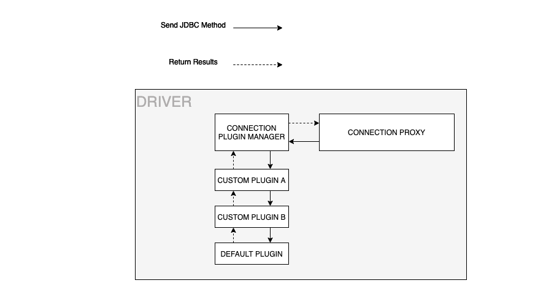
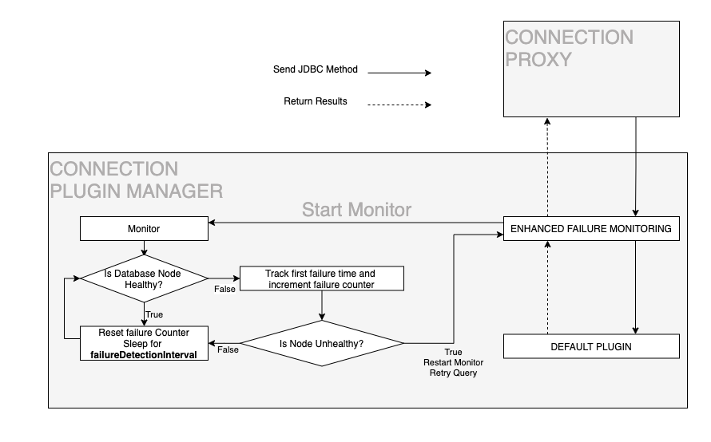

# Amazon Web Services(AWS) JDBC Driver for MySQL

- AWS JDBC Driver for MySQL 은 클러스터된 MySQL 데이터베이스 기능의 이점을 얻을 수 있도록 해준다. 
- MySQL Connector/J 드라이버를 기반으로 하고 드롭인 호환으로 사용할 수 있으며, 모든 MySQL 배포와 호환된다. 

## FailOver이란?

- Amazon Aurora DB 클러스터는 장애 조치를 사용하여 기본 DB인스턴스를 사용할 수 없게 되면 DB클러스터 상태를 자동으로 복구한다. 
- Failover 중에 Aurora 는 복제본을 새로운 기본 DB인스턴스로 승격하여 DB클러스타가 기본 읽기/쓰기 DB인스턴스에 최대 가용성을 제공한다. 
- MySQL용 AWS JDBC Driver는 DB인스턴스 오류 발생 시 가동 중지 시간을 최소화 하기 위해 이 동작을 조정하도록 설계되었다. 

## AWS JDBC Driver for MySQL 드라이버의 이점

- Aurora가 장애조치를 통해 최대 가용성을 제공할 수 있지만, 기존에 존재하는 드라이버는 이 기능을 완젼히 지원하지 않는다. 
- 이는 부분적으로 새로운 메인 DB인스턴스의 DNS가 완전히 확인하는데 필요한 시간 때문이다. 
- AWS JDBC 드라이버는 Aurora 클러스터 환경의 캐시 관리와 각 인스턴스 롤을 유지하기 위해 장애 조치 동작을 완젼히 활용한다. 
- 이 토폴로지는 Aurora 데이터베이스에 대한 직접 쿼리를 통해 제공되며 기본적으로 DNS확인으로 인한 지연을 우회하는 지름길을 제공한다.
- 이 지식과 함께 AWS JDBC 드라이버는 Aurora DB클러스터 상태를 보다 면밀히 모니터링 하여 새로운 기본 DB 인스턴스에 대한 연결을 최대한 빨리 설정할 수 있다. 
- 추가적으로  위에서 이야기한것과 같이 AWS JDBC DRiver는 다른 MySQL JDBC 드라이버에 대해서 호환되도록 설계 되었고, RDS와 MySQL 데이터베이스와 잘 호환된다. 

## Getting Started

### 사전준비

- Amazon Corretto 8+와 Java8 + 을 설치해야한다. 이는 AWS JDBC Driver for MySQL을 사용하기 위해 필요하다. 

### Installing and Upgrading the AWS JDBC Driver for MySQL

#### .jar 파일을 직접 다운로드 하기 

- AWS JDBC Driver for MySQL 은 사전 컴파일된 패키지가 설치될수 있다. 이는 Github Release 혹은 Maven Central 에서 다운로드 받는다. 
- https://github.com/awslabs/aws-mysql-jdbc/releases
- https://search.maven.org/search?q=g:software.aws.rds
- 드라이버를 인스톨 하기 위해서 상응하는 JAR파일을 획득하고, CLASSPATH 에 포함시킨다. 

#### Direct - Direct download with wget

```go
wget https://github.com/awslabs/aws-mysql-jdbc/releases/download/1.1.0/aws-mysql-jdbc-1.1.0.jar
cp aws-mysql-jdbc-1.1.0.jar /home/userx/libs/
export CLASSPATH=$CLASSPATH:/home/userx/libs/aws-mysql-jdbc-1.1.0.jar
```

#### wget으로 새로운 버젼으로 업그레이드 하기 

- 드라이버 업그레이드를 위해서 .jar 파일을 사전에 설치한 .jar파일로 교체한다. 
- .jar 파일을 교체하고 나서 CLASSPATH를 새로운 파일로 교체한다. 

```go
wget https://github.com/awslabs/aws-mysql-jdbc/releases/download/1.1.0/aws-mysql-jdbc-1.1.0.jar
cp aws-mysql-jdbc-1.1.0.jar /home/userx/libs/
export CLASSPATH=$CLASSPATH:/home/userx/libs/aws-mysql-jdbc-1.1.0.jar
```

#### As a Maven dependency 

- Maven 의존성 관리를 이용하여 다운로드 받기 위해서 pom.xml 파일에 다음과 같이 작성하자. 

##### Maven

```go
<dependencies>
  <dependency>
    <groupId>software.aws.rds</groupId>
    <artifactId>aws-mysql-jdbc</artifactId>
    <version>1.1.0</version>
  </dependency>
</dependencies>
```

##### Upgrading to a newer version with maven

- 신규 버젼으로 업그레이드 하기 위해서 버젼 번호를 교체하자. 
- 예를 들어 1.1.0으로 업그레이드 하기 위해서 다음과 같이 버젼에 작성할 수 있다. 
  
```go
<dependencies>
  <dependency>
    <groupId>software.aws.rds</groupId>
    <artifactId>aws-mysql-jdbc</artifactId>
    <version>1.1.0</version>
  </dependency>
</dependencies>
```

##### Gradle 의존성 관리 

- Gradle의 의존성 관리를 이용할 수 있다. 
- 이는 다음 설정을 build.gradle에 추가할 수 있다. 

예제)

```go
dependencies {
    implementation group: 'software.aws.rds', name: 'aws-mysql-jdbc', version: '1.1.0'
}
```

##### Upgrading to a newer version with Gradle

- 신규 드라이버로 버젼업을 위해서 버젼 정보를 build.gradle 파일에 수정하자. 

```go
dependencies {
    implementation group: 'software.aws.rds', name: 'aws-mysql-jdbc', version: '1.1.0'
}
```

##### IDE 이용하기. 

- IDE에서 이를 이용하기 위해서 .jar 파일을 다운로드 하고, 어플리케이션의 libs 폴더에 추가하자. 그리고 CLASSPATH를 잡아주면 된다. 

- IntelliJ 구조 
  
```go
wget https://github.com/awslabs/aws-mysql-jdbc/releases/download/1.1.0/aws-mysql-jdbc-1.1.0.jar
cp aws-mysql-jdbc-1.1.0.jar /home/userx/libs/
export CLASSPATH=$CLASSPATH:/home/userx/libs/aws-mysql-jdbc-1.1.0.jar
```

- .jar 파일을 다운로드 하고 나서 CLASSPATH를 업데이트한다. 그리고 프로젝트에 드라이버 정보를 추가하자. 

1. Project Structure 를 IntelliJ 인터페이스를 이용하여 오픈한다. 
2. Modules를 선택한다. 
3. Dependencies 탭을 연다. 
4. AWS JDBC Driver for MySQL .jar 파일을 추가한다. 
5. jdbc:mysql:// 을 jdbc:mysql:aws:// 로 변경한다. 

- 새 버젼을 IntelliJ에 업그레이드 하기. 

```go
wget https://github.com/awslabs/aws-mysql-jdbc/releases/download/1.1.0/aws-mysql-jdbc-1.1.0.jar
cp aws-mysql-jdbc-1.1.0.jar /home/userx/libs/
export CLASSPATH=$CLASSPATH:/home/userx/libs/aws-mysql-jdbc-1.1.0.jar
```

##### Database client 에서 드라이버 이용하기 (DBeaver)

- DBeaver 데이터베이스 클라이언트를 이 드라이브와 함께 이용하기 위해서, .jar 파일을 다운로드 하고, lib 폴더에 넣은후 CLASSPATH 값을 조정하자. 

- 예제

```go
wget https://github.com/awslabs/aws-mysql-jdbc/releases/download/1.1.0/aws-mysql-jdbc-1.1.0.jar
cp aws-mysql-jdbc-1.1.0.jar /home/userx/libs/
export CLASSPATH=$CLASSPATH:/home/userx/libs/aws-mysql-jdbc-1.1.0.jar
```
- .jar 파일을 다운로드 하고 나서, CLASSPATH에 추가하자. 그리고 DBeaver 클라이언트에 추가한다. 

1. DBeaver Driver Manager 윈도우를 열고 New 클릭을 수행하여 AWS JDBC Driver 를 추가한다. 
2. Settins에서 다음 정볼르 추가한다. 

```go
Default Port: 3306
Driver Name: AWS JDBC Driver for MySQL
Class Name: software.aws.rds.jdbc.mysql.Driver
URL Template: jdbc:mysql:aws://<endpoint>
```

3. Libraries 에 가서 Add Artifact 를 클릭하고 다음 선언을 한다. 

```go
<dependency>
  <groupId>software.aws.rds</groupId>
  <artifactId>aws-mysql-jdbc</artifactId>
</dependency>
```

4. DBeaver 는 다음과 같이 알려준다. Artifacts Found: 1
5. OK를 클릭하여 드라이버 추가를 완료하자. 

- 새로 추가한 드라이버를 통해서 연결이 설정될 것이다. 

##### Upgrading to a newer version with the DBeaver Client

- 새로운 버젼을 업그레이드 하기 위해서는 드라이버 폴더에 새로 .jar파일을 다운로드 하고 CLASSPATH에 추가하자. 

```go
wget https://github.com/awslabs/aws-mysql-jdbc/releases/download/1.1.0/aws-mysql-jdbc-1.1.0.jar
cp aws-mysql-jdbc-1.1.0.jar /home/userx/libs/
export CLASSPATH=$CLASSPATH:/home/userx/libs/aws-mysql-jdbc-1.1.0.jar
```

- 그리고 다음 스탭으로 DBeaver 클라이언트 세팅을 업데이트 하자. 

### Using a Snapshot of the Driver

- 만약 릴리즈 하지 않은 기능을 이용하고자 한다면 driver의 스냅샷 빌드를 이용할 수 있다. 

```go
<dependencies>
  <dependency>
    <groupId>software.aws.rds</groupId>
    <artifactId>aws-mysql-jdbc</artifactId>
    <version>1.1.0</version>
    <scope>system</scope>
    <systemPath>path-to-snapshot-jar</systemPath>
  </dependency>
</dependencies>
```

```go
dependencies {
    implementation(files("path-to-snapshot-jar"))
}
```

## Using the AWS JDBC Driver for MySQL

- AWS JDBC Driver for MySQL 은 호환성을 제공하며 이는 MySQL-Connector-JDBC driver 와 호환된다. 
- 다음은 failover를 위한 내용을 알려준다. 

### Driver Name

- 드라이버 이름은 이용하기 위해서 software.aws.rds.jdbc.Driver 이용
- 만약 메인에서 이용한다면 직접 software.aws.rds.jdbc.mysql.Driver 이용
- 드라이버를 드라이버 관리자에 명시적으로 로드할 때 드라이버 이름이 필요하다. 

## Connection URL 설정

- Aurora DB 클러스터에 연결할 수 있는 다양한 유형의 URL이 있다. 
- 이 섹션에서 다양한 URL유형에 대해 간단히 설명한다. 
- 일부 URL 유형의 경우 AWS JDBC Driver는 사용자가 장애 조치 기능을 제공하기 위해 Aurora DB 클러스터에 대한 일부 정보를 제공하도록 요구한다. 
- 각 URL 유형에 대해 드라이버가 작동하는 방식과 해당되는 경우 드라이버가 DB클러스터에 대해 요구하는 정보에 대한 정보가 아래에 제공된다. 

- 참고: 연결 문자열은 표준 URL매개변수를 따른다. 연결 문자열에 매개변수를 추가하려면 간단히 연결문자열 끝에 있는 parameter_name=value 쌍이다. 

- Cluster Endpoint
  - jdbc:mysql:aws://db-identifier.cluster-XYZ.us-east-2.rds.amazonaws.com:3306
  - 초기 연결되는 메인 DB 인스턴스 경로
  - 장애조치시 새로운 메인 DB인스턴스로 연결됨
- ReadOnly Cluster Endpoint
  - jdbc:mysql:aws://db-identifier.cluster-ro-XYZ.us-east-2.rds.amazonaws.com:3306
  - 초기 연결되는 모든 Aurora 복제본
  - 장애시 Aurora 복제본에 우선적으로 연결
  - 더 빠른 연결을 위해서는 메인 DB 인스턴스에 연결될 수 있음 
- Instance Endpoint
  - jdbc:mysql:aws://instance-1.XYZ.us-east-2.rds.amazonaws.com:3306
  - 초기 연결되는 인스턴스
  - 장애시 메인 DB인스턴스에 연결
- RDS Custom Cluster
  - jdbc:mysql:aws://db-identifier.cluster-custom-XYZ.us-east-2.rds.amazonaws.com:3306
  - 초기 연결: 사용자 지정 DB 클러스터의 모든 DB 인스턴스 
  - 장애 조치 동작: 기본 DB 인스턴스에 연결(사용자 지정 DB 클러스터 외부에 있을 수 있음)
- IP Address
  - jdbc:mysql:aws://10.10.10.10:3306
  - clusterInstanceHostPattern
  - 초기 연결: 지정된 DB 인스턴스 
  - 장애 조치 동작: 기본 DB 인스턴스에 연결
- Custom Domain
  - jdbc:mysql:aws://my-custom-domain.com:3306
  - clusterInstanceHostPattern
  - 초기 연결: 지정된 DB 인스턴스 
  - 장애 조치 동작: 기본 DB 인스턴스에 연결
- Non Aurora Endpoint
  - jdbc:mysql:aws://localhost:3306
  - 일반 JDBC 연결이 반환됩니다. 
  - 장애 조치 기능이 없습니다.
- Aurora Endpoint (커스텀 터널 이용)
  - jdbc:mysql:aws://localhost:3306
  - clusterInstanceHostPattern
  - 초기 연결: 지정된 DB 인스턴스 
  - 장애 조치 동작: 기본 DB 인스턴스에 연결

- clusterInstanceHostPattern 파라미터는 아래 섹션에서 논의 
- AWS JDBC Driver 로 구성할 수 있는 파라미터에 대한 자세한 내용은 장애 조치 파라미터에 대한 아래 섹션 참조 

## Connection Plugin Manager

- connection plugin manager는 연결 플러그인 초기화, 트리거 및 정리를 수행한다. 
- 커넥션 플러그인은 해당 연결과 관련된 추가 또는 보완 논리를 실행하는 데 도움이 되도록 각 연결 개체에 연결된 위젯이다. 
- 장애조치 (Failover) 및 향상된 장애 모니터링 (Enhanced Failure Monitoring) 은 모두 연결 플러그인 예이다. 

- 장애조치(failover) 및 향상된 장애 모니터링 (Enhanced Failure Monitoring) 이 기본적으로 로드된다. 
- 추가 사용자 정의 플러그인을 구현하고 기존 플러그인과 함께 사용할 수 있다. 
- 플러그인은 체인을 생성하기 위해 특정 순서로 로드될 수 있으며 각 플러그인은 그 결과를 다음 플러그인으로 전달한다. 

- 참고: 사용자 지정 플러그인 로드에는 connectionPluginFactories 매개변수를 통해 명시적으로 명시되지 않는 한 향상된 장애 모니터링 및 장애 조치 연결 플러그린이 포함되지 않는다. 



- 위 그림은 커넥션 플러그인 관리자의 워크플로우를 단순하게 보여준다. 

<br/>

- 먼저 드라이버에서 JDBC 메소드를 실행하면 Connection Plugin 매니저로 전달된다. 
- Connection Plugin Manager 에서 JDBC 메소드가 각 플러그인에 순서대로 전달되어 체인처럼 로드된다. 
- 이 예제에서 메서드는 먼저 Custom Plugin A로 전달된 다음 Custom Plugin B로 전달되고 마지막으로 JDBC메소드를 실행하고 체인을 통해 결과를 반환하는 Default Plugin으로 전달된다. 

<br/>

- 기본적으로 향상된 장애 모니터링 플러그인으로 로드된다. 
- 추가 사용자 정의 플러그인을 구현하고 기존 플러그인과 함께 사용할 수 있다. 
-  플러그인을 지정된 순서대로 함께 연결할 수 있다. 로드된 사용자 정의 플러그인은 connectionPluginFactories 매개 변수로 명시적으로 언급되지 않는 한 Enhanced Failure Monitoring 플러그인을 포함하지 않는다. 

<br/>

- AWS JDBC Driver for MySQL 은 DefaultConnectionPlugin을 첨부하여 플러그인 체인의 마지막에 첨부된다. 실제적으로 JDBC 메소드를 실행한다.

<br/>

- 모든 연결 플러그인이 함께 연결되어 있기 때문에 이전 연결 플러그인이 후자의 플러그인에 영향을 미친다. 
- 연결 플러그인 체인의 헤드에 있는 연결 플러그인이 실행 시간을 측정하는 경우 이 측정은 체인 아래의 모든 연결 플러그인에 소요된 시간을 포함한다. 
- 더 많은 정보를 확인하기 위해서 다음을 참고하자. https://github.com/awslabs/aws-mysql-jdbc/tree/main/src/demo/java/customplugins

### Connection Plugin Manager Parameters

- useConnectionPlugins
  - Boolean 값으로 지정하기
  - 기본값인 true로 설정하면 Failover 및 Enhanced Failure Monitor 플러그인을 포함한 연결 플러그인이 로드된다.
  - false로 설정하면 연결 플러그인이 로드되지 않고 드라이버가 대신 JDBC 메소드를 직접 실행한다. 
  - 참고: 장애 조치 기능 및 향상된 장애 모니터링은 플러그인으로 구현되므로 연결 플러그인을 비활성화하면 해당 기능도 비활성화 된다.
- connectionPluginFactories
  - String값
  - 플러그인 객체를 생성할 플러그인 팩토리의 정규화된 클래스 이름 문자열로 지정한다.
  - 문자열의 각 팩토리는 쉼표로 구분되어야 한다. 
  - 참고: 선언된 팩토리의 순서는 중요하다.
  - 기본값: com.mysql.cj.jdbc.ha.plugins.failover.FailoverConnectionPluginFactory, com.mysql.cj.jdbc.ha.plugins.NodeMonitoringConnectionPluginFactory

## Failover Plugin

- 장애 조치 플러그인은 기본적으로 로드되며 매개 변수 enableClusterAwareFailover를 false로 설정하여 비활성화 할 수 있다. 

### AWS JDBC Driver Failover Process


- 위 그림은 AWS JDBC Driver가 Aurora 장애 조치 발생을 처리하는 방법에 대한 간략한 개요를 제공한다. 
- 다이어그램의 맨 위에서 시작하여 클래스 경로에 AWS JDBC Driver가 있는 애플리케이션은 드라이버를 사용하여 Aurora 데이터베이스에 대한 논리적 연결을 얻는다. 

<br/>

- 이 예에서 애플리케이션은 Aurora DB클러스터 엔드 포인트를 사용하여 연결을 요청하고 DB클러스터의 기본 DB 인스턴스인 DB인스턴스 C에 대한 물리적 연결이 포함된 논리적 연결을 반환한다. 
- 애플리케이션이 논리적 연결에 대해 작동하는 방식으로 인해 특정 DB인스턴스에 대한 물리적 연결 세부 정보가 추상화 되었다.

<br/>

- 애플리케이션 수명동안 논리적 연결에 대해 다양한 명령문을 실행한다. 
- DB인스턴스가 C가 안정적이고 활성 상태이면 이러한 명령문이 성공하고 애플리케이션이 정상적으로 계속된다. 
- 나중에 DB인스턴스 C에 장애가 발생하명 Aurora가 장애 조치를 시작하여 복제본을 새로운 기본 DB 인스턴스(이 경우 DB인스턴스 A또는 B)로 승격한다. 
- 동시에 AWS JDBC Driver는 관련 통신 예외를 가로채고 자체 내부 장애 조치 프로세스를 시작한다. 

<br/>

- 이 경우 기본 DB 인스턴스가 실패한 경우 드라이버는 내부 토폴로지 캐시를 사용하여 활성 Aurora 복제본에 임시로 연결한다.
- 토폴로지 캐시에는 사용 가능한 인스턴스에 대한 정보가 포함된다.
- 드라이버가 연결된 활성 Aurora 복제본은 새 기본 DB 인스턴스 (DB 인스턴스 A 또는 B)가 식별될 때까지 DB 클러스터 토폴로지에 대해 주기적으로 쿼리된다. 
  
<br/>

- 이 시점에서 드라이버는 새로운 기본 DB인스턴스에 연결하고 필요에 따라 세션 상태를 재구성 할 수 있도록 SQLState 08S02로 SQLException 을 발생시켜 애플리케이션에 제어를 반환한다. 
- DB 클러스터의 DNS 엔드포인트는 아직 새 기본 DB 인스턴스로 확인되지 않을 수 있지만 드라이버는 장애 조치 프로세스 중에 이미 이 새 DB 인스턴스를 발견했으며 애플리케이션이 명령문을 계속 실행할 때 직접 연결된다.

<br/>

- 애플리케이션에 논리적 연결은 변경된 것으로 나타나지 않지만 물리적 연결은 새로운 기본 DB인스턴스로 교체된다. 
- 이러한 방식으로 드라이버는 새로 승격된 DB인스턴스에 재연결하는 더 빠른 방법을 제공하여 DB클러스터의 가용성을 높인다. 

### Failover Parameters

- https://dev.mysql.com/doc/connector-j/8.0/en/connector-j-reference-configuration-properties.html 을 통해서 기본적인 파라미터 확인가능
- 다음 추가적인 파라미터를 통해서 FailOver 를 수행할 수 있다. 

- enableClusterAwareFailover
  - Boolean
  - 기본값: true
  - AWS JDBC Driver 에서 제공하는 빠른 장애 조치 동작을 활성화 하려면 true로 설정한다. 
  - 빠른 장애조치가 필요하지 않는 단순한경우 false로 지정하면 된다. 
  - 노트: 이 매개변수 외에도 장애 조치 기능이 연결 플러그인으로 구현되므로 useConnectionPlugins 를 비활성화 하면 장애 조치 기능도 비활성화 된다. 
  - useConnectionPlugins가 활성화되면 enableClusterAwareFailover가 true또는 false인지 여부에 관계없이 기본적으로 장애 조치 플러그인이 로드된다. 
- clusterInstanceHostPattern
  - String
  - 기본값: 연결 문자열이 IP주소 또는 사용자 지정 도메인이 아닌 경우 드라이버는 고객이 제공한 연결 문자열에서 클러스터 인스턴스 호스트 패턴을 자동으로 가져온다.
  - 이 파라미터는 IP 주소 또는 사용자 지정 도메인 URL을 통해 AWS RDS 클러스터에 연결하지 않는 한 필요하지 않다.
  - 이경우 매개변수는 완전한 인스턴스 엔드포인트를 구축하는 데 사용할 클러스터 인스턴스 DNS 패턴을 지정한다. 
  - ?, 이 패턴의 문자는 클러스터에 있는 인스턴스의 DB인스턴스 식별자에 대한 자리 표시자로 사용해야한다. 
  - 예) ?.my-domain.com, any-subdomain.?.my-domain.com:9999
  - 예) 만약 클러스터 인스턴스 엔드포인트가 instanceIdentifier1.customHost, instanceIdentifier2.customHost 이라면 다음과 같이 작성할 수 있다. jdbc:mysql:aws://customHost:1234/test?clusterInstanceHostPattern=?.customHost
- clusterId
  - String
  - 기본값: 드라이버는 AWS RDS 클러스터에 대한 클러스터 ID를 자동으로 획득한다.
  - 클러스터의 고유 식별자이다. 
  - 동일한 클러스터 ID를 가진 연결은 클러스터 토폴로지 캐시를 공유한다. 
  - 이 연결 매개변수는 필요하지 않으므로 원하는 경우에만 설정해야 한다.
- clusterTopologyRefreshRateMs
  - Integer
  - 기본값: 30000
  - 클러스터 토폴로지 새로 고침 빈도(밀리초)이다. 
  - 클러스터에 대해 캐시된 토폴로지는 지정된 시간이 지나면 무효화되며 그 후에는 연결과의 다음 상호 작용 중에 업데이트된다
- failoverTimeoutMs
  - Integer
  - 기본값: 60000
  - 클러스터 장애 조치가 시작된 후 새 기록기 또는 판독기 인스턴스에 다시 연결을 시도하는 데 허용되는 최대 시간(밀리초)이다.
- failoverClusterTopologyRefreshRateMs
  - Integer
  - 기본값: 5000
  - 쓰기 페일오버 프로세스가 수행되는 동안 클러스터 토폴로지의 새로고침 빈도
  - 쓰기 페일오버 처리동안 클러스터 토폴리지는 새롭게 승격된 쓰기를 발견하는 속도를 향상시키기 위해 평소보다 빠른 속도로 새로 고침할 수 있다. 
- failoverWriterReconnectIntervalMs
  - Integer
  - 기본값: 5000
  - 쓰기가 페일오버 처리가 진행되는 동안 장애 대상에 연결 시도 사이에 대기하는 최대 시간 (밀리초)
- failoverReaderConnectTimeoutMs
  - Integer
  - 기본값: 5000
  - 읽기 장애 조치 프로세스 중 익기 인스턴스에 연결을 시도하는데 허용된 최대 시간 (밀리초)
- acceptAwsProtocolOnly
  - Boolean
  - 기본값: false
  - jdbc:mysql:aws:// 프로토콜이 있는 URL에 대한 연결만 허용하려면 true로 설정한다. 
  - 드라이버 프로토콜이 깨지지 않도록 이 드라이버를 동일한 프로토콜을 지원하는 다른 MySQL 드라이버(예: MySQL JDBC 드라이버)와 동시에 사용하는 애플리케이션을 실행할 때 이 설정을 true로 설정해야한다. 
  - 이 동작은 Driver.setAcceptAwsProtocolOnly 메서드를 통해 모든 연결에 대해 드라이버 수준에서 설정할 수도 있다. 그러나 이 연결 매개변수가 있는 경우 우선 순위가 지정된다. 
- gatherPerfMetrics
  - Boolean
  - 기본값: false
  - 드라이버가 장애 조치 관련 메트릭을 기록하도록 하려면 true로 설정하라. 
  - 수집된 지표를 인쇄하려면 IClusterAwareMetricsReporter.reportMetrics(String connUrl, Log log) 를 호출하면 된다. 
  - 예) IClusterAwareMetricsReporter.reportMetrics(db-identifier.cluster-ro-XYZ.us-east-2.rds.amazonaws.com:3306, myLog)
  - 수짐된 메트릭을 리셋하기 위해서 To reset collected metrics, call IClusterAwareMetricsReporter.reportMetrics().을 호출하라.
- gatherMetricsPerInstance
  - Boolean
  - 기본값: false
  - 인스턴스 및 클러스터별로 추가 성능 지표를 수집하려면 true로 설정하라. 
  - 클러스터당 성능 메트릭만 수집하려면 false로 설정하라.
  - 인스턴스 레벨에서 컬렉트된 메트릭을 출력하려면 IClusterAwareMetricsReporter.reportMetrics(String connUrl, Log log, true) 을 호출하라.
- allowXmlUnsafeExternalEntity
  - Boolean
  - 기본값: false
  - 외부 엔터티를 참조하는 XML입력을 사용하려면 true로 설정하라. 
  - 주의: 이 값을 true로 설정하는 것은 시스템이 XXE 공력에 취약하기 때문에 안전하지 않다. 

### Failover Exception Codes

#### 08001 - Unable to Establish SQL Connection

- 드라이버가 코드 08001과 함께 SQLException을 발생시키면 원래 연결이 실패 되었고, 드라이버가 새 인스턴스로 장애 조치를 시도했지만 실패한 경우이다.
- 사용가능한 노드가 없거나 네트워크 오류가 발생하는 등 여러가지 이유가 있다.
- 이 시나리오에서 서버가 가동되기까지 기다리거나 혹은 다른 문제가 완료될때 까지 기다려라 

#### 08S02 - Communication Link

- 드라이버가 코드 08S02와 함께 SQLException을 throw하면 자동 커밋이 true로 설정된 동안 원래 연결이 실패했고 드라이버가 클러스터에서 사용 가능한 다른 인스턴스로 성공적으로 장애 조치가 된다. 
- 그러나 이제 초기 연결의 모든 세션 상태 구성이 손실된다.
- 이 시나리오에서 다음과 같이 수행하라. 
  - 원래 연결을 재구성하고 재사용한다. (재구성된 세션 상태는 원래 연결과 동일하다.)
  - 연결 실패 시 실행한 쿼리를 반복하고 원하는 대로 작업을 계속한다.

```java
import java.sql.*;

/**
 * Scenario 1: Failover happens when autocommit is set to true - Catch SQLException with code 08S02.
 */
public class FailoverSampleApp1 {

   private static final String CONNECTION_STRING = "jdbc:mysql:aws://db-identifier.cluster-XYZ.us-east-2.rds.amazonaws.com:3306/employees";
   private static final String USERNAME = "username";
   private static final String PASSWORD = "password";
   private static final int MAX_RETRIES = 5;

   public static void main(String[] args) throws SQLException {
      try (Connection conn = DriverManager.getConnection(CONNECTION_STRING, USERNAME, PASSWORD)) {
         // Configure the connection.
         setInitialSessionState(conn);

         // Do something with method "betterExecuteQuery" using the Cluster-Aware Driver.
         String select_sql = "SELECT * FROM employees";
         try (ResultSet rs = betterExecuteQuery(conn, select_sql)) {
            while (rs.next()) {
               System.out.println(rs.getString("first_name"));
            }
         }
      }
   }

   private static void setInitialSessionState(Connection conn) throws SQLException {
      // Your code here for the initial connection setup.
      try (Statement stmt1 = conn.createStatement()) {
         stmt1.executeUpdate("SET time_zone = \"+00:00\"");
      }
   }

   // A better executing query method when autocommit is set as the default value - true.
   private static ResultSet betterExecuteQuery(Connection conn, String query) throws SQLException {
      // Record the times of retry.
      int retries = 0;

      while (true) {
         try {
            Statement stmt = conn.createStatement();
            return stmt.executeQuery(query);
         } catch (SQLException e) {
            // If the attempt to connect has failed MAX_RETRIES times,            
            // throw the exception to inform users of the failed connection.
            if (retries > MAX_RETRIES) {
               throw e;
            }

            // Failover has occurred and the driver has failed over to another instance successfully.
            if ("08S02".equalsIgnoreCase(e.getSQLState())) {
               // Reconfigure the connection.
               setInitialSessionState(conn);
               // Re-execute that query again.
               retries++;

            } else {
               // If some other exception occurs, throw the exception.
               throw e;
            }
         }
      }
   }
}
```

#### 08007 - Transaction Resolution Unknown

- 드라이버가 코드 08007과 함께 SQL Exception 을 발생시키면 트랜잭션 내에서 원래 커넥션이 실패한경우이다. (자동 커밋이 false로 설정된 경우)
- 이 시나리오에서 드라이버는 먼저 트랜잭션을 롤백하려고 시도한 다음 클러스터에서 사용 가능한 다른 인스턴스로 장애 조치한다. 
- 드라이버가 문제를 인식할 때 초기 연결이 끊어질 수 있으므로 롤백이 실패할 수 있다. 
- 또한 초기 연결의 모든 세션 상태 구성이 이제 손실된다. 
- 이 시나리오에서 해야할일 
  - 원래 연결을 재구성하고 재사용한다. (재구성된 세션 상태는 원래 연결과 동일하다.)
  - 트랜잭션을 다시 시작하고 연결이 실패하기 전에 트랜잭션 중에 실행된 모든 쿼리 반복 
  - 연결이 실패 시 실행한 쿼리를 반복하고 원하는 대로 작업을 계속한다. 

```java
import java.sql.*;

/**
 * Scenario 2: Failover happens when autocommit is set to false - Catch SQLException with code 08007.
 */
public class FailoverSampleApp2 {

   private static final String CONNECTION_STRING = "jdbc:mysql:aws://db-identifier.cluster-XYZ.us-east-2.rds.amazonaws.com:3306/employees";
   private static final String USERNAME = "username";
   private static final String PASSWORD = "password";
   private static final int MAX_RETRIES = 5;

   public static void main(String[] args) throws SQLException {
      String[] update_sql = {
              "INSERT INTO employees(emp_no, birth_date, first_name, last_name, gender, hire_date) VALUES (5000000, '1958-05-01', 'John', 'Doe', 'M', '1997-11-30')",
              "INSERT INTO employees(emp_no, birth_date, first_name, last_name, gender, hire_date) VALUES (5000001, '1958-05-01', 'Mary', 'Malcolm', 'F', '1997-11-30')",
              "INSERT INTO employees(emp_no, birth_date, first_name, last_name, gender, hire_date) VALUES (5000002, '1958-05-01', 'Tom', 'Jerry', 'M', '1997-11-30')"
      };

      try (Connection conn = DriverManager.getConnection(CONNECTION_STRING, USERNAME, PASSWORD)) {
         // Configure the connection - set autocommit to false.
         setInitialSessionState(conn);

         // Do something with method "betterExecuteUpdate_setAutoCommitFalse" using the Cluster-Aware Driver.           
         betterExecuteUpdate_setAutoCommitFalse(conn, update_sql);
      }
   }

   private static void setInitialSessionState(Connection conn) throws SQLException {
      // Your code here for the initial connection setup.
      try (Statement stmt1 = conn.createStatement()) {
         stmt1.executeUpdate("SET time_zone = \"+00:00\"");
      }
      conn.setAutoCommit(false);
   }

   // A better executing query method when autocommit is set to false.
   private static void betterExecuteUpdate_setAutoCommitFalse(Connection conn, String[] queriesInTransaction) throws SQLException {
      // Create a boolean flag.
      boolean isSuccess = false;
      // Record the times of retry.
      int retries = 0;

      while (!isSuccess) {
         try (Statement stmt = conn.createStatement()) {
            for (String sql : queriesInTransaction) {
               stmt.executeUpdate(sql);
            }
            conn.commit();
            isSuccess = true;
         } catch (SQLException e) {

            // If the attempt to connect has failed MAX_RETRIES times,
            // rollback the transaction and throw the exception to inform users of the failed connection.
            if (retries > MAX_RETRIES) {
               conn.rollback();
               throw e;
            }

            // Failure happens within the transaction and the driver failed over to another instance successfully.
            if ("08007".equalsIgnoreCase(e.getSQLState())) {
               // Reconfigure the connection, restart the transaction.
               setInitialSessionState(conn);
               // Re-execute every queries that were inside the transaction.
               retries++;

            } else {
               // If some other exception occurs, rollback the transaction and throw the exception.
               conn.rollback();
               throw e;
            }
         }
      }
   }
}
```

### Connection Pooling

- MySQL용 AWS JDBC Driver는 연결 풀링과 호환되지만 일부 연결 풀링 라이브러리에는 SQL 예외를 처리할 때 추가 동작이 포함될 수 있다.
- 즉, AWS JDBC Driver for MySQL에서 생성된 예외가 인식되지 않을 수 있으며, 연결 풀에 따라 인식되지 않는 SQL 예외로 인해 연결이 조기에 닫힐 수 있다.
- 사용자는 선택한 연결 풀링 라이브러리를 조사하고 연결 풀이 드라이버에서 발생한 예외를 수락할 수 있도록 필요한 추가 코드를 구현하는 것이 좋다.
- 예를 들어 HikariCP에는 아래와 같은 장애 조치 후 즉시 연결이 닫히는 것을 방지하기 위해 사용자가 구현할 수 있는 인터페이스가 있다. 

```java
import com.zaxxer.hikari.SQLExceptionOverride;

import java.sql.SQLException;

public class HikariCPSQLException implements SQLExceptionOverride {
    public Override adjudicate(final SQLException sqlException) {
        String sqlState = sqlException.getSQLState();
        if (sqlState.equalsIgnoreCase("08S02") ||
            sqlState.equalsIgnoreCase("08007")) {
            return Override.DO_NOT_EVICT;
        } else {
            return Override.CONTINUE_EVICT;
        }
    }
}
```
### MySQL 용 AWS JDBC 드라이버의 올바른 사용에 대한 경고 

1. JDBC 드라이버를 사용할 때 일반적인 관행은 try-catch 블록에서 Connection 객체에 대한 호출을 래핑하고 예외가 발생하면 Connection객체를 삭제하는 것이다. 만약 어플리케이션이 이 접근을 채택한다면 드라이버에서 제공하는 빠른 장애 조치 기능을 잃게 된다. Failover 가 발생하면 Driver는 예외를 던지기 전에 내부적으로 원래 연결 개체 내에서 바료 사용할 수 있도록 연결을 설정한다. 이 연결 개체가 삭제되면 새로 설정된 연결이 삭제된다. 올바른 방법은 예외의 SQL 오류 코드를 확인하고 오류 코드가 성공적인 장애 조치를 나타내는 경우 연결 개체를 재사용하는 것이다. [FailoverSampleApp1](https://github.com/awslabs/aws-mysql-jdbc#sample-code) 및 [FailoverSampleApp2](https://github.com/awslabs/aws-mysql-jdbc#sample-code-1) 는 이 방법을 보여준다. 더 상세한 정보는 [FailoverExceptionCodes](https://github.com/awslabs/aws-mysql-jdbc#failover-exception-codes)에서 확인하자.
2. 애플리케이션의 인스턴스 엔드포인트 사용량이 확실하지 않다면 Aurora 클러스터의 직접 인스턴스 엔드포인트 대신 클러스터 및 읽기 전용 클러스터 엔드포인트를 사용하는 것이 좋다. 드라이버는 인스턴스 끝점을 사용할 때 새 기록기 인스턴스로 올바르게 장애 조치되지만 장애 조치가 발생할 때 개별 인스턴스가 자발적으로 읽기/쓰기 상태를 변경할 수 있으므로 이러한 끝점의 사용은 권장되지 않는다. 드라이버는 인스턴스 엔드포인트가 제공되는 경우 항상 지정된 인스턴스에 직접 연결하므로 애플리케이션이 인스턴스 엔드포인트를 사용하는 경우 쓰기 안전한 커넥션을 가정할 수 없다. 

## Enhanced Failure Monitoring



- 위 그림은 Enhanced Failure Monitoring 의 간소화된 워크플로우를 보여준다. 
- Enhanced Failure Monitoring 은 모니터 스레드에 의해 구현된 연결 플러그인이다. 
- 모니터는 연결된 데이터베이스 노드의 상태를 주기적으로 확인한다. 
- 데이터베이스 노드가 비정상인 것으로 확인되면 새 데이터베이스 노드로 쿼리가 재시도 되고 모니터가 다시 시작된다. 
- Enhanced Failure Monitoring 플러그인은 기본적으로 로드되며 매개 변수 failureDetectionEnabled 를 false로 설정하여 비활성화 될 수 있다. 

<br/>

- 사용자 지정 연결 플러그인이 로드된 경우 추가로 명시적으로 포함 (com.mysql.cj.jdbc.ha.plugins.failover.FailoverConnectionPluginFactory,com.mysql.cj.jdbc.ha.plugins.NodeMonitoringConnectionPluginFactory)을 connectionPluginFactories에 포함 되지 않는 한 Enhanced Failure Monitoring 및 Failover Connection Plugin이 로드되지 않는다. 

### Enhanced Failure Monitoring Parameters

- failureDetectionTime, failureDetectionInterval 및 failureDetectionCount는 TCP 연결 유지 매개변수와 유사하다.
- 구성 키에 monitoring- 접두사를 추가하여 추가 모니터링 구성을 포함할 수 있다.

- failureDetectionEnabled
  - Boolean
  - 기본값: true
  - 강화된 장애 모니터링을 활성화 하려면 true로 지정한다. false로 지정하면 비활성화 된다. 
  - 참고: 이 매개변수 외에도 Enhanced Failure Monitor는 연결 플러그인으로 구현되므로 useConnectionPlugins 를 비활성화 하면 Enhanced Failure Monitor 기능도 비활성화 된다. 
  - useConnectionPlugins가 활성화되면 failureDetectionEnabled가 true 또는 false인지 여부에 관계없이 기본적으로 Enhanced Failure Monitor 플러그인이 로드된다. 
- failureDetectionTime
  - Integer
  - 기본값: 30000
  - 서버에 SQL 쿼리를 보내는 것과 데이터베이스 노드에 대한 첫번째 프로브 사이의 간격 (밀리초)이다.
- failureDetectionInterval
  - Integer
  - 기본값: 5000
  - 데이터베이스 노드에 대한 프로브 사이의 간격(밀리초) 이다.
- failureDetectionCount
  - Integer
  - 기본값: 3
  - 데이터베이스 노드를 비정상으로 간주하기 전에 실패한 연결 검사의 수이다.
- monitorDisposalTime
  - Integer
  - 기본값: 60000
  - 모니터가 비활성화 상태로 간주되어 폐기되는 간격(밀리초) 이다. 

### RDS 프록시와 함께 MySQL용 AWS JDBC 드라이버 사용에 대한 경고 

- Enhanced Failure Monitoring 플러그인이 있는 MySQL 용 AWS JDBC Driver와 함께 RDS 프록시 엔드포인트를 사용하면 심각한 문제가 발생하지 않는다. 
- 이 플러그인은 선택 사항이며 연결 플러그인 관리자 매개변수 테이블에 표시된 대로 connectionPluginFactories 매개 변수로 활성화할 수 있다. 
- 사용자가 이 플러그인을 활성화하여 새 연결을 생성하면 플러그인이 시크릿을 검색하고 해당 자격 증명을 사용하여 연결이 생성된다. 

- 참고: 이 플러그인을 사용하려면 프로젝트에 런타임 종속성 Jackson Databind및 AWS Secrets Manager를 포함해야한다. 

- AWS Secrets Manager 플러그인이 암호를 검색하려면 다음 속성이 필요하다. 

- secretsManagerSecretId
  - String
  - 이 값을 설정시 secret manager 혹은 secret ARN을 설정한다. 
- secretsManagerRegion
  - String
  - 이 값을 설정하여 시크릿이 있는 리젼을 생성한다. 

```java
import java.sql.*;
import java.util.Properties;
import software.aws.rds.jdbc.mysql.shading.com.mysql.cj.jdbc.ha.plugins.AWSSecretsManagerPluginFactory;

public class AWSSecretsManagerPluginSample {

   private static final String CONNECTION_STRING = "jdbc:mysql:aws://db-identifier.cluster-XYZ.us-east-2.rds.amazonaws.com:3306/employees";
   private static final String SECRET_ID = "secretId";
   private static final String REGION = "us-east-1";

   public static void main(String[] args) throws SQLException {
      final Properties properties = new Properties();
      // Enable the AWS Secrets Manager Plugin:
      properties.setProperty("connectionPluginFactories", AWSSecretsManagerPluginFactory.class.getName());
      
      // Set these properties so secrets can be retrieved:
      properties.setProperty("secretsManagerSecretId", SECRET_ID);
      properties.setProperty("secretsManagerRegion", REGION);

      // Try and make a connection:
      try (final Connection conn = DriverManager.getConnection(CONNECTION_STRING, properties);
           final Statement statement = conn.createStatement();
           final ResultSet rs = statement.executeQuery("SELECT * FROM employees")) {
         while (rs.next()) {
            System.out.println(rs.getString("first_name"));
         }
      }
   }
}
```

## Extra Additions

### XML Entity Injection Fix

- 기본 XML 파서는 드라이버를 XXE(XML Entity Injection) 공격에 취약하게 만드는 보안 위험을 포함하고 있다. 
- 이 이슈를 해결하기 위해 XML 파서에서 DTD를 비활성화 했다. 
- 애플리케이션에서 이 제한을 해제해야하는 경우 연결 문자열의 allowXmlUnsafeExternalEntity매개 변수를 true로 설정할 수 있다. 이 매개변수의 정의는 아래표를 참조하라. 

- allowXmlUnsafeExternalEntity
  - Boolean
  - 기본값: false
  - 외부 엔터티를 참조하는 XML입력을 사용하려면 true로 설정하라.
  - 경고: 시스템이 XXE 공격에 취약하기 때문에 이것을 true로 설정하면 안전하지 않다. 

### AWS IAM Database Authentication

- 참고: 커뮤니티 드라이버를 사용하는 고객과의 호환성을 유지하기 위해 IAM 인증에서는 AWS Java SDK RDS v2.x 가 클래스 경로에 별도로 포함되어야한다. AWS Java SDK RDS는 런타임 종속성이므로 반드시 이를 해결해야한다. 

- 드라이버는 Amazon AWS Identity와 Access Management(IAM) 인증을 지원한다. AWS IAM 데이터베이스 인증을 사용할때, 호스트 URL은 반드시 유효한 Amazon endpoint 여야 하며, 커스텀 도메인이나 IP주소는 허용되지 않는다. 
- IAM 데이터베이스 인증 사용은 특정 데이터베이스 엔진으로 제한된다. 제한 사항 및 권장 사항에 대한 자세한 내용은 IAM 설명서 참고 

#### MySQL 에 대한 IAM 데이터베이스 인증 설정 

1. 기존 데이터베이스에 대한 AWS IAM 데이터베이스 인증을 켜거나 AWS RDS콘솔에서 새 데이터베이스를 생성한다. 
   1. 필요한경우 새 데이터베이스 작성에 대한 문서 검토하기 (https://docs.aws.amazon.com/AmazonRDS/latest/UserGuide/USER_CreateDBInstance.html)
   2. 필요한경우 기존 데이터베이스에서 변경 하기 참조 (https://docs.aws.amazon.com/AmazonRDS/latest/UserGuide/Overview.DBInstance.Modifying.html)
2. AWS IAM 데이터베이스 인증을 위한 생성/변경 그리고 AWS IAM Policy 이용하기 (https://docs.aws.amazon.com/AmazonRDS/latest/UserGuide/UsingWithRDS.IAMDBAuth.IAMPolicy.html)
3. 데이터베이스 계정 생성 (AWS IAM database 인증 이용을 위해) https://docs.aws.amazon.com/AmazonRDS/latest/UserGuide/UsingWithRDS.IAMDBAuth.DBAccounts.html
   1. 마스터 로그인을 사용하여 MySQL 데이터베이스에 연결하고 다음 명령을 사용하여 새 사용자를 만든다. 

```go
CREATE USER example_user_name IDENTIFIED WITH AWSAuthenticationPlugin AS 'RDS';
```

- useAwsIam 
  - Boolean
  - 기본값: false
  - AWS IAM 데이터베이스 인증을 활성화하려면 true로 설정

```java
import java.sql.*;
import java.util.Properties;

public class AwsIamAuthenticationSample {

   private static final String CONNECTION_STRING = "jdbc:mysql:aws://db-identifier.cluster-XYZ.us-east-2.rds.amazonaws.com:3306/employees";
   private static final String USER = "username";

   public static void main(String[] args) throws SQLException {
      final Properties properties = new Properties();
      // Enable AWS IAM database authentication
      properties.setProperty("useAwsIam", "true");
      properties.setProperty("user", USER);

      // Try and make a connection
      try (final Connection conn = DriverManager.getConnection(CONNECTION_STRING, properties);
           final Statement statement = conn.createStatement();
           final ResultSet rs = statement.executeQuery("SELECT * FROM employees")) {
         while (rs.next()) {
            System.out.println(rs.getString("first_name"));
         }
      }
   }
}
```

### Development

- 이하 생략