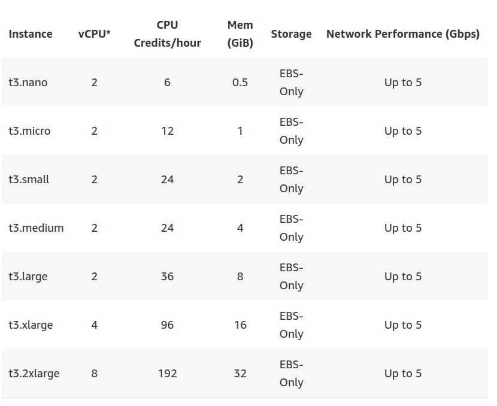
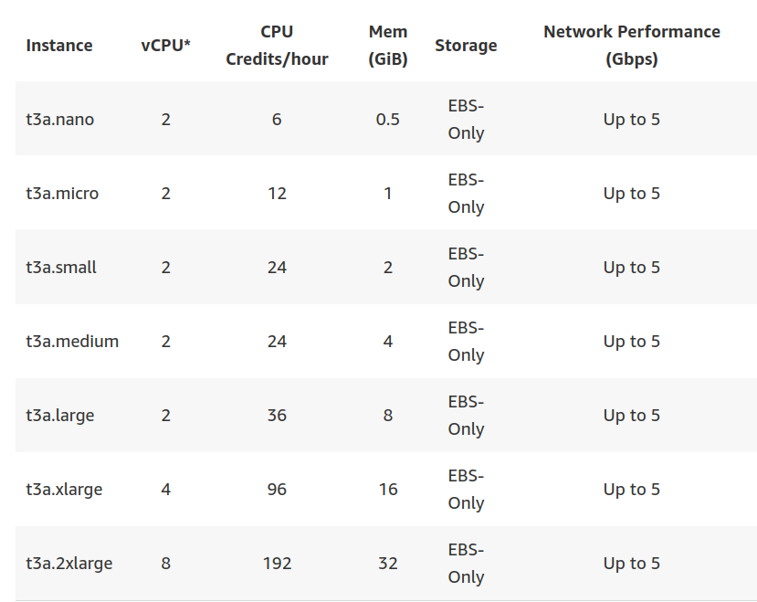
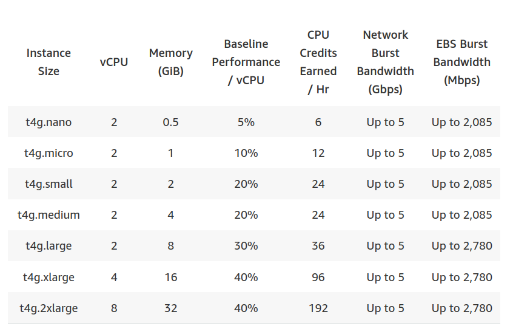

# AWS EC2 Instance Comparison: T3 vs T3a vs T4g

from: https://www.learnaws.org/2020/12/19/t3-t3a-t4g/

- AWS는 다양한 인스턴스 타입이 존재한다 그리고 이는 특정 use-case에서 최적의 인스턴스 타입을 결정하는 것은 매우 어렵다. 
- 이번 아티클에서 우리는 3가지 인기 있는 인스턴스 유형인 T3, T3a, T4g 를 사양, 성능, 비용면에서 비교할 것이다. 

## T3, T3a 그리고 T4g 인스턴스 패밀리 비교 

### T3 인스턴스 

- 아마존의 T 인스턴스 패밀리는 "bustable" 워크로드에 최적화 된 사양이다. 
- 이 워크로드는 일반적으로 낮은 CPU 사용성을 보이며, 가끔 특정 주기에 높은 CPU 사용을 수행한다. 이것을 bustable라고 한다. 
- T3 인스턴스 패밀리는 이런 패턴을 보이는 워크로드에 잘 맞으며, 비용 면에서 효과적이다. 



### T3a 인스턴스 

- T3, T3a 인스턴스들은 서로 매우 유사하지만 프로세서 면에서는 다르다. 
- T3 인스턴스들은 Skylake 프로세서이며 T3a 인스턴스들은 AMD EPYC 7000 시리즈 프로세스를 이용한다. 



### T4g 인스턴스 

- T4g 인스턴스들은 Arm 기반의 AWS Graviton2 프로세서에 의해서 성능을 발휘한다. 이들은 더 낳은 가격과 성능을 지원한다. 



## 성능 

- 이 인스턴스는 다음과 같이 비교된다. 
  - t3.xlarge
  - t3a.xlarge
  - t4g.xlarge

|Instance|Type	Number of cores|Memory (GB)|
|---|---|---|
|t3.xlarge|4|16|
|t3a.xlarge|4|16|
|t4g.xlarge|4|16|

## 벤치마크 

- Sysbench 를 이용하여 CPU, 메모리 및 파일 IO 성능 측정하기 위한 다양한 테스트를 실행할 것이다. 

## CPU

- sysbench cpu --threads=4 run을 실행하여 CPU벤치 마크 수행하였다. 
- 벤치마크에 대한 총 시간과 총 이벤트 수를 처음부터 끝까지 비교할 것이다. 
- 아래 결과에서 알 수 있듯이 t4g.xlarge 가 이 벤치마크에서 최고의 성능을 보였다. 

### t3.xlarge

```
General statistics:
    total time:                          10.0008s
    total number of events:              32591
```

### t3a.xlarge

```
General statistics:
    total time:                          10.0010s
    total number of events:              26621
```

### t4g.xlarge

```
General statistics:
    total time:                          10.0004s
    total number of events:              113588
```

## Memory 

- sysbench memory --threads=4 run 커맨드를 통해서 메모리 벤치마크를 실행했다. 
- 다양한 인스턴스 유형에 대해 수행된 작업을 비교할 것이다. 
- 이 벤치마크에서 t3.xlarge 가 최소의 성능을 보인 반면 t4g.xlarge 는 최악의 성능을 보였다. 

### t3.xlarge

```
Total operations: 93129278 (9311302.73 per second)

90946.56 MiB transferred (9093.07 MiB/sec)
```

### t3a.xlarge

```
Total operations: 85354682 (8533783.52 per second)

83354.18 MiB transferred (8333.77 MiB/sec)
```

### t4g.xlarge

```
Total operations: 61109295 (6110003.56 per second)

59677.05 MiB transferred (5966.80 MiB/sec)
```

## Disk performance

- 단순 읽기/쓰기 벤치마크를 수행하였고, 각 인스턴스 타입에 대해서 EBS 볼륨의 성능을 비교했다. 
- T3a 인스턴스들은 디스크 성능 벤치마크에서 최고의 성능을 보였다. 

### t3.xlarge

#### Write

```
dd bs=16k count=102400 oflag=direct if=/dev/zero of=test_data
102400+0 records in
102400+0 records out

1677721600 bytes (1.7 GB, 1.6 GiB) copied, 73.5538 s, 22.8 MB/s
```

#### Read

```
dd bs=16K count=102400 iflag=direct if=test_data of=/dev/null
102400+0 records in
102400+0 records out

1677721600 bytes (1.7 GB, 1.6 GiB) copied, 44.5627 s, 37.6 MB/s
```

### t3a.xlarge

#### Write

```
write
dd bs=16k count=102400 oflag=direct if=/dev/zero of=test_data
102400+0 records in
102400+0 records out
1677721600 bytes (1.7 GB, 1.6 GiB) copied, 66.9927 s, 25.0 MB/s
```

#### read

```
dd bs=16K count=102400 iflag=direct if=test_data of=/dev/null
102400+0 records in
102400+0 records out
1677721600 bytes (1.7 GB, 1.6 GiB) copied, 39.1757 s, 42.8 MB/s
```

### t4g.xlarge

#### Write

```
dd bs=16k count=102400 oflag=direct if=/dev/zero of=test_data
102400+0 records in
102400+0 records out
1677721600 bytes (1.7 GB, 1.6 GiB) copied, 73.5538 s, 22.8 MB/s
```

#### Read

```
dd bs=16K count=102400 iflag=direct if=test_data of=/dev/null
102400+0 records in
102400+0 records out
1677721600 bytes (1.7 GB, 1.6 GiB) copied, 65.7547 s, 25.5 MB/s
```

## 가격 

- 긱 인스턴스 타입에 대해서 시간당 가격을 비교하였다. 
- T4g 인스턴스들은 3개의 인스턴수 패밀리 중에서 가장 가격이 저렴하다 T3 인스턴스들은 가장 가격이 비쌌다. 

|Instance Type|	Price / hour|
|---|---|
|t3.xlarge|	$0.1664|
|t3a.xlarge|	$0.1504|
|t4g.xlarge|	$0.1344|

## 결론 

- T4g 인스턴스는 T3와 T3a에 비해서 더 싸고 좋은 CPU성능을 보인다. 
- 이는 인스턴스 패밀리에서 이동할 수 있는 유형이어야 한다. 

